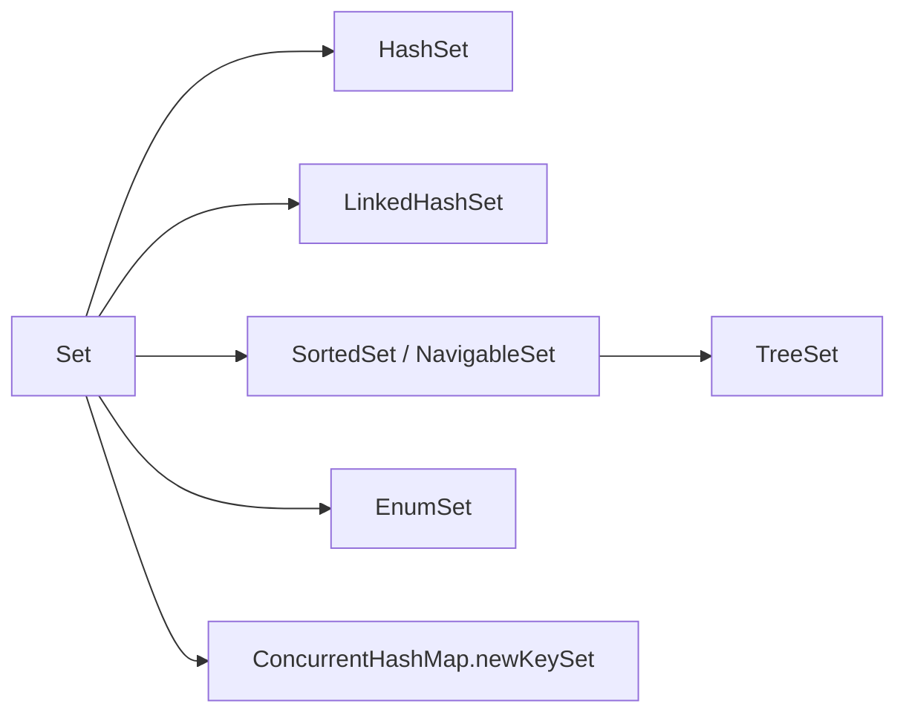

# Java Set Collections Overview

<DocLabels items={[{label: 'Collection family', tone: 'foundation'}, {label: 'Uniqueness', tone: 'intermediate'}]} />

A `Set` models membership without duplicates. “Duplicate” is defined by
`equals`/`hashCode` for hash sets, comparator equality for sorted sets, and enum
identity for `EnumSet`.

## Implementation Map

| Implementation | Order | Storage | Best use |
|---|---|---|---|
| `HashSet` | unspecified | keys in a `HashMap` | fast general membership |
| `LinkedHashSet` | insertion order | `LinkedHashMap` keys | uniqueness plus deterministic encounter order |
| `TreeSet` | sorted | red-black tree through `TreeMap` | ranges, floor/ceiling, sorted traversal |
| `EnumSet` | enum declaration order | bit vector | flags and policies from one enum type |
| `Set.copyOf` | unspecified | immutable implementation | immutable boundary snapshot |

## Important `Set` Methods

`add`, `remove`, and `contains` express membership. `addAll`, `retainAll`, and
`removeAll` implement union-like addition, intersection, and difference. A
`NavigableSet` adds `lower`, `floor`, `ceiling`, `higher`, and backed range
views.

<DocCallout type="mistake" title="Never mutate equality fields while stored">

If a hash-set element changes fields used by `equals` or `hashCode`, it can
become unreachable in its original bucket. Prefer immutable value objects.

</DocCallout>

## Dedicated Internals

<TopicCards items={[
  {title: 'HashSet', href: '/java/collections/set/HASHSET-INTERNALS', description: 'HashMap backing, load factor, capacity, equality, and collisions.', icon: 'boxes', tags: ['General membership']},
  {title: 'LinkedHashSet', href: '/java/collections/set/LINKEDHASHSET-INTERNALS', description: 'Hash lookup plus insertion-order links and memory trade-offs.', icon: 'route', tags: ['Stable order']},
  {title: 'TreeSet', href: '/java/collections/set/TREESET-INTERNALS', description: 'Red-black tree ordering, comparator identity, and range operations.', icon: 'network', tags: ['Sorted set']},
  {title: 'EnumSet', href: '/java/collections/set/ENUMSET-INTERNALS', description: 'Bit-vector storage, constant-time operations, and enum policies.', icon: 'gauge', tags: ['Compact flags']},
]} />

## Official Reference

- [`Set`](https://docs.oracle.com/en/java/javase/25/docs/api/java.base/java/util/Set.html)
