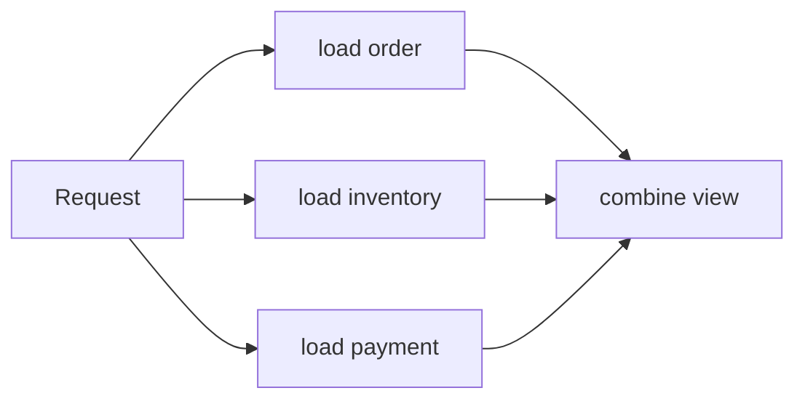

# CompletableFuture Composition And Fan-Out

## Transformation Vocabulary

| Method | Shape | Intent |
|---|---|---|
| `thenApply` | `T -> R` | synchronous transformation |
| `thenCompose` | `T -> CompletionStage<R>` | dependent async call and flatten |
| `thenAccept` | `T -> void` | terminal side effect |
| `thenRun` | `() -> void` | continuation that ignores the value |
| `thenCombine` | `(T,U) -> R` | combine two independent stages |

```java
CompletableFuture<OrderView> view = loadOrder(id)
        .thenCompose(order -> loadPayment(order.paymentId())
                .thenApply(payment -> new OrderView(order, payment)));
```

Using `thenApply` for a function that returns a future creates a nested
`CompletableFuture<CompletableFuture<T>>`; use `thenCompose` to flatten it.

## Fan-Out And Fan-In



Start independent work before joining. Joining immediately after each submission
serializes the workflow accidentally.

```java
var order = async(() -> orderClient.load(id));
var inventory = async(() -> inventoryClient.forOrder(id));
var payment = async(() -> paymentClient.forOrder(id));

return CompletableFuture.allOf(order, inventory, payment)
        .thenApply(ignored -> new OrderView(
                order.join(), inventory.join(), payment.join()));
```

`allOf` is a `Void` completion barrier; typed values remain on their original futures.
Define whether one failure invalidates the entire result and whether partial data is a
real API contract.

## Dynamic Collections

```java
static <T> CompletableFuture<List<T>> sequence(
        List<? extends CompletableFuture<? extends T>> futures) {
    return CompletableFuture.allOf(futures.toArray(CompletableFuture[]::new))
            .thenApply(ignored -> futures.stream()
                    .map(CompletableFuture::join)
                    .toList());
}
```

Do not create one unbounded future per database row. Partition input, limit concurrent
submissions, and align the bound with the downstream capacity.

## Racing

`anyOf` completes with the first completion, including failure, and returns `Object`.
Slower tasks are not cancelled automatically. A production hedge must define when a
second request is allowed, how duplicate side effects are prevented, and how losers are
cancelled and observed.

## Composition Review

- Are independent tasks started before any wait?
- Is every dependent async call flattened with `thenCompose`?
- Is fan-out bounded?
- Is the partial-result policy explicit?
- Are side effects idempotent if work races or retries?
- Does the combined stage retain useful failure identity?

## Official References

- [`CompletionStage` API](https://docs.oracle.com/en/java/javase/25/docs/api/java.base/java/util/concurrent/CompletionStage.html)

## Recommended Next

Continue with [Failure, Timeout And Cancellation](./COMPLETABLE-FUTURE-FAILURE-CANCELLATION.md).
