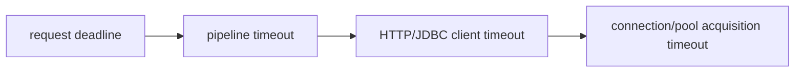

# CompletableFuture Failure, Timeout And Cancellation

Failure is part of the pipeline type even though Java does not encode it in the generic
parameter. Preserve cause identity and decide deliberately where failure becomes a
fallback, domain error, or transport response.

## Recovery Methods

| Method | Runs on success | Runs on failure | Can replace value |
|---|---:|---:|---:|
| `exceptionally` | no | yes | yes |
| `handle` | yes | yes | yes |
| `whenComplete` | yes | yes | no, except its own callback can fail |

```java
return loadOrder(id)
        .whenComplete((value, failure) -> recordLatency(id, failure))
        .exceptionallyCompose(failure ->
                failedFuture(mapOrderFailure(unwrap(failure))));
```

Avoid a broad fallback that converts authorization, corruption, programming defects,
and temporary unavailability into the same apparently successful value.

## Deadline Layers



`orTimeout` completes the future exceptionally; `completeOnTimeout` supplies a value.
Neither proves that underlying work stopped. Configure connect, request, query, lock and
pool-acquisition timeouts at the owner that can actually abort or release the resource.

## Cancellation And Interruption

`CompletableFuture.cancel(true)` marks the future cancelled but does not provide the
same interrupt-control guarantee as a task handle owned by an executor. An HTTP request,
database statement, message publication, or remote payment may continue.

Cancellation therefore requires:

- a cooperative client API or cancellable task handle;
- idempotency for side effects that may finish late;
- cleanup in the resource owner;
- propagation of the request deadline;
- observation of late completion.

If blocking through `get`, restore the interrupt flag after catching
`InterruptedException`.

## Failure Unwrapping

`CompletionException` and `ExecutionException` wrap causes. Unwrap only recognized
wrapper layers and retain the original exception as the cause of a stable domain error.
Do not log the same stack at every stage.

## Shopverse Failure Contract

For dashboard reads, a missing optional recommendation panel may have a documented
fallback. Failure to authorize the user, load the order owner, or establish tenant
identity must fail the whole response. For payment writes, a timeout means *unknown
outcome* until reconciliation; it must not be converted to a definite decline.

## Official References

- [`CompletableFuture` API](https://docs.oracle.com/en/java/javase/25/docs/api/java.base/java/util/concurrent/CompletableFuture.html)
- [`Future` API](https://docs.oracle.com/en/java/javase/25/docs/api/java.base/java/util/concurrent/Future.html)

## Recommended Next

Continue with [Production Architecture](./COMPLETABLE-FUTURE-PRODUCTION.md).
