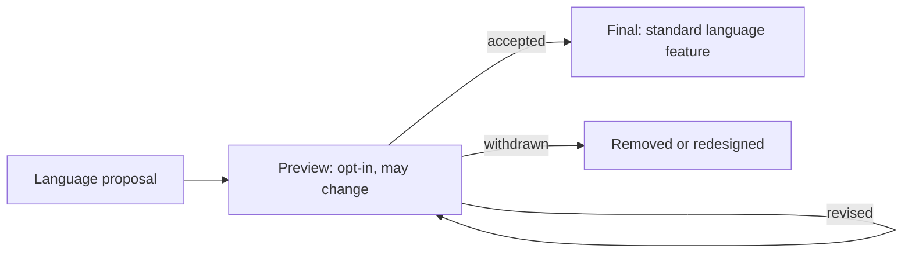

# Java 25 And 26 Language Changes

Java 25 finalized three language features; Java 26 has no newly finalized language
feature and re-previews primitive patterns. Treat `final`, `preview`, and `incubator`
as compatibility states, not marketing labels.



## Status Matrix

| Feature | Java 25 | Java 26 | Shopverse policy |
|---|---|---|---|
| module import declarations | final | final | useful for labs; prefer explicit imports in production modules |
| compact source files and instance `main` | final | final | learning scripts and small tools, not service modules |
| flexible constructor bodies | final | final | useful for fail-fast validation; review initialization carefully |
| primitive types in patterns and switch | third preview | fourth preview | experiments only; never stable service contracts |

## Module Import Declarations

`import module M;` imports public top-level types from packages exported by a module.
It does not add a module dependency and does not import packages from the unnamed
module.

```java
import module java.base;

final class ReservationSummary {
    Map<String, Integer> quantities(List<OrderLine> lines) {
        return lines.stream().collect(Collectors.toMap(
                OrderLine::sku,
                OrderLine::quantity,
                Math::addExact));
    }
}
```

Module imports can create simple-name ambiguity. A single-type import can resolve it.
For a large service, explicit imports make dependencies and code review clearer; module
imports are most useful in exploration, compact programs, and examples.

## Compact Source Files And Instance Main Methods

Small programs no longer require an explicit enclosing class or a `public static`
`main` declaration.

```java
void main() {
    var reference = "SV-ORDER-1001";
    IO.println("checking " + reference);
}
```

Use this form for learning, one-file diagnostics, and operational experiments. A
Shopverse service should retain named packages, explicit types, tests, build metadata,
and ordinary application entry points.

## Flexible Constructor Bodies

Java 25 permits validation and limited initialization before an explicit `super(...)`
or `this(...)` invocation. Code in the constructor prologue cannot freely use the
not-yet-initialized instance.

```java
class PricedOrder extends Order {
    private final Currency currency;

    PricedOrder(BigDecimal total, Currency currency) {
        Objects.requireNonNull(total, "total");
        Objects.requireNonNull(currency, "currency");
        if (total.signum() < 0) {
            throw new IllegalArgumentException("negative total");
        }
        this.currency = currency;
        super(total);
    }
}
```

The benefit is fail-fast validation before superclass construction and stronger
subclass invariants. The risk is making already subtle initialization order harder to
review. Prefer factories or composition when construction logic becomes elaborate.

## Primitive Patterns: Java 26 Preview

Primitive patterns extend pattern matching, `instanceof`, and `switch` across primitive
types with conversion rules that express whether a value can be represented safely.

```java
// Java 26 preview syntax; compile and run with --enable-preview.
String bucket(long quantity) {
    return switch (quantity) {
        case byte small -> "small:" + small;
        case int normal -> "normal:" + normal;
        default -> "bulk:" + quantity;
    };
}
```

Keep preview syntax out of public APIs, persisted expressions, generated clients, and
shared libraries unless the organization accepts upgrade-driven source changes.

## Compilation And Rollout

```powershell
javac --release 26 --enable-preview Example.java
java --enable-preview Example
```

Before adopting a Java 25 feature, verify framework, compiler-plugin, static-analysis,
IDE, bytecode-tooling, and deployment-image support. For a Java 26 preview, also define
the removal path and prohibit preview-generated class files from leaking into stable
libraries.

## Official References

- [Java 25 language changes](https://docs.oracle.com/en/java/javase/25/language/java-language-changes-summary.html)
- [Java 26 language changes](https://docs.oracle.com/en/java/javase/26/language/java-language-changes-summary.html)
- [JEP 511: Module Import Declarations](https://openjdk.org/jeps/511)
- [JEP 512: Compact Source Files and Instance Main Methods](https://openjdk.org/jeps/512)
- [JEP 513: Flexible Constructor Bodies](https://openjdk.org/jeps/513)
- [JEP 530: Primitive Types in Patterns](https://openjdk.org/jeps/530)

## Recommended Next

Continue with [Java 25 And 26 Runtime Changes](./JAVA-25-26-RUNTIME.md).
