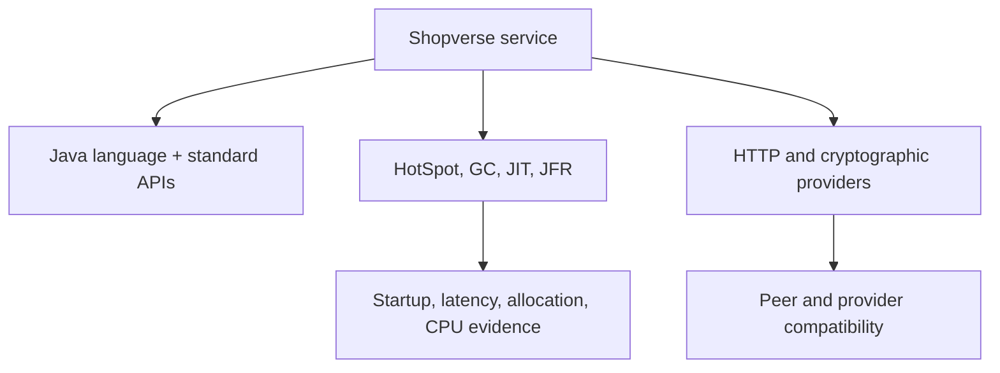

# Java 25 And 26 Runtime Changes

JDK 25 is an LTS release for many vendors and combines finalized APIs with preview,
experimental, and incubating work. JDK 26 advances the runtime without finalizing a
new Java language feature.



## Release Matrix

| Area | Java 25 | Java 26 | Adoption posture |
|---|---|---|---|
| scoped values | final | final | adopt after context-boundary review |
| structured concurrency | fifth preview | sixth preview | labs and controlled prototypes |
| compact object headers | product feature | retained | benchmark representative heaps |
| AOT | command ergonomics and method profiling | object caching with any GC | benchmark startup and image lifecycle |
| JFR | CPU profiling, cooperative sampling, method timing/tracing | retained | evaluate for production diagnostics |
| crypto | KDF API; PEM preview | PEM second preview | use standard providers; preview with caution |
| HTTP Client | HTTP/1.1 and HTTP/2 | HTTP/3 support | test negotiation, fallback and observability |
| Vector API | tenth incubator | eleventh incubator | library/benchmark work, not stable contracts |
| GC | generational Shenandoah | G1 synchronization improvement | workload-specific evidence required |
| lazy constants | stable values preview | lazy constants second preview | prototypes only |

## Scoped Values

Scoped values provide bounded, immutable context sharing with callees and child tasks.
They avoid many lifetime and mutation problems associated with `ThreadLocal`.

```java
static final ScopedValue<RequestContext> REQUEST = ScopedValue.newInstance();

Response handle(RequestContext context, Request request) {
    return ScopedValue.where(REQUEST, context)
            .call(() -> route(request));
}
```

Do not place mutable security state in a scoped value. Bind a minimal immutable value,
validate it at entry, and avoid allowing domain code to depend invisibly on ambient
context.

## Structured Concurrency Remains Preview

Structured concurrency models related subtasks as one lifetime, improving cancellation,
failure handling, and observability. The API is still preview in JDK 26, so examples in
this library are architecture guidance rather than a stable Shopverse dependency.

```java
// Illustrative preview API; exact surface follows the selected JDK preview.
try (var scope = StructuredTaskScope.open()) {
    var inventory = scope.fork(() -> loadInventory(orderId));
    var payment = scope.fork(() -> loadPayment(orderId));
    scope.join();
    return new OrderView(inventory.get(), payment.get());
}
```

## AOT, Object Headers And GC

AOT caching can reduce startup and warm-up work, but it changes build/run artifact
handling. Compact object headers may reduce heap footprint. Neither guarantees lower
tail latency for a particular service.

Measure with the same application artifact, container limits, traffic shape, heap,
collector, CPU quota, warm-up, and dependency behavior. Record startup-to-readiness,
RSS, allocation rate, pause distribution, throughput, and image/cache size.

## JFR Improvements

JDK 25 adds experimental CPU-time profiling, cooperative sampling, and method
timing/tracing capabilities. Use JFR as evidence, but quantify recording overhead and
avoid enabling broad method tracing without a bounded diagnostic plan.

## HTTP/3 In JDK 26

The standard HTTP Client can negotiate HTTP/3. This does not remove the need for
timeouts, TLS validation, connection limits, proxy testing, cancellation, response-size
bounds, and HTTP/2 or HTTP/1.1 fallback.

For Shopverse, validate gateway/load-balancer support before enabling it and capture
protocol version, handshake failures, retry reason, and latency without logging secrets.

## Cryptography Changes

JDK 25 finalizes a Key Derivation Function API and previews PEM encodings; JDK 26
re-previews PEM support. Prefer algorithm names without pinning a provider unless a
deployment has a deliberate provider requirement. Key derivation is not a substitute
for a reviewed password-storage or protocol design.

## Upgrade Gate

1. Classify every adopted feature as final, preview, experimental, or incubator.
2. Run compile, test and packaging pipelines on the target JDK.
3. Check agents, bytecode libraries, frameworks, native libraries and container images.
4. Compare startup, memory, CPU, GC and latency against the current production JDK.
5. Test rollback compatibility for serialized data and persistent state.
6. Keep preview/incubator APIs behind replaceable internal boundaries.

## Official References

- [JDK 25 features](https://openjdk.org/projects/jdk/25/)
- [JDK 26 features](https://openjdk.org/projects/jdk/26/)
- [JDK 26 significant changes](https://docs.oracle.com/en/java/javase/26/migrate/significant-changes-jdk-26-release.html)
- [ScopedValue API](https://docs.oracle.com/en/java/javase/25/docs/api/java.base/java/lang/ScopedValue.html)

## Recommended Next

Continue with [JVM Architecture And Operations](../JAVA-JVM-ARCHITECTURE-OPERATIONS.md)
and [Virtual And Structured Concurrency](../JAVA-VIRTUAL-STRUCTURED-CONCURRENCY.md).
