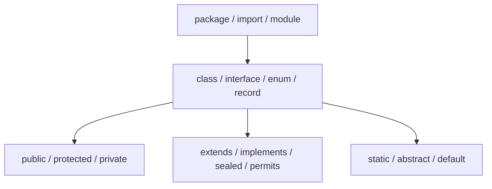

# Java Type And Declaration Keywords

## Declaration Map



| Keyword | Meaning that matters in review |
|---|---|
| `class` | identity-bearing reference type with state and behavior |
| `interface` | behavioral contract; fields are constants, nested types are static |
| `enum` | fixed instance set with class behavior; do not persist ordinal |
| `record` | transparent data carrier with generated accessors/equality; shallowly immutable |
| `abstract` | incomplete class/member contract requiring concrete realization |
| `extends` | class inheritance or upper generic bound, depending on context |
| `implements` | class commitment to interface contracts |
| `sealed` / `permits` / `non-sealed` | controls direct subtype set |
| `static` | belongs to declaration rather than an instance; does not imply immutability |

## Access And API Design

Prefer the narrowest access that supports the required collaboration. Package-private
is useful for cohesive implementation modules. `protected` exposes a subclass contract
and often creates more coupling than composition.

```java
public sealed interface PaymentResult
        permits PaymentAccepted, PaymentDeclined {}

record PaymentAccepted(String providerReference) implements PaymentResult {}
record PaymentDeclined(String reasonCode) implements PaymentResult {}
```

The closed result hierarchy enables exhaustive switching without treating new result
types as silently compatible.

## Package, Import And Module

`package` establishes the namespace. `import` affects source name resolution, not
runtime loading. `module`, `requires`, `exports`, `opens`, `uses`, and `provides` define
JPMS readability, accessibility, reflection and service-provider relationships.

Java 25 adds `import module M;`; it imports accessible exported types but does not add a
`requires` dependency. See [Java 25 And 26 Language Changes](../features-8-to-26/JAVA-25-26-LANGUAGE.md).

## Official References

- [JLS Chapter 7: Packages and Modules](https://docs.oracle.com/javase/specs/jls/se25/html/jls-7.html)
- [JLS Chapter 8: Classes](https://docs.oracle.com/javase/specs/jls/se25/html/jls-8.html)
- [JLS Chapter 9: Interfaces](https://docs.oracle.com/javase/specs/jls/se25/html/jls-9.html)

## Recommended Next

Continue with [State And Concurrency Keywords](./JAVA-STATE-CONCURRENCY-KEYWORDS.md).
