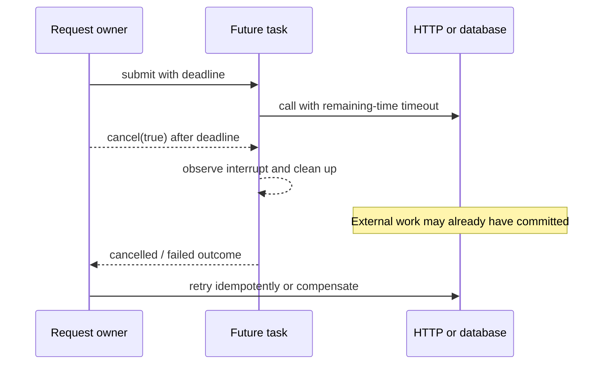

# Java Task Cancellation, Deadlines And Shutdown

A timeout limits how long one operation waits. A deadline limits the remaining
time for an end-to-end request. Cancellation asks work to stop. Interruption is
one cooperative signal to a Java thread. None of them automatically rolls back
remote or durable side effects.



## Keep The Contracts Separate

| Mechanism | What it guarantees | What it does not guarantee |
|---|---|---|
| `Future.get(timeout, unit)` | bounds the caller's wait | stops the worker or dependency |
| `Future.cancel(true)` | records cancellation and may interrupt the running task | termination, remote I/O cancellation, or rollback |
| `Thread.interrupt()` | sets the flag or wakes many interruptible waits | forcibly kills arbitrary code |
| HTTP/JDBC timeout | bounds a client or driver operation according to its API | the server did not commit before disconnect |
| executor shutdown | rejects new work and coordinates worker lifetime | business compensation for completed work |

For `CompletableFuture`-specific semantics, including why `cancel(true)` does not
control underlying stages like an executor task handle, use
[Failure, Timeout And Cancellation](../completable-future/COMPLETABLE-FUTURE-FAILURE-CANCELLATION.md).

## Write Interruptible Tasks

Blocking methods such as `BlockingQueue.take`, `Future.get`, `Thread.join`, and
many lock operations expose `InterruptedException`. Prefer to propagate it. If
the current API must translate it, restore the flag before returning or throwing:

```java
try {
    return reservationQueue.take();
} catch (InterruptedException interrupted) {
    Thread.currentThread().interrupt();
    throw new ReservationCancelledException(interrupted);
}
```

CPU loops need deliberate checkpoints. Cleanup belongs in `finally` or
try-with-resources and must be idempotent.

```java
for (OrderLine line : lines) {
    if (Thread.currentThread().isInterrupted()) {
        throw new OrderComputationCancelled();
    }
    price(line);
}
```

Do not catch `InterruptedException` and continue normally. Do not use deprecated
forced termination such as `Thread.stop()`.

## Propagate One Deadline

Create one deadline at the request boundary and derive remaining time at every
wait. Reusing a fresh fixed timeout at each hop can exceed the caller's budget.

```java
Instant deadline = Instant.now().plusMillis(800);
Future<InventoryView> task = ioExecutor.submit(
        () -> inventoryClient.load(orderId, millisRemaining(deadline)));

try {
    return task.get(millisRemaining(deadline), MILLISECONDS);
} catch (TimeoutException timeout) {
    task.cancel(true);
    throw new CheckoutDeadlineExceeded(orderId, timeout);
}
```

The client timeout in the task and the wait timeout at the owner are both
required. Give cleanup and error mapping a small budget rather than setting
every nested timeout equal to the full request deadline.

## Shopverse Side Effects

If checkout reserves inventory or initiates payment, cancellation can race with
completion. Treat the outcome as unknown until the service's durable state is
read. Preserve the checkout idempotency key on retries, make state transitions
conditional, and use saga compensation such as releasing a confirmed inventory
reservation after payment failure.

The same rule applies to Kafka: interrupting a listener does not retract an
already-published event. Persist correlation and idempotency data with the
outbox record so recovery does not depend on the original thread.

## Graceful Executor Shutdown

Shutdown is an ownership protocol: stop admission, allow bounded completion,
request cancellation, then preserve interruption on the shutdown caller.

```java
executor.shutdown();
try {
    if (!executor.awaitTermination(10, SECONDS)) {
        executor.shutdownNow();
        if (!executor.awaitTermination(5, SECONDS)) {
            logger.error("checkout_executor_did_not_terminate");
        }
    }
} catch (InterruptedException interrupted) {
    executor.shutdownNow();
    Thread.currentThread().interrupt();
}
```

The executor owner also needs a policy for queued tasks, partially completed
side effects, and observability. See [Executors And Thread Pools](../JAVA-EXECUTORS-THREAD-POOLS.md)
for sizing, admission, rejection, and metrics.

## Verification Checklist

1. Test cancellation before start, during an interruptible wait, during CPU
   work, and after a durable side effect.
2. Assert cleanup runs and the interrupt flag is preserved at translation
   boundaries.
3. Prove a timed-out dependency does not retain a connection or worker forever.
4. Re-run with duplicate idempotency keys and delayed responses.
5. Exercise deploy shutdown with queued and running tasks.
6. Record requested cancellation, observed cancellation, late completion, and
   compensation as distinct outcomes.

Continue with [Concurrency Design Review](../JAVA-CONCURRENCY-DESIGN-REVIEW.md)
to verify invariant, admission, cancellation, and lifecycle evidence together.

## Official References

- [`Future`](https://docs.oracle.com/en/java/javase/25/docs/api/java.base/java/util/concurrent/Future.html)
- [`ExecutorService`](https://docs.oracle.com/en/java/javase/25/docs/api/java.base/java/util/concurrent/ExecutorService.html)
- [`Thread.interrupt`](https://docs.oracle.com/en/java/javase/25/docs/api/java.base/java/lang/Thread.html#interrupt())
