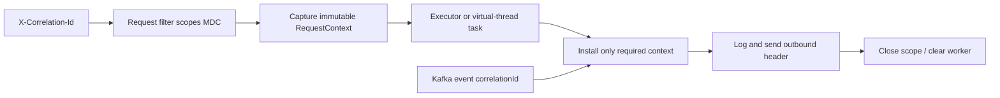

# Java Thread Context Propagation

`ThreadLocal` associates a value with the current `Thread`; it is not request
state and it is not stored on a virtual thread's carrier. When execution moves
to an executor worker, virtual thread, callback, or message consumer, the code
must establish the required context for that boundary and clear it afterward.



## Classify Context Before Propagating It

| Context | Recommended boundary contract | Why |
|---|---|---|
| correlation or trace ID | immutable value; scope it into MDC and forward as a header/event field | observability must survive thread and service hops |
| authenticated principal | capture the minimum immutable identity/claims the task needs | mutable framework state can leak authority or become stale |
| locale or tenant | explicit task input | business behavior should not depend on whichever worker runs the task |
| transaction, persistence session, request/response object | do not propagate; open a new owned scope if required | these resources have thread and lifetime constraints |
| arbitrary MDC map | avoid copying wholesale | it can contain stale, high-cardinality, secret, or irrelevant values |

Context propagation is not data durability. A correlation ID needed after a
process crash belongs in the outbox or event payload, as Shopverse does for saga
events, rather than only in MDC.

## Shopverse Pattern: Scope And Restore

The observability starter's `ShopverseRequestLoggingFilter` reads or creates the
correlation ID and uses `MDC.putCloseable` around request processing. Its
`CorrelationContext` helper applies the same lexical cleanup rule to callbacks:

```java
public static <T> T call(String correlationId, Supplier<T> action) {
    try (MDC.MDCCloseable ignored =
                 MDC.putCloseable(CorrelationConstants.MDC_KEY, correlationId)) {
        return action.get();
    }
}
```

Capture the value while still on the request thread, then establish it inside
the task. Do not call `MDC.get` for the first time on the worker and expect the
request value to be there.

```java
record RequestContext(String correlationId, String username) {}

RequestContext context = new RequestContext(correlationId, username);

CompletableFuture<OrderView> order = CompletableFuture.supplyAsync(
        () -> CorrelationContext.call(
                context.correlationId(),
                () -> orderClient.loadFor(context.username())),
        ioExecutor);
```

`OrderSagaListener` and `InventorySagaListener` use the durable event
`correlationId` to re-establish MDC around each Kafka callback. That is a new
consumer execution boundary, not continuation of the producer's thread-local
state.

## Platform And Virtual Threads

Platform pools reuse workers, so an unclosed `ThreadLocal` value can appear in a
later, unrelated request. Virtual threads are not pooled in the usual
thread-per-task model, but implicit context is still fragile: callbacks may run
elsewhere, and copying large thread-local graphs to every task wastes memory.

For immutable in-process call-tree context, Java 25 scoped values offer bounded,
lexical sharing. They do not replace HTTP headers, Kafka fields, authorization
checks, or explicit executor propagation.

## Review And Test Checklist

1. Identify every thread, executor, callback, HTTP, and message boundary.
2. Whitelist the values allowed to cross each boundary.
3. Capture immutable values before submitting work.
4. Install context inside a lexical `try` scope and restore or clear it.
5. Start the transaction inside the task that owns the database operation.
6. Test two sequential tasks on one worker and prove the second cannot observe
   the first task's correlation or principal.
7. Test logs and outbound headers for success, failure, timeout, and cancellation.

Continue with [Task Cancellation, Deadlines And Shutdown](./TASK-CANCELLATION-DEADLINES.md)
to give the same task an explicit lifetime.

## Official References

- [`ThreadLocal`](https://docs.oracle.com/en/java/javase/25/docs/api/java.base/java/lang/ThreadLocal.html)
- [`ScopedValue`](https://docs.oracle.com/en/java/javase/25/docs/api/java.base/java/lang/ScopedValue.html)
