# Architect Practice And Evidence Path

Knowing a technology is only the first layer. A strong Lead or Architect candidate can
trace its runtime, justify its selection, predict failure, diagnose from evidence, design
safe scale and security, compare rejected options, and prove the result.

```mermaid
flowchart LR
  Internal["1. Runtime internals"] --> Decision["2. Selection rationale"]
  Decision --> Failure["3. Failure model"]
  Failure --> Diagnose["4. Evidence-led diagnosis"]
  Diagnose --> Scale["5. Scale and security"]
  Scale --> Tradeoff["6. Rejected alternatives"]
  Tradeoff --> Proof["7. Production evidence"]
  Proof --> Review["Reassess decision"]
```



## The Seven-Question Standard

| Question | Strong answer contains |
|---|---|
| What happens internally? | request/event path, state transitions, threads, queues, I/O, persistence, acknowledgements |
| Why was this design selected? | business outcome, constraints, invariants, workload, decision criteria |
| What can fail? | failure domains, partial failure, overload, stale state, data loss/duplication, operator error |
| How would you diagnose it? | symptom, hypotheses, metrics/logs/traces, controlled tests, containment, root cause |
| How would you scale and secure it? | capacity model, bottleneck, partitioning, identity, authorization, secrets, abuse controls |
| What trade-offs did you reject? | credible alternatives, benefit/cost, rejection evidence, reconsideration trigger |
| What production evidence proves it works? | SLOs, correctness checks, load/failure tests, deployment and recovery evidence |

## Complete Route

1. [Runtime Internals And Design Selection](./architect-practice/ARCHITECT-RUNTIME-DESIGN-REASONING.md)
2. [Failure Modeling, Diagnosis, And Incident Reasoning](./architect-practice/ARCHITECT-FAILURE-DIAGNOSIS.md)
3. [Scaling, Security, And Rejected Trade-Offs](./architect-practice/ARCHITECT-SCALE-SECURITY-TRADEOFFS.md)
4. [Production Evidence, Portfolio, Labs, And Interview Worksheet](./architect-practice/ARCHITECT-PRODUCTION-EVIDENCE-WORKBOOK.md)

## How To Apply It To Every Topic

After reading a technology page, create one seven-question sheet. Do not copy definitions.
Use one concrete workload and one production failure. Examples:

| Topic | Runtime focus | Failure/evidence focus |
|---|---|---|
| Java concurrency | task submission, queue, worker, memory visibility | saturation, deadlock, thread dump, throughput curve |
| Spring transaction | proxy, interceptor, connection, flush, commit | self-invocation, lock wait, transaction metrics and SQL |
| Kafka consumer | poll, assignment, processing, commit | lag, rebalance, duplicate, per-partition evidence |
| Cassandra | coordinator, replicas, memtable/SSTable | hot partition, tombstones, latency and repair evidence |
| Oracle | parse/execute, buffer cache, undo/redo | plan regression, blockers, A/E rows and wait events |
| Elasticsearch | routing, shard, segment, refresh, reduce | hot shard, stale search, slow log/Profile and recovery |
| Kubernetes | scheduling, probes, service routing, termination | restart loop, drain failure, events/metrics/rollout proof |

## Answer Shape For Interviews And Reviews

```text
Outcome and constraints
  -> internal request/data path
  -> selected design and alternatives
  -> failure and overload behavior
  -> diagnosis and containment
  -> scale/security controls
  -> rollout, rollback, reconciliation
  -> measured production proof and reconsideration trigger
```

Lead with a concrete decision and evidence. Add low-level detail where it changes correctness,
capacity, security, recovery, or the choice—not merely to display vocabulary.

## Completion Standard

For at least five major technologies and three end-to-end systems, you can produce the
worksheet without notes, draw the runtime path, calculate one capacity boundary, model three
failures, identify diagnostic signals, name a rejected alternative, and define measurable
success plus rollback/reconciliation evidence.

## Official References

- [Google SRE Workbook](https://sre.google/workbook/table-of-contents/)
- [AWS Well-Architected Framework](https://docs.aws.amazon.com/wellarchitected/latest/framework/welcome.html)
- [CISA Secure by Design](https://www.cisa.gov/securebydesign)

## Recommended Next

Begin with [Runtime Internals And Design Selection](./architect-practice/ARCHITECT-RUNTIME-DESIGN-REASONING.md).

