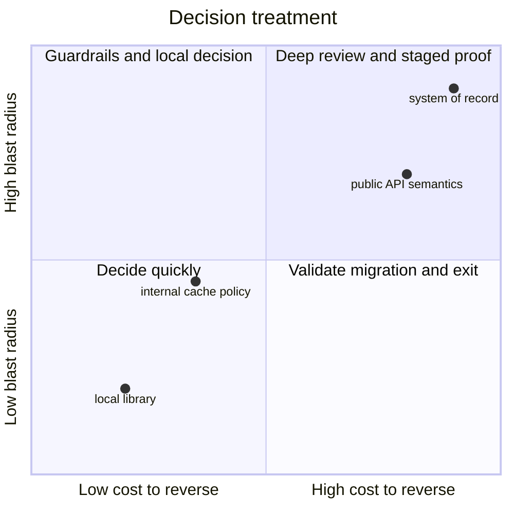

# Architecture Decisions And Disagreements

Architecture disagreement is expected. Different engineers see different failure
modes, constraints, and opportunity costs. The leadership task is not to suppress
debate or force unanimous agreement; it is to operate a fair, time-bounded process
that produces an accountable decision and makes learning possible.

## Diagnose The Disagreement

Teams often appear to disagree on technology while actually disagreeing on the
problem, priority, assumption, or decision authority.

| Apparent dispute | Underlying question |
|---|---|
| REST versus Kafka | must the caller receive an immediate authoritative answer? |
| PostgreSQL versus NoSQL | which access patterns, consistency, scale, and operating skills matter? |
| rewrite versus refactor | what risk, deadline, and legacy retirement economics are acceptable? |
| build versus buy | which differentiation, compliance, exit, and total-cost constraints apply? |
| platform standard versus team choice | where does local autonomy create systemic cost or risk? |

Before discussing options, write one decision statement:

```text
Decision
Choose how Order communicates an accepted reservation request to Inventory.

Required outcomes
- checkout responds within the agreed deadline;
- an accepted order is never silently lost;
- duplicate reservation is prevented;
- Inventory can be temporarily unavailable;
- the workflow is auditable and repairable.

Constraints
- 500 requests per second peak;
- PostgreSQL and Kafka are supported platforms;
- three teams deploy independently;
- delivery is required this quarter.
```

This eliminates solutions to different problems from competing in the same debate.

## Separate Invariants, Constraints, Assumptions, And Preferences

- **Invariant:** a business or safety rule that must hold, such as no double charge.
- **Constraint:** a fixed boundary for this decision, such as data residency.
- **Assumption:** a belief requiring evidence, such as traffic growing tenfold.
- **Preference:** a choice that may improve consistency but is not required.

Disagreement becomes productive when assumptions are tested and preferences stop
masquerading as invariants.

## Establish Evaluation Criteria Before Scoring Options

Choose criteria relevant to the decision and agree their relative importance.

| Criterion | Questions |
|---|---|
| business fit | does it solve the user outcome and preserve domain invariants? |
| reliability | how does it fail, recover, degrade, and meet SLO/RTO/RPO? |
| consistency | what can be stale, duplicated, reordered, or conflicting? |
| performance | what are latency, throughput, tail, and saturation effects? |
| security/privacy | how are identity, authorization, PII, audit, and supply chain handled? |
| operability | can teams deploy, observe, support, restore, and reconcile it? |
| delivery | what is the path, dependency, skill, and migration cost? |
| economics | what is total cost, including people, support, licensing, and exit? |
| evolution | can contracts, data, and deployment change compatibly? |
| reversibility | how expensive is it to undo after data and users accumulate? |

Do not hide judgment behind a weighted spreadsheet. Scores expose reasoning; they
do not make subjective inputs objective. Record decisive evidence and sensitivity:
would a small change in one assumption reverse the recommendation?

## Compare Real Alternatives

Example for Order-to-Inventory communication:

| Option | Strength | Material risk | Suitable when |
|---|---|---|---|
| synchronous HTTP | immediate result and simple request flow | runtime coupling and deadline propagation | order cannot be accepted without a current reservation answer |
| durable event/command | temporal decoupling and replay | eventual consistency and operational complexity | pending state is acceptable and work must survive outage |
| shared database | fast initial implementation | destroys ownership and independent evolution | normally only inside one bounded context |

Include “retain the current design” as a baseline. An option should explain
migration, mixed-version behavior, operations, and exit—not only steady-state boxes.

## Use Evidence That Can Change The Decision

Useful evidence includes:

- production traces, dependency latency, traffic shape, and incident history;
- database execution plans, lock waits, storage growth, and recovery tests;
- load tests with production-shaped data and realistic arrival models;
- contract tests and compatibility experiments;
- threat models and compliance review;
- cost model and operator/support capability;
- a thin vertical prototype through the uncertain boundary.

A spike should have a hypothesis, time box, representative workload, success and
abort criteria, and an explicit decision it informs. A prototype that becomes
production accidentally has bypassed design, security, and lifecycle review.

## Match Rigor To Reversibility And Blast Radius



Low-cost reversible choices should not wait for an architecture council. Public
contracts, data authority, identity, multi-region topology, and strategic platform
choices deserve deeper review because mistakes compound over years.

## Assign Decision Rights

Define roles before the debate:

- **driver:** prepares context and moves the decision forward;
- **contributors:** provide domain, security, data, operations, and delivery evidence;
- **decider:** accepts the trade-off and residual risk;
- **implementers/operators:** validate feasibility and own lifecycle consequences;
- **affected stakeholders:** are informed and can raise material constraints.

Consensus is desirable when feasible. Unanimity is not required. If accountable
ownership is unclear, escalation should resolve ownership rather than re-run the
technical argument at a higher title.

## Facilitate The Conversation

1. circulate context, criteria, options, and open assumptions before the meeting;
2. restate the shared outcome and invite missing constraints;
3. let each option receive a fair explanation, including failure and migration;
4. distinguish evidence from prediction and preference;
5. identify the smallest experiment for decisive uncertainty;
6. time-box discussion and state who decides by when;
7. summarize the decision, dissent, consequences, and next evidence;
8. commit to execution while preserving a reassessment trigger.

The architect should speak last when their status may anchor the group. Invite
security, operations, data, support, and less-senior voices whose risks are often
underrepresented.

## Record An Architecture Decision

```text
Title: Publish durable OrderPlaced events through Kafka
Status: Accepted
Date and owner: 2026-07-13, Commerce Architecture

Context
Order acceptance must survive analytics and notification outages. Order and
Inventory deploy independently. Duplicate delivery is possible.

Decision
Commit the order and outbox record in one local transaction. Publish OrderPlaced
to Kafka. Consumers process idempotently and expose lag and terminal failures.

Alternatives
- synchronous calls to every consumer;
- database polling without an outbox contract;
- shared order tables.

Consequences
- accepted work is durable and consumers are temporally decoupled;
- users can observe a pending state;
- schema governance, replay, reconciliation, and broker operations are required.

Validation and reassessment
Canary at 5%, verify no outbox loss, duplicate business effects, or workflow-age
SLO breach. Reassess if p99 convergence exceeds 30 seconds or operating cost
exceeds the approved threshold for two quarters.
```

An ADR records why a consequential choice was reasonable in its context. It is
not a detailed design, a meeting transcript, or an immutable commandment. Supersede
it when evidence changes; retain the history.

## Resolve Stalemate And Escalation

When discussion stalls:

1. name the unresolved assumption precisely;
2. seek discriminating evidence or run a bounded experiment;
3. narrow scope or choose a reversible interim step;
4. ask the accountable decider to decide with recorded residual risk;
5. escalate only when authority, cross-organization risk, compliance, or budget
   exceeds that decider's mandate.

Do not use escalation to recruit a higher-ranking ally. Do not repeatedly reopen a
decision without new evidence. Conversely, “disagree and commit” never requires
hiding a security, ethics, compliance, or safety concern.

## Preserve Psychological Safety

Prohibit personal attacks, ridicule, title-based victory, private pre-decisions,
and retaliation for dissent. Reward engineers who change their view when evidence
changes. Capture minority concerns when they describe a plausible failure mode;
they can become canary checks or reassessment triggers.

After a poor outcome, evaluate the information and process available at decision
time. Avoid hindsight bias. Improve the decision system instead of searching for
an individual to blame.

## Architecture Governance At Scale

Use different mechanisms for different decisions:

| Mechanism | Best use |
|---|---|
| team design review | local, reversible implementation choices |
| ADR | consequential choice with alternatives and durable context |
| request for comments | cross-team contract or standard requiring broad input |
| architecture council | systemic risk, shared platform, exception, or strategic investment |
| automated fitness function | dependency, security, compatibility, or policy rule that can be tested |

Governance should reduce repeated decision cost and systemic risk. A council that
approves ordinary changes creates delay and learned helplessness.

Measure decision lead time, number of exceptions, reopened decisions with new
evidence, recurring incident causes, standard adoption, and age of temporary
exceptions. Do not measure ADR count as architectural quality.

## Interview-Ready Answer

> I make the decision explicit because teams often appear to disagree while solving
> different problems. We agree on outcomes, invariants, constraints, assumptions,
> and criteria such as reliability, consistency, security, delivery, operability,
> cost, and reversibility before comparing credible alternatives.
>
> I use production evidence or a time-boxed experiment for uncertainty that could
> change the choice. The depth of review matches blast radius and reversal cost. I
> invite dissent and relevant operational voices, but define an accountable decider
> so consensus does not become endless debate. The outcome is recorded in an ADR
> with alternatives, consequences, validation, and reassessment triggers.
>
> Once decided, the team commits unless material new evidence appears. My role is
> to create a fair decision system and surface risk, not to win through title. I
> escalate unresolved authority or organization-wide risk, while preserving
> psychological safety and explicit handling for security or compliance concerns.

## Related Guides

- [HLD And LLD](../architecture/HLD-LLD.md)
- [Spring Decision Guides](../spring/decisions/README.md)
- [Engineering Leadership Practices](./ENGINEERING-LEADERSHIP-PRACTICES.md)
- [End-To-End Design Method](../architecture/system-design-deep-dives/END-TO-END-DESIGN-METHOD.md)

## Official References

- [AWS Prescriptive Guidance: ADR process](https://docs.aws.amazon.com/prescriptive-guidance/latest/architectural-decision-records/adr-process.html)
- [Google Engineering Practices: code review standard](https://google.github.io/eng-practices/review/reviewer/standard.html)

## Recommended Next

Continue with [Production Performance And Availability](./PRODUCTION-PERFORMANCE-AND-AVAILABILITY.md)
to apply evidence-based decisions to incidents, capacity, and failure domains.
