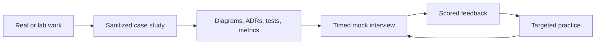

# Architecture Portfolio And Mock Interview Programme

This track converts knowledge into interview performance. A portfolio proves that you can
make and validate decisions; mock interviews prove that you can explain those decisions
under time pressure, incomplete information, and follow-up questioning.

## Complete Route

1. [Build A Defensible Architecture Portfolio](./interview-program/ARCHITECTURE-PORTFOLIO-BUILDING.md)
2. [Mock Interview Formats, Question Bank, And Scoring](./interview-program/MOCK-INTERVIEW-FORMATS-QUESTION-BANK.md)
3. [System Design, Troubleshooting, And Leadership Rounds](./interview-program/SYSTEM-DESIGN-BEHAVIORAL-LEADERSHIP-ROUNDS.md)
4. [Twelve-Week Preparation And Revision Programme](./interview-program/TWELVE-WEEK-PREPARATION-PROGRAM.md)

## Completion Standard

You are ready when you have three sanitized case studies, two runnable technical demos,
an architecture decision log, measured load and failure evidence, ten recorded mocks, and
no repeated critical weakness across the last three scored interviews.

## Interview Evidence Matrix

| Claim | Minimum credible evidence |
|---|---|
| scalable | workload model, bottleneck, load-test graph and headroom |
| reliable | failure model, retry/idempotency design and recovery exercise |
| secure | threat model, identity boundary, authorization and secret handling |
| operable | SLO, dashboard, alert, runbook and incident timeline |
| evolvable | contract policy, migration plan, compatibility tests and rollback |
| cost-aware | capacity assumptions, dominant cost drivers and optimization decision |

## Official References

- [C4 model](https://c4model.com/)
- [Architecture Decision Records](https://adr.github.io/)
- [Google SRE workbook](https://sre.google/workbook/table-of-contents/)

## Recommended Next

Begin with [Build A Defensible Architecture Portfolio](./interview-program/ARCHITECTURE-PORTFOLIO-BUILDING.md).

