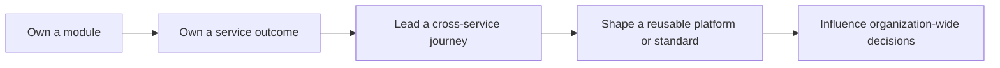

# Engineering Leadership Practices

Code review and mentoring are two parts of the same leadership system. Reviews
protect outcomes and share context today; mentoring grows engineers who can own
those outcomes tomorrow. If all judgment remains centralized in the lead, both
practices have failed to scale.

## Conducting Code Reviews

### Define the purpose

A review should improve correctness, maintainability, security, reliability,
operability, architectural alignment, and shared understanding. It is not a test
of the author's status and should not become an asynchronous design meeting for
a change whose direction was never aligned.

### Make the change reviewable

The author should provide:

```text
Problem and intended outcome
Scope and deliberately excluded work
Design choice and rejected alternatives
Risk and affected user journeys
How correctness and failure were tested
Schema, API, event, configuration, or security changes
Observability and rollout plan
Rollback, roll-forward, or reconciliation plan
```

Prefer one coherent change small enough to understand. Large migrations can be
stacked into separately safe changes: preparation, compatible schema, dormant
code, traffic enablement, and cleanup.

### Review in risk order

#### Business correctness

- Does behavior satisfy the requirement and domain invariant?
- Are boundary, negative, duplicate, concurrent, and partial-failure cases covered?
- Is money, inventory, authorization, or customer-visible state changed safely?

#### Design and ownership

- Is responsibility in the correct module and layer?
- Is the abstraction justified by a real variation or policy?
- Does the change cross a domain, data, transaction, thread, or deployment boundary?
- Does it create shared mutable state, temporal coupling, or an ownership gap?

#### Security and privacy

- Are authentication and authorization enforced at the right boundary?
- Is input validated and output minimized?
- Could secrets, tokens, payment data, or PII enter logs, traces, events, or errors?
- Are injection, SSRF, insecure deserialization, path traversal, and dependency risks relevant?

#### Data and consistency

- Are transactions short and correctly scoped?
- Are migrations backward compatible and safe for production-sized data?
- Are retries and duplicate delivery idempotent?
- Are isolation, locking, stale reads, reconciliation, and retention addressed?

#### Performance and resilience

- Is there an N+1 query, unbounded loop, queue, result, executor, or allocation?
- Are remote calls pooled, timed out, and included in an end-to-end deadline?
- Can retries amplify overload or repeat a non-idempotent effect?
- What happens when the database, broker, cache, or downstream API is slow?

#### Testing and operability

- Is the lowest useful test level used without mocking away the risk?
- Are failure paths deterministic and concurrency assumptions exercised?
- Do logs, metrics, and traces identify the business operation without leaking data?
- Can the change be rolled out, observed, disabled, recovered, and supported?

### Classify comments

| Label | Meaning | Example |
|---|---|---|
| Blocker | correctness, security, data-loss, or production-safety defect | duplicate payment can be submitted after timeout |
| Important | material maintainability, resilience, or ownership concern | database query inside an unbounded loop |
| Suggestion | useful improvement that need not block | extract a named policy after this release |
| Question | context is missing or an assumption needs confirmation | what guarantees ordering for this aggregate? |
| Nit | mechanical style issue | naming already enforced by formatter soon |

Feedback should name impact and evidence:

> **[Important]** This performs one inventory query per order line. At the allowed
> 500-line request size it can create 501 round trips and exhaust the connection
> pool under concurrency. Could we fetch the required SKUs in one bounded query and
> add a query-count integration test?

Avoid comments such as “bad design” or “rewrite this.” Critique the code and risk,
not the person. Ask when context may change the conclusion; be direct when an
invariant is violated.

### Separate standards from preferences

Formatters, linters, static analysis, dependency checks, secret scanning, and
test gates should enforce mechanical policy. Review time should focus on behavior,
design, and risk. If a subjective preference is not an agreed standard, do not
present it as a blocker.

### Avoid the review bottleneck

- define module owners without making them permanent gatekeepers;
- rotate reviewers and pair across ownership boundaries;
- use risk-based reviewer rules for security, data, or public contracts;
- set a review response expectation and protect focus time;
- move complex disagreement to a short synchronous conversation;
- record recurring decisions in standards or ADRs;
- teach reviewers to approve when risk is adequately handled, not when code matches their personal implementation.

Track time to first meaningful review, review age, oversized changes, escaped
defects, reopened incidents, and distribution of review ownership. Comment count
and lines changed are poor quality measures and invite gaming.

## Mentoring Senior Developers

Senior engineers usually need less task instruction and more opportunity to
exercise judgment across ambiguous, cross-team, and operational boundaries.

### Start with direction, not assumptions

Discuss the engineer's desired path: deep specialist, staff/principal technical
leadership, delivery leadership, architecture, or people management. Do not make
management the only form of progression.

Assess observable capability across:

- problem framing and business understanding;
- system design and trade-off reasoning;
- delivery decomposition and risk control;
- production diagnosis and incident leadership;
- security, data, performance, and reliability judgment;
- written and verbal communication;
- cross-team influence and conflict handling;
- delegation, teaching, and capability created in others.

### Create a growth contract

A useful development plan connects one capability to a real opportunity and
observable evidence.

| Growth goal | Stretch opportunity | Support | Evidence |
|---|---|---|---|
| architecture trade-offs | lead payment reliability redesign | design rehearsal and fortnightly coaching | accepted ADR, safe rollout, SLO improvement |
| cross-team influence | coordinate checkout contract change | stakeholder map and meeting feedback | three teams adopt compatible plan |
| incident leadership | act as incident commander in game day | shadow first exercise | clear roles, mitigation, timeline, owned actions |
| mentoring | sponsor two engineers into module ownership | monthly calibration | mentees independently review and operate module |

The opportunity must be real enough to require judgment but bounded enough that a
learning mistake does not create uncontrolled customer or compliance harm.

### Coach through questions

Useful questions develop a reusable decision model:

- What user or business problem are we solving?
- Which invariant must never be violated?
- What evidence supports the current diagnosis?
- Which alternatives did you reject, and why?
- Where are the transaction, thread, data, and deployment boundaries?
- What happens at ten times load or when a dependency times out?
- How will old and new versions coexist?
- How do we detect failure, roll back, reconcile, and learn?
- Who must agree, who decides, and who operates the result?

Do not turn coaching into withholding essential context. Share constraints, safety
limits, and organizational history, then allow the engineer to form and defend a
recommendation.

### Give behavior-based feedback

Use situation, observable behavior, impact, and next experiment:

> In Tuesday's design review, you had the strongest failure analysis, but the
> decision stalled because constraints and alternatives were introduced only after
> debate began. For the next review, send a one-page context, criteria, options, and
> recommendation beforehand, then ask participants to challenge the assumptions.

Balance reinforcing feedback with corrective feedback. “Great leadership” is as
unhelpful as “improve communication” unless the engineer knows what to repeat or
change.

### Increase scope deliberately

Progress through broader ownership:



Offer architecture facilitation, incident command, roadmap decomposition,
stakeholder presentations, operational reviews, hiring loops, technical writing,
and mentoring. Visibility should follow contribution and learning, not replace it.

### Delegate outcomes, not abandonment

State the outcome, constraints, decision rights, checkpoints, available support,
and escalation threshold. Avoid prescribing every step. Intervene when risk crosses
the agreed boundary, not merely because the approach differs from yours.

Afterward, review the decision process and system outcome. Do not judge only whether
the engineer happened to choose the same design as the mentor.

### Handle common senior-level patterns

| Pattern | Coaching response |
|---|---|
| technically strong but dismissive | set collaboration expectations, give specific impact feedback, observe change |
| takes all difficult work | require delegation and measure capability created in others |
| waits for certainty | use reversible decisions and time-boxed experiments |
| proposes broad rewrites | require baseline, incremental path, compatibility, and retirement economics |
| avoids production ownership | pair on incident/game-day leadership and runbook improvement |
| wants promotion without evidence | map level expectations to opportunities and observable outcomes |

Performance management and mentoring are related but not interchangeable. If
role expectations are repeatedly unmet, make expectations, support, evidence,
timeline, and consequences explicit rather than hiding the issue inside informal
coaching.

## Leadership Health

Look for these outcomes:

- reviews are timely, risk-focused, and distributed;
- standards are increasingly automated;
- senior engineers independently frame and own ambiguous work;
- design and incident leadership is shared;
- decisions are understandable after the meeting;
- teams learn from defects without normalizing avoidable risk;
- successors can operate when the lead is absent.

## Interview-Ready Answers

### How do you conduct code reviews?

> I treat review as a correctness, risk, and knowledge-sharing mechanism rather
> than gatekeeping. I review the business invariant first, then design and ownership,
> security, data consistency, performance, resilience, tests, operability, and
> rollout. Feedback names severity and impact, distinguishing blockers from
> suggestions and preferences. Small coherent changes, author self-review, CI,
> static analysis, and security gates make reviews effective. I distribute module
> ownership and reviewer capability so I do not become the bottleneck, and I turn
> recurring decisions into automated rules, standards, or ADRs. I measure review
> flow and escaped risk, not comment volume.

### How do you mentor senior developers?

> I begin with the engineer's chosen direction and assess judgment, influence,
> delivery, operations, and capability-building gaps. We connect one growth goal to
> a real stretch assignment, clear decision rights, bounded risk, support, and
> observable evidence. I coach through questions and share constraints instead of
> taking back the solution. Feedback describes a specific behavior, its impact, and
> the next experiment. I deliberately expand ownership from a module to cross-team
> outcomes and expect senior engineers to grow others. Success is independent sound
> judgment and broader team capability, not dependence on me.

## Related Guides

- [Engineering Principles](../development/ENGINEERING-PRINCIPLES.md)
- [Production Design Principles](../development/PRODUCTION-DESIGN-PRINCIPLES.md)
- [Architecture Decisions And Disagreements](./ARCHITECTURE-DECISIONS-AND-DISAGREEMENTS.md)
- [Supply-Chain Security And Privacy](../security/SUPPLY-CHAIN-PRIVACY.md)

## Official References

- [Google Engineering Practices: code review](https://google.github.io/eng-practices/review/)
- [Google Engineering Practices: writing code review comments](https://google.github.io/eng-practices/review/reviewer/comments.html)

