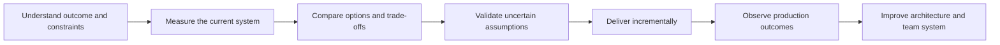

# Leadership And Architecture Scenarios

<DocLabels items={[
  {label: 'Lead and architect', tone: 'advanced'},
  {label: 'Scenario based', tone: 'production'},
  {label: 'Interview workbook', tone: 'intermediate'},
  {label: 'Generic guidance', tone: 'neutral'},
]} />

Architect interviews do not reward a list of fashionable technologies. They test
whether a candidate can turn an ambiguous business problem into a safe decision,
align people around it, deliver it incrementally, and prove the result in
production. The same standard applies to architecture work outside an interview.

<DocCallout type="tip" title="Lead with the decision process">

Begin with the business outcome, current evidence, constraints, and success
measure. Technology follows. Name the owner, migration path, failure behavior,
rollback or reconciliation route, and evidence that will determine whether the
decision worked.

</DocCallout>

## Complete Scenario Map

| Interview scenario | Primary guide | Architect emphasis |
|---|---|---|
| Split a monolith into microservices | [Monolith To Microservices Strategy](./MONOLITH-TO-MICROSERVICES-STRATEGY.md) | boundaries, data ownership, incremental extraction, platform cost |
| Conduct code reviews | [Engineering Leadership Practices](./ENGINEERING-LEADERSHIP-PRACTICES.md) | scalable quality system, risk, learning, ownership |
| Mentor senior developers | [Engineering Leadership Practices](./ENGINEERING-LEADERSHIP-PRACTICES.md) | judgment, influence, succession, measurable growth |
| Resolve architecture disagreements | [Architecture Decisions And Disagreements](./ARCHITECTURE-DECISIONS-AND-DISAGREEMENTS.md) | evidence, decision rights, ADRs, commitment |
| Improve a slow production system | [Production Performance And Availability](./PRODUCTION-PERFORMANCE-AND-AVAILABILITY.md) | stabilization, bottleneck evidence, safe validation |
| Design for high availability | [Production Performance And Availability](./PRODUCTION-PERFORMANCE-AND-AVAILABILITY.md) | SLO, RTO/RPO, failure domains, tested recovery |
| Handle zero-downtime deployments | [Zero-Downtime Delivery](./ZERO-DOWNTIME-DELIVERY.md) | mixed-version compatibility, data migration, rollout control |
| Migrate a legacy application to Spring Boot | [Legacy To Spring Boot Modernization](./LEGACY-TO-SPRING-BOOT-MODERNIZATION.md) | safety nets, incremental modernization, operational outcome |

The [Leadership And Architecture Interview Workbook](./LEADERSHIP-ARCHITECTURE-INTERVIEW-WORKBOOK.md)
turns every guide into a model answer, follow-up probes, weak-answer warnings,
and a self-scoring exercise.

## What Changes By Level

| Dimension | Developer answer | Lead answer | Architect answer |
|---|---|---|---|
| scope | component and implementation | team and delivery stream | system, organization, lifecycle, and portfolio |
| design | correct pattern | maintainable team solution | explicit trade-off across business and technical constraints |
| risk | tests the change | plans rollout and team ownership | models failure domains, migration, reversibility, and systemic risk |
| evidence | code and unit tests | integration evidence and delivery metrics | production SLOs, capacity, cost, security, recovery, and adoption |
| people | collaborates with peers | coaches and delegates | establishes decision systems and cross-team alignment |
| operations | logs and handles errors | owns dashboards and runbooks | designs operability, incident response, DR, and governance |

An architect does not need to personally implement every layer. The architect is
still accountable for making ownership and verification explicit. A design that
cannot be deployed, diagnosed, recovered, or evolved is incomplete.

## Reusable Answer Structure

### 1. Clarify the outcome

Ask what business or user result must improve. Define the affected journey,
stakeholders, deadline, risk tolerance, compliance boundary, budget, and success
measure. Challenge the proposed solution when it is being treated as the goal.

### 2. Establish the current evidence

Use dependency maps, runtime traces, change history, incident data, delivery
metrics, ownership maps, data flows, and user research. State what is known, what
is assumed, and what requires validation.

### 3. Name constraints and invariants

Examples include no lost accepted orders, regulated data residency, a p95 latency
target, a fixed migration window, mixed-version operation, limited operator
capacity, or an external contract that cannot change.

### 4. Compare credible alternatives

Include the option to make no architectural change. Compare business fit,
correctness, availability, consistency, security, delivery time, operability,
cost, team capability, vendor dependence, and reversibility.

### 5. Make ownership and decision rights visible

Name who recommends, contributes, decides, implements, operates, and accepts
residual risk. Consensus can inform a decision; it must not make accountability
ambiguous.

### 6. Deliver through bounded increments

Use seams, feature flags, canaries, expand-and-contract data changes, compatibility
windows, shadow traffic, reconciliation, and explicit retirement criteria. Each
increment should produce evidence and preserve a safe recovery path.

### 7. Prove the outcome

Measure user behavior, availability, latency, correctness, cost, deployment
frequency, lead time, change-failure rate, recovery time, incident recurrence,
and team ownership as relevant. A completed project is not automatically a
successful outcome.

## Cross-Cutting Architect Principles

### Business before technology

“Use Kafka and Kubernetes” is not an objective. “Allow checkout to accept an
order while analytics is unavailable, without losing the event” is an objective
with a testable invariant.

### Trade-offs are part of the design

| Choice | Benefit | Cost or risk |
|---|---|---|
| microservices | independent ownership and deployment | network failure, distributed data, operational load |
| event-driven integration | temporal decoupling and fan-out | eventual consistency, replay and schema governance |
| caching | lower latency and dependency load | stale data, invalidation, stampede risk |
| active-active regions | regional resilience and local latency | conflict resolution, routing, testing, and cost |
| strong synchronous consistency | simpler invariant reasoning | latency and availability trade-off |

### Incremental change reduces uncertainty

Strangler migration, modularization, canary release, parallel runs, feature flags,
and expand-and-contract are not merely deployment techniques. They turn one large
irreversible bet into a sequence of observable decisions.

### Operations is part of architecture

Every proposal must answer: how is it deployed, monitored, secured, capacity
planned, diagnosed, restored, rolled back, reconciled, and supported at 03:00?

### Leadership scales through other people

Strong leaders establish context, standards, feedback loops, decision rights,
and ownership. If every review, incident, and architecture choice requires the
lead, the leadership system has created a single point of failure.

## Evidence Checklist

Before accepting an answer or design, verify that it contains:

- a business outcome and named user journey;
- current-state evidence rather than assumptions alone;
- constraints, invariants, and non-functional requirements;
- at least two credible alternatives and the option of no change;
- explicit failure behavior and scarce-resource boundaries;
- data, security, privacy, and compliance ownership;
- an incremental migration and compatibility strategy;
- deployment, rollback or roll-forward, and reconciliation;
- observability, SLOs, alerts, and operational ownership;
- stakeholder alignment, decision rights, and team capability;
- measurable success and reassessment triggers.

## Recommended Learning Order

1. [Monolith To Microservices Strategy](./MONOLITH-TO-MICROSERVICES-STRATEGY.md)
2. [Engineering Leadership Practices](./ENGINEERING-LEADERSHIP-PRACTICES.md)
3. [Architecture Decisions And Disagreements](./ARCHITECTURE-DECISIONS-AND-DISAGREEMENTS.md)
4. [Production Performance And Availability](./PRODUCTION-PERFORMANCE-AND-AVAILABILITY.md)
5. [Zero-Downtime Delivery](./ZERO-DOWNTIME-DELIVERY.md)
6. [Legacy To Spring Boot Modernization](./LEGACY-TO-SPRING-BOOT-MODERNIZATION.md)
7. [Leadership And Architecture Interview Workbook](./LEADERSHIP-ARCHITECTURE-INTERVIEW-WORKBOOK.md)

## Related Canonical Guides

- [End-To-End System Design Method](../architecture/system-design-deep-dives/END-TO-END-DESIGN-METHOD.md)
- [Microservices Architect Path](../architecture/microservices/MICROSERVICES-ARCHITECT-PATH.md)
- [Production Platform Engineering](../architecture/PRODUCTION-PLATFORM-ENGINEERING.md)
- [Spring Architect Path](../spring/SPRING-ARCHITECT-PATH.md)
- [SRE, Disaster Recovery, And Chaos Engineering](../operations/SRE-DR-CHAOS.md)

## Recommended Next

Begin with [Monolith To Microservices Strategy](./MONOLITH-TO-MICROSERVICES-STRATEGY.md),
then follow the learning order above before attempting the interview workbook.

## Official References

- [Google Engineering Practices](https://google.github.io/eng-practices/)
- [Google Site Reliability Engineering book](https://sre.google/sre-book/table-of-contents/)
- [Spring Boot reference](https://docs.spring.io/spring-boot/reference/)
- [Kubernetes documentation](https://kubernetes.io/docs/)
