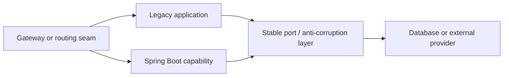

# Legacy To Spring Boot Modernization

Migration to Spring Boot is not successful merely because an executable JAR starts.
The program should reduce delivery risk, unsupported technology, operational toil,
and recovery time while preserving valuable business behavior. Framework conversion,
architecture change, database redesign, and cloud migration should not be combined
without evidence that the organization can absorb their compounded risk.

## Avoid The Rewrite Reflex

Big-bang rewrites commonly underestimate undocumented rules, long-tail integrations,
data quality, operational workarounds, and the time during which old and new products
diverge. A rewrite can be justified when the current platform is unmaintainable or
cannot satisfy strategic constraints, but it still needs incremental validation
and a migration seam.

Begin with the business outcomes:

- remove unsupported Java, framework, or application-server risk;
- shorten release lead time and improve deployment frequency;
- improve security, observability, scaling, and recovery;
- reduce licensing or infrastructure cost;
- enable a product capability blocked by the current design;
- retire obsolete functionality and simplify ownership.

## Build A Current-State Portfolio

Inventory:

- Java, Spring, Java EE/Jakarta EE, build, and library versions;
- application server, JNDI, server-managed transaction, shared library, and WAR assumptions;
- modules, cycles, runtime calls, batch jobs, schedulers, and file exchange;
- database schemas, procedures, triggers, reports, data volume, and ownership;
- SOAP, JMS, REST, LDAP, identity, payment, and partner integrations;
- authentication, authorization, secrets, certificates, PII, and audit obligations;
- deployment steps, configuration sources, environments, and rollback process;
- test coverage, production baselines, incident history, and support workarounds;
- users, business criticality, seasonality, RTO/RPO, and compliance deadlines;
- team knowledge, vendor dependencies, licenses, and operating cost.

Use runtime evidence and interviews with support and business experts; source code
does not reveal every operational or contractual behavior.

## Classify Each Capability

| Classification | Meaning | Example |
|---|---|---|
| retain | delivers value safely with little change | stable tax calculation library behind a port |
| refactor | valuable behavior with harmful structure | order module with tangled persistence access |
| replace | capability is better met by a supported product or implementation | obsolete custom identity provider |
| retire | no verified user or regulatory need remains | unused report and its nightly batch |
| rehost | move runtime with minimal code change as a temporary risk reduction | supported WAR moved off expiring hardware |

Verify usage before retirement. Rehost can buy time but does not remove code or
application-server coupling; record it as an interim state with an expiry.

## Establish Safety Nets

### Characterization tests

Capture what the system actually does for critical journeys, including behavior
that documentation does not describe. Characterization is not approval of every
quirk; it distinguishes behavior to preserve from defects to change deliberately.

Use:

- domain-level examples and approval tests for complex calculations;
- integration tests around database and external contracts;
- HTTP/SOAP/message contract tests with real serialization;
- critical-journey tests for login, order, payment, cancellation, and reporting;
- data snapshots and reconciliation queries;
- performance, capacity, security, availability, and recovery baselines.

Prioritize business risk rather than chasing a coverage percentage. Add observability
to legacy paths so parallel results and cutover behavior can be compared.

### Operational safety

Create reproducible builds, artifact storage, dependency and secret scanning,
database backups, restore evidence, deployment automation where feasible, and a
known rollback process before broad refactoring.

## Define The Target And Intermediate Architectures

Decide:

- supported Java and Spring Boot line;
- modular monolith or independently deployed services;
- servlet/MVC or reactive execution based on workload evidence;
- persistence approach and transaction boundaries;
- authentication, authorization, service identity, and secret management;
- configuration, observability, packaging, and deployment platform;
- API/event strategy and compatibility window;
- data ownership and migration sequence;
- test, release, support, and retirement model.

Prefer the simplest target that achieves the outcomes. Spring Boot does not require
microservices. A modular Spring Boot application can remove server coupling and
improve delivery while retaining low operational complexity.



Document intermediate states. Most migration risk occurs while two models coexist,
not in the clean final diagram.

## Sequence Platform And Java Change

Do not leap across multiple incompatible Java, framework, build, and dependency
generations blindly. For each supported step:

1. make the build reproducible and remove unused dependencies;
2. run characterization and integration tests on the current baseline;
3. upgrade in bounded increments supported by the chosen Spring Boot line;
4. replace removed JDK APIs and incompatible libraries;
5. address namespace and container changes explicitly where relevant;
6. verify startup, behavior, performance, memory, TLS, serialization, and time zones;
7. scan dependencies and container images;
8. deploy through a controlled cohort before the next major step.

Use official migration notes and supported dependency management for the exact
versions selected. Do not override managed libraries casually; test compatibility
when an exception is necessary.

## Remove Application-Server Coupling

| Legacy dependency | Spring Boot direction | Migration concern |
|---|---|---|
| server-managed WAR | executable JAR/container with embedded server | ports, context path, TLS, headers, graceful shutdown |
| JNDI datasource | externalized datasource properties and managed pool | credentials, pool sizing, validation, failover |
| server transaction manager | explicit Spring transaction boundaries | propagation, XA assumptions, rollback behavior |
| shared server libraries | build-managed versioned dependencies | classloading changes and duplicated APIs |
| XML bean graph | Java configuration and constructor injection | bean names, order, conditions, cycles |
| container authentication | Spring Security/resource server or approved identity integration | session, token, authority, logout, CSRF/CORS |
| manual environment files | validated configuration properties and secret manager | precedence, rotation, missing values |
| proprietary scheduler/JMS | supported scheduler or messaging adapter | delivery, ordering, duplicate work, failover |

Wrap legacy infrastructure behind application-owned ports before replacing it:

```java
public interface PaymentGateway {
    PaymentResult authorize(PaymentCommand command);
}
```

The legacy SOAP/JMS adapter and new HTTP/event adapter can implement the same
business-facing port while contract and reconciliation tests compare behavior.
Do not leak provider-generated types into the domain.

## Modernize Configuration And Secrets

Use typed, validated configuration with safe defaults only where absence is valid.
Keep environment-specific values outside the artifact. Source secrets from an
approved secret manager, use short-lived credentials where possible, restrict
access, audit reads and changes, rotate during mixed-version operation, and prevent
values from appearing in logs or Actuator output.

Configuration evolution needs compatibility just like APIs. Old and new versions
must understand values during rollout; remove old keys only after adoption evidence.

## Preserve Transaction And Data Correctness

Initially avoid combining framework migration with a broad database redesign.
Map transaction boundaries, stored-procedure behavior, isolation, locks, generated
identifiers, triggers, and batch interactions.

Use Flyway or Liquibase for versioned changes and the expand-transition-contract
pattern. Backfills must be resumable and rate limited. Define one source of truth,
reconcile old and new representations, and protect against duplicate commands.

If decomposing into services, replace implicit cross-table transactions with
explicit local transactions, durable messages/outbox, idempotency, saga state,
compensation, and repair. `@Transactional` does not create a cross-service rollback.

## Migrate Security Deliberately

Inventory every path and role before changing the security model. Preserve or
deliberately change authentication, authorization, session/token lifetime, service
identity, method security, CSRF/CORS, password handling, audit, and error semantics.

Test positive and negative access, tenant boundaries, expired/revoked credentials,
key rotation, clock skew, and privilege changes. A successful login test does not
prove authorization equivalence.

## Introduce Operations As A Product Capability

A meaningful modernization adds:

- structured logs with correlation and PII controls;
- RED/user metrics, pool/queue saturation, JVM, database, and dependency metrics;
- distributed traces across supported boundaries;
- startup, readiness, liveness, and graceful shutdown;
- dashboards, SLOs, burn-rate alerts, runbooks, and ownership;
- dependency scanning, SBOM/provenance, image policy, and patch process;
- container requests/limits, capacity tests, and autoscaling guardrails;
- backup, restore, DR, incident, and rollback exercises.

Do not expose sensitive Actuator endpoints publicly. Health must reflect the user
contract and avoid restart cascades.

## Choose An Incremental Migration Route

### In-place modernization

Use when modules are separable and the application can move through supported
states. Typical sequence: build and tests, Java/dependency upgrade, Boot bootstrap,
server decoupling, configuration/security, observability, packaging, automation,
then internal modularization.

### Strangler migration

Use when capabilities can be routed independently or replacement must coexist for
an extended period. Build new functionality in Spring Boot, extract one existing
capability at a time, and retire legacy routes and data after cutover evidence.

### Parallel run and shadow validation

Mirror safe inputs or replay sanitized production cases without causing duplicate
external effects. Compare normalized outputs, performance, and decisions. For
payments or commands, shadow only read/calculation paths unless the provider offers
a safe sandbox or idempotent duplicate protection.

## Cutover And Retirement

For each wave define:

- users/traffic and capability in scope;
- prerequisite schema, contract, security, and capacity evidence;
- feature/routing control and canary stages;
- business and technical health gates;
- data comparison and acceptable variance;
- support communication and incident owner;
- rollback, roll-forward, compensation, and reconciliation;
- old job, route, table, server, license, and access retirement date.

Leaving the old system indefinitely doubles cost and ambiguity. Retirement is a
deliverable with usage telemetry and compliance-aware data retention.

## Success Measures

- release frequency, lead time, and manual deployment steps;
- change-failure rate, incident recurrence, and mean time to restore;
- critical-journey correctness and performance;
- unsupported/high-risk dependencies and vulnerability remediation time;
- build/startup duration and developer onboarding time;
- infrastructure, licensing, support, and cost per transaction;
- legacy routes, jobs, tables, servers, and knowledge risks retired;
- SLO, RTO/RPO, restore, and operational ownership evidence.

## Interview-Ready Answer

> I treat migration to Spring Boot as business and operational modernization, not
> an annotation conversion. I inventory business-critical journeys, dependencies,
> data, integrations, server coupling, security, operations, incidents, and team
> knowledge, then classify capabilities to retain, refactor, replace, retire, or
> temporarily rehost.
>
> Before changing behavior I establish characterization, contract, integration,
> critical-journey, data-reconciliation, and production baselines. I define the
> simplest target and every intermediate state—often a modular Boot application
> before microservices. I incrementally remove JNDI, server transactions, shared
> libraries, XML configuration, container authentication, and manual deployment,
> while modernizing configuration, security, data migrations, observability, and
> CI/CD.
>
> Depending on coupling, I use in-place steps or a Strangler seam, with shadow or
> parallel validation, compatible schemas and contracts, canary routing, and explicit
> rollback, roll-forward, reconciliation, and legacy retirement. Success is improved
> delivery, reliability, security, recovery, maintainability, and cost—not merely
> that the application runs on Spring Boot.

## Related Guides

- [Spring Boot 4 And Framework 7](../spring/SPRING-BOOT-4-FRAMEWORK-7.md)
- [Spring Boot Internals](../development/SPRING-BOOT-INTERNALS.md)
- [Database Migrations And Operations](../data/database-selection/DATABASE-MIGRATIONS-OPERATIONS.md)
- [Zero-Downtime Delivery](./ZERO-DOWNTIME-DELIVERY.md)
- [Monolith To Microservices Strategy](./MONOLITH-TO-MICROSERVICES-STRATEGY.md)

## Official References

- [Spring Boot reference](https://docs.spring.io/spring-boot/reference/)
- [Spring Boot system requirements](https://docs.spring.io/spring-boot/system-requirements.html)
- [Spring Boot migration guides](https://github.com/spring-projects/spring-boot/wiki#release-notes)
- [Spring Security reference](https://docs.spring.io/spring-security/reference/)
- [Liquibase documentation](https://docs.liquibase.com/)

