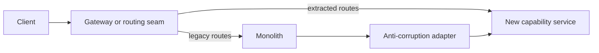
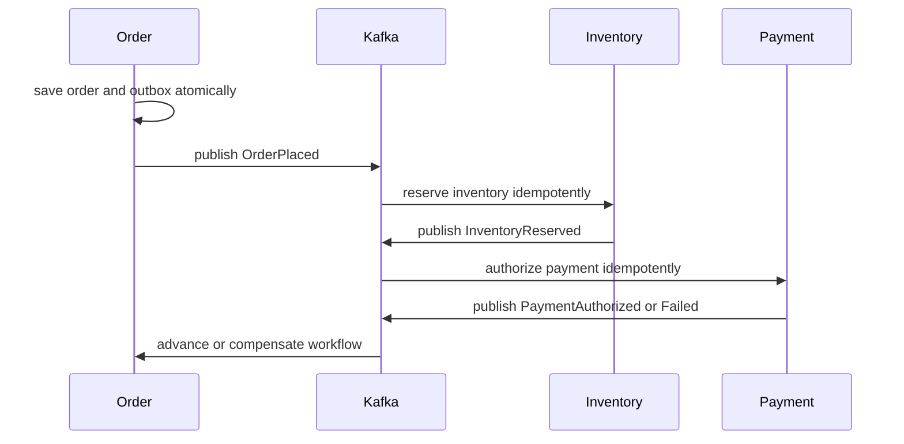

# Monolith To Microservices Strategy

Splitting a monolith is an organizational and data migration, not a package-moving
exercise. Microservices can improve independent ownership, release cadence,
scaling, and fault isolation. They also add network latency, partial failure,
distributed consistency, contract evolution, platform cost, and harder diagnosis.

## Start With The Reason

Do not decompose merely because the codebase is large. Establish the constraint
that a new boundary is expected to remove.

| Evidence | Possible implication | Evidence required after change |
|---|---|---|
| teams regularly block one release train | independent deployability may help | reduced lead time and coordination delay |
| one capability dominates resource demand | independent scaling may help | lower unit cost without downstream saturation |
| incidents in reporting stop checkout | failure isolation may help | checkout SLO survives reporting failure |
| one regulated domain needs stricter controls | isolated ownership may help | auditable access and deployment boundary |
| code is tangled but operations are simple | modularization may be enough | dependency reduction and faster safe change |

<DocCallout type="production" title="Service count is not a success metric">

A distributed monolith has multiple deployables but retains shared release
coordination, shared data, chatty calls, and cascading failure. It costs more to
operate without creating meaningful independence.

</DocCallout>

## Assess The Current System

Build a fact base before drawing target services:

- business capabilities, critical journeys, domain language, and invariants;
- compile-time dependencies and runtime call graphs;
- database tables, foreign keys, stored procedures, reporting queries, and data owners;
- modules that change together and modules with different change frequency;
- release cadence, rollback coupling, incident history, latency, and saturation;
- authentication, authorization, PII, audit, and compliance flows;
- scheduled jobs, message flows, file transfers, and external integrations;
- teams, cognitive load, support rotations, and decision ownership;
- capacity profile, seasonal load, availability targets, RTO, RPO, and cost.

Static dependency analysis finds direct coupling; traces reveal runtime coupling;
version-control history reveals temporal coupling; domain workshops reveal semantic
coupling. None is sufficient alone.

## Define Boundaries Around Business Capabilities

A bounded context owns a coherent model and language. A service boundary should
normally align business responsibility, data authority, deployment, and operational
ownership.

```text
Good capability candidates
  Customer Identity
  Catalog
  Order Management
  Inventory
  Payment
  Fulfilment
  Notification

Poor technical-layer split
  Controller Service
  Validation Service
  Repository Service
  Utility Service
```

Evaluate a candidate boundary with these questions:

1. Which business decisions and invariants belong here?
2. Which data is authoritative, and who may write it?
3. Can the capability deploy without synchronized changes elsewhere?
4. Can its team operate and support it independently?
5. What consistency is required across the proposed boundary?
6. What happens when either side is slow, unavailable, or duplicated?
7. Does the boundary reduce cognitive load or create chatty orchestration?

Use context mapping to record upstream/downstream relationships, shared kernels,
conformist dependencies, anti-corruption layers, and published language. A noun
such as `Customer` may legitimately have different models in Identity, Orders,
and Support.

## Create A Modular Monolith Before Network Boundaries

When responsibilities are tangled, enforce them inside the process first:

```text
io.shopverse.commerce
  order
    api
    application
    domain
    infrastructure
  inventory
  payment
  fulfilment
```

Modules communicate through published interfaces or domain events, not internal
repositories and entities. Architecture tests or Spring Modulith verification can
detect forbidden dependencies. This stage reveals whether the proposed boundary
is stable without yet paying distributed-systems cost.

Retain the modular monolith when it meets the business goal. Extraction is an
option, not an automatic final step.

## Select The First Extraction

Score candidates across value, coupling, risk, and learnability.

| Favor an early candidate | Delay the candidate |
|---|---|
| clear capability and owner | central transaction spans most of the monolith |
| limited data entanglement | unclear data authority or business rules |
| measurable scaling or release pain | many synchronous bidirectional calls |
| narrow stable contract | public contract is changing rapidly |
| useful platform learning | failure would threaten the entire business |

Notification, document generation, search indexing, reporting, and media
processing are common early candidates, but the actual evidence decides. A trivial
service proves deployment plumbing; it may not prove the hardest data or workflow
assumptions.

## Apply The Strangler Fig Pattern



For each extraction:

1. establish a seam at an API, event, module, job, or data boundary;
2. define a versioned contract and ownership;
3. implement the new capability behind a feature or routing control;
4. migrate or replicate required data with a named source of truth;
5. validate with shadow reads, parallel calculations, or bounded traffic;
6. move writes only after idempotency and reconciliation are proven;
7. increase traffic using business and technical health gates;
8. remove the legacy path, temporary synchronization, and unused data only after the compatibility window.

Avoid indefinite dual writes from application code. They create an unatomic gap
and ambiguous authority. Prefer one authoritative write plus an outbox/CDC feed,
or a temporary migration mechanism with reconciliation and an expiry owner.

## Establish Data Ownership

The service owns its schema and write decisions. Other services use an API,
event, or owned read model instead of directly querying its tables.

| Need | Integration choice | Trade-off |
|---|---|---|
| current answer required to continue | synchronous API | runtime coupling and timeout budget |
| durable business fact for many consumers | event | eventual consistency and schema governance |
| cross-domain query | API composition or materialized view | latency or freshness trade-off |
| multi-step state change | saga | compensation and workflow visibility |

For database decomposition, identify table ownership, foreign-key crossings,
transaction boundaries, generated identifiers, reporting access, and retention.
Move one authority at a time. Use versioned migrations, backfill checkpoints,
checksums or business reconciliation, cutover criteria, and a roll-forward plan.

## Replace Distributed Transactions With Explicit Workflow



The design must define:

- local transaction boundaries;
- command and event identity;
- transactional outbox publication;
- consumer inbox or uniqueness-based deduplication;
- ordering and concurrency rules per aggregate;
- retry classification and bounded backoff;
- compensation when a committed effect must be reversed;
- terminal failure, operator repair, and reconciliation;
- user-visible states such as pending, confirmed, rejected, or delayed.

“Exactly once” transport wording does not remove the need for idempotent business
effects. Crashes can occur between every durable step and acknowledgment.

## Build Platform Capabilities Before Service Proliferation

Require a paved path for:

- reproducible builds, dependency scanning, artifact provenance, and CI/CD;
- service identity, secrets, authorization, and network policy;
- contract testing and compatible API/event evolution;
- centralized logs, metrics, traces, correlation, dashboards, and alerts;
- timeouts, retry budgets, circuit breakers, bulkheads, and rate limiting;
- discovery, configuration, ingress, certificates, and DNS;
- health probes, graceful shutdown, autoscaling, and resource limits;
- backups, restores, failover, incident response, and runbooks;
- service catalog, ownership, on-call routing, and lifecycle standards.

Every new service consumes platform and human capacity. Include cognitive load,
on-call burden, cloud cost, data operations, and compliance evidence in the business
case.

## Migration Governance

Use an extraction charter containing:

- problem statement and baseline;
- target capability and excluded scope;
- domain, data, contract, security, and operational owners;
- dependencies and compatibility window;
- hypotheses and validation experiments;
- rollout stages and health gates;
- rollback or roll-forward decision tree;
- reconciliation and customer-support plan;
- legacy deletion criteria and date;
- success metrics and reassessment trigger.

Architecture governance should review high-cost, irreversible choices. Teams should
own ordinary implementation decisions inside agreed boundaries.

## Shopverse Application

Shopverse already represents capabilities as services, so use it as a study model,
not proof that every production hardening control is implemented. A decomposition
exercise can begin from a hypothetical commerce monolith and test boundaries for
Order, Inventory, Payment, User/Auth, Gateway, and platform services.

The hardest seam is checkout because it crosses order acceptance, inventory
reservation, payment authorization, and customer communication. Extracting
notification first can prove delivery plumbing; extracting checkout requires a
queryable saga, outbox, idempotency, compensation, and reconciliation. That
difference belongs in the migration risk model.

## Success Measures

Measure outcomes before and after each extraction:

- deployment frequency and lead time by capability;
- percentage of releases requiring coordinated deployment;
- change-failure rate and mean time to restore;
- availability, p95/p99 latency, saturation, and error rate;
- escaped contract or consistency defects;
- service operating cost and on-call load;
- team ownership clarity and time waiting on other teams;
- volume of legacy code, routes, tables, and synchronization retired.

If delivery slows, incidents rise, and ownership remains shared, stop creating
services and correct the boundaries or platform.

## Interview-Ready Answer

> I would first confirm which business or delivery constraint decomposition must
> solve and whether a modular monolith can solve it at lower cost. I would map
> business capabilities, runtime and data dependencies, change coupling, incidents,
> scaling needs, compliance, and team ownership. Boundaries would follow coherent
> business capabilities with explicit data authority, not technical layers.
>
> I would modularize first, select a valuable low-to-moderate-risk seam, and use
> Strangler migration rather than a rewrite. Each extracted service would own its
> data and contract. Cross-service workflows would use explicit local transactions,
> outbox, idempotent consumers, sagas, compensation, and reconciliation where
> eventual consistency is acceptable.
>
> Before increasing service count, I would provide CI/CD, security, contract
> governance, observability, resilience, health, recovery, and clear operational
> ownership. Each rollout would have compatibility, canary evidence, rollback or
> roll-forward, and legacy retirement criteria. I would judge success by delivery
> independence, reliability, recovery, cost, and team outcomes rather than the
> number of services.

## Related Guides

- [Service Boundaries And Ownership](../architecture/microservices/SERVICE-BOUNDARIES-OWNERSHIP.md)
- [Microservices Patterns](../architecture/MICROSERVICES-PATTERNS.md)
- [Saga Consistency And Compensation](../reliability/SAGA-CONSISTENCY-COMPENSATION.md)
- [Outbox Delivery And Operations](../reliability/OUTBOX-DELIVERY-OPERATIONS.md)
- [API And Event Compatibility](../architecture/API-EVENT-COMPATIBILITY.md)

## Official References

- [AWS Prescriptive Guidance for decomposing monoliths](https://docs.aws.amazon.com/prescriptive-guidance/latest/modernization-decomposing-monoliths/)
- [Spring Modulith reference](https://docs.spring.io/spring-modulith/reference/)

## Recommended Next

Continue with [Engineering Leadership Practices](./ENGINEERING-LEADERSHIP-PRACTICES.md)
to establish the review, coaching, and ownership system needed to sustain the migration.
