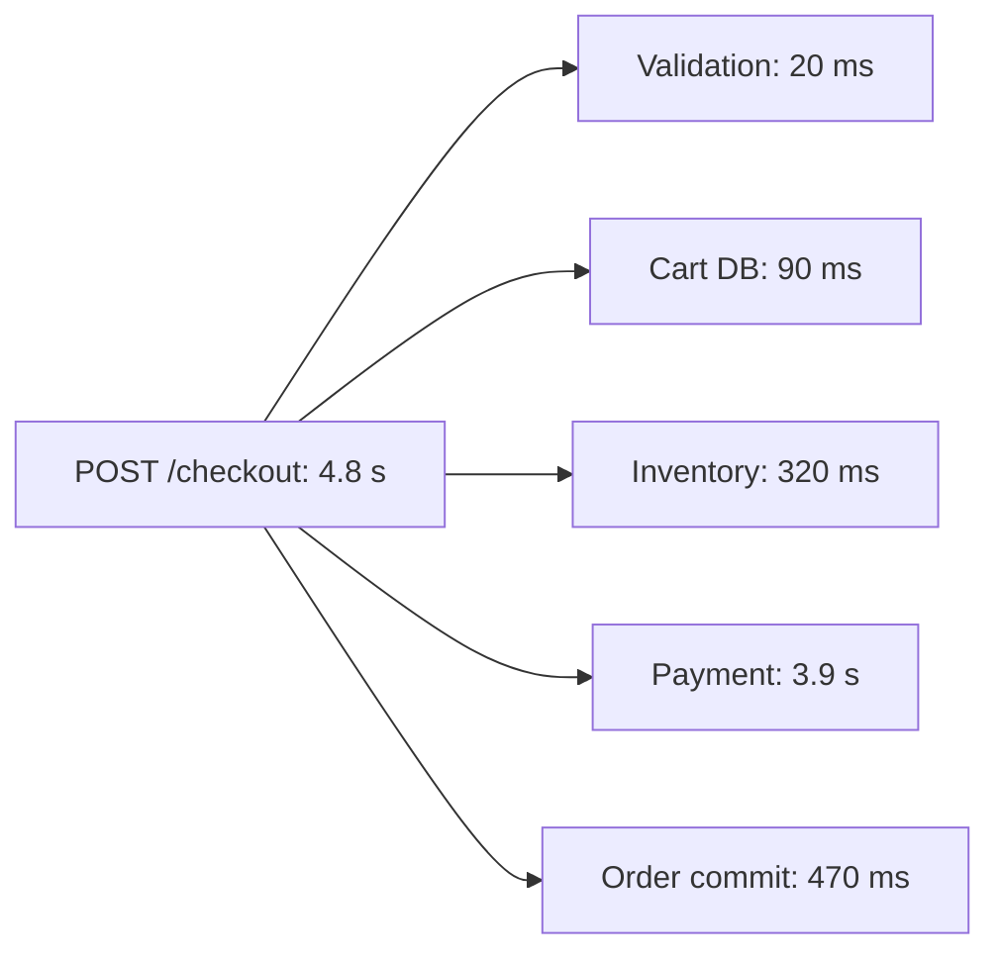
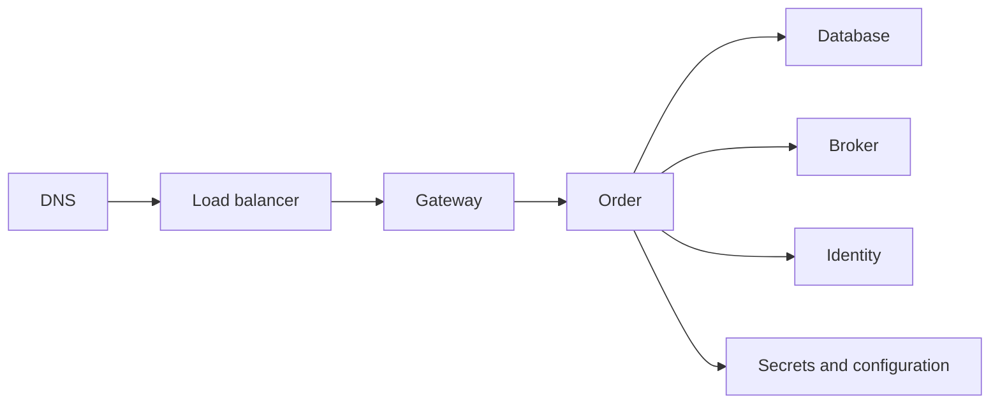

# Production Performance And Availability

Performance and availability are user outcomes, not infrastructure properties.
A service can have healthy CPUs while checkout is unusable, or multiple replicas
that all depend on one failing database. The architect defines the target and
failure model; the incident lead coordinates evidence, stabilization, correction,
and learning.

## Part I: Improve A Slow Production System

### Define “slow” precisely

Name the user journey, population, time window, and SLO:

```text
Symptom: checkout confirmation is delayed for Indian mobile users
Current: p95 4.8 s, p99 11.2 s, timeout rate 3.4%
Target: p95 < 1.5 s and successful checkout > 99.9%
Scope: started after 14:10 deployment; cart browsing is unaffected
```

Use p50, p95, p99, distribution, throughput, errors, queue time, and saturation.
An average can hide a severely affected minority. Segment by endpoint, tenant,
region, payload size, dataset cardinality, version, instance, and dependency.

### Stabilize active customer impact

Establish an incident commander and one coordinated change log. Choose the smallest
safe mitigation:

- roll back or stop a recent rollout;
- disable an expensive path through a feature flag;
- shed optional work or return a degraded response;
- reduce background concurrency competing for a scarce resource;
- rate limit, queue, or reject excess work before collapse;
- route around a failing dependency or region;
- scale a proven stateless bottleneck temporarily;
- serve safe cached or stale data where the business contract permits it.

Temporary scaling is harmful if the fixed constraint is a database, downstream
quota, or connection budget. Record mitigation risk and an expiry owner.

### Build a timeline and rank hypotheses

Correlate the first bad interval with:

- application, schema, configuration, feature-flag, and infrastructure changes;
- traffic volume, request mix, payload, tenant, and data-growth shifts;
- scheduled jobs, backups, reindexing, compaction, or certificate rotation;
- dependency incidents, DNS/network changes, throttling, and quota;
- cache hit ratio, autoscaling activity, pod restarts, and failover;
- JVM, database, broker, host, and container saturation.

Do not assume temporal correlation proves causation. Rank hypotheses by explanatory
power, likelihood, blast radius, and the speed and safety of discriminating evidence.

### Follow the latency budget



A trace identifies where time is observed, not automatically why. Correlate the
slow span with pool acquisition, queue age, retries, connection setup, locks,
downstream server time, and resource metrics.

### Inspect every ownership layer

| Layer | Failure signals | Discriminating evidence |
|---|---|---|
| edge/network | handshake, DNS, packet loss, load-balancer imbalance | edge timing, network telemetry, instance distribution |
| application | lock contention, blocking, algorithm, serialization | profile, flame graph, thread state, allocation rate |
| JVM | GC pause, heap pressure, native memory, thread explosion | GC logs, JFR, heap/native metrics, thread dump |
| executor | full active set, growing queue, rejection | active/queued/age, task duration, downstream wait |
| database pool | pending acquisition, leaked/long transactions | Hikari metrics, transaction and connection spans |
| database | slow plan, N+1, locks, I/O, bloat | query plan, statement stats, lock graph, buffer/I/O metrics |
| HTTP dependency | timeout, retry amplification, exhausted client pool | per-attempt trace, pool metrics, deadline and status |
| Kafka | lag, rebalance, hot partition, slow handler | partition lag, processing time, rebalance and broker metrics |
| cache | low hit ratio, stampede, hot key, eviction | hit/miss/eviction, key cardinality, loader concurrency |
| container/node | CPU throttle, OOM, disk/network saturation | cgroup and node metrics, requests/limits, scheduling events |

### Common Spring And JVM traps

- database calls or remote calls inside loops;
- lazy-loading/N+1 during JSON serialization;
- unbounded results or missing pagination;
- blocking work on reactive event-loop threads;
- oversized executors that overwhelm HikariCP or downstream pools;
- `REQUIRES_NEW` work requiring a second connection per concurrent request;
- absent connect, read, acquisition, and total deadlines;
- retry policies that exceed caller deadlines or repeat unsafe effects;
- synchronous logging or high-cardinality metrics on the hot path;
- large payload serialization, compression, or object allocation;
- cache stampede and synchronized refresh;
- container CPU throttling that inflates tail latency;
- GC tuning attempted before allocation and live-set evidence.

Collect thread dumps over time, not only one snapshot. Protect heap dumps and
profiles because they can contain credentials and customer data.

### Correct the dominant constraint

Choose one bounded correction with a testable causal model:

- rewrite a query, add a selective index, or remove N+1 access;
- batch or coalesce calls and bound request size;
- reduce lock scope or transaction duration;
- introduce safe caching with freshness and invalidation policy;
- move optional work asynchronously while exposing pending state;
- configure pooled connections and end-to-end deadline budgets;
- bound concurrency and queues at the scarce resource;
- partition a hot key or isolate workloads through bulkheads;
- improve the algorithm or data structure;
- scale only the resource demonstrated to be horizontally scalable.

Changing many layers at once destroys attribution and increases rollback risk.

### Validate safely

1. reproduce the failure shape with production-like data and traffic;
2. preserve a baseline and test the expected causal signal;
3. exercise normal, peak, spike, soak, dependency-slow, and N-1 capacity states;
4. canary the correction and compare equivalent cohorts;
5. monitor user SLI, p95/p99, errors, saturation, resource waits, and business success;
6. define automatic abort and rollback or roll-forward;
7. verify no correctness, security, or cost regression;
8. complete a post-incident review and track preventive actions.

Prevent recurrence with SLOs, burn-rate alerts, capacity forecasts, query-plan and
performance regression checks, workload budgets, runbooks, and game days.

## Part II: Design For High Availability

### Begin with business targets

Availability is the proportion of eligible user interactions that meet the service
contract. Time-based figures are useful but can hide partial failure.

| Target | Approximate annual unavailability |
|---:|---:|
| 99% | 3.65 days |
| 99.9% | 8.76 hours |
| 99.95% | 4.38 hours |
| 99.99% | 52.6 minutes |

Also define:

- SLI eligibility and success semantics;
- latency, correctness, freshness, and durability objectives;
- RTO: maximum acceptable time to restore capability;
- RPO: maximum acceptable data-loss interval;
- degraded-mode requirements and customer communication;
- regional, residency, maintenance, support, and cost constraints.

Do not give every component the same target. Derive dependency objectives from the
critical user journey and its error budget.

### Model failure domains and single points of failure



For each node ask:

1. Can one failure remove the required capability?
2. Is state replicated, durable, and recoverable?
3. Can routing detect failure and move safely?
4. Can a replacement take ownership without split-brain?
5. Is capacity sufficient during failure and maintenance?
6. Has detection, failover, recovery, and return-to-normal been tested?

Two replicas on one node, zone, database, credential, or network path do not remove
that shared failure domain.

### Design redundancy at each layer

| Layer | Availability design | Important caveat |
|---|---|---|
| stateless application | multiple replicas, health routing, topology spread | shared downstream can still fail all replicas |
| gateway/load balancer | redundant managed control and data plane | configuration errors can be correlated |
| PostgreSQL | standby, monitored replication, promotion, fencing | replication is not backup; sync affects latency/availability |
| Kafka | multiple brokers, replicated partitions, quorum | wrong replication/ack settings weaken durability |
| cache | replica/cluster and failure-aware client | cache may not be authoritative or warm after failover |
| secrets/config | redundant service and bounded bootstrap strategy | stale or unavailable credentials can halt recovery |
| region | warm standby or active-active where justified | data conflicts, routing, cost, and operational complexity |

Backups protect against deletion, corruption, and operator error. Replication
primarily supports availability and sometimes reads. Test point-in-time restore and
application-level reconciliation; a successful backup job is not proof of recovery.

### Design the application for partial failure

- set connect, acquisition, read, and end-to-end deadlines;
- retry only transient, idempotent units with exponential backoff, jitter, and budget;
- use circuit breakers to stop repeated calls after failure is evident;
- isolate scarce resources and dependencies through bulkheads;
- bound queues and reject or shed load before resource collapse;
- make commands and message effects idempotent;
- degrade optional recommendations, search, notification, and reporting;
- expose pending or read-only state when the business contract permits it;
- reconcile ambiguous outcomes rather than pretending they never occur.

Retries are additional load. A breaker reacts after failures; it does not replace
capacity, deadlines, admission control, or safe fallback.

### Keep state and work ownership explicit

Avoid required session state only in an application instance. Use signed tokens or
a suitably available session store where the threat model permits. For scheduled
and asynchronous work, define leases, partition ownership, acknowledgments,
idempotency, and crash recovery. Scaling replicas otherwise duplicates jobs.

### Choose regional posture deliberately

| Model | Benefit | Cost and risk |
|---|---|---|
| backup and restore | lowest steady-state cost | longest RTO and manual complexity |
| pilot light | core data/services remain ready | scale-up and dependency ordering |
| warm standby | faster controlled failover | drift and unused capacity risk |
| active-passive | one clear writer/serving region | failover delay and standby confidence |
| active-active | regional resilience and latency | consistency, conflict, routing, and high cost |

Active-active is not inherently superior. If one global database remains a single
dependency, the application topology overstates resilience. Define consistency,
conflict resolution, home-region routing, failback, and data reconciliation.

### Prove availability

Test under controlled blast radius:

- process, node, zone, dependency, broker, and database failure;
- network latency, packet loss, DNS, certificate, and credential failure;
- primary promotion and old-primary fencing;
- backup restoration and point-in-time recovery;
- loss of a region and dependency-order recovery;
- peak load during deployment, failover, backup, and broker rebalance;
- graceful degradation and return to full service;
- alert delivery, incident roles, runbook accuracy, and support communication.

Measure actual detection time, user impact, RTO, RPO, degraded capacity, data
reconciliation, and error-budget consumption. Architecture diagrams are hypotheses
until these exercises pass.

## Shopverse Reliability Walkthrough

For checkout, trace Gateway, Auth/User, Order, Inventory, Payment, Kafka, each
database, secrets/configuration, DNS, and observability. Classify payment and
inventory as critical to final confirmation; notification and analytics can often
degrade asynchronously. Define what “accepted,” “pending,” and “confirmed” mean.

Shopverse documentation describes both current study implementation and production
hardening. Treat multi-zone databases, automated failover, regional recovery, and
chaos results as target capabilities unless implementation evidence explicitly
marks them complete.

## Interview-Ready Answers

### How do you improve a slow production system?

> I define the affected user journey and quantify latency distribution, throughput,
> errors, and saturation. During active impact I establish incident ownership and
> apply the smallest safe mitigation, such as rollback, feature disablement, load
> shedding, or bounded scaling. I correlate the start with changes and use traces,
> profiles, pool metrics, thread dumps, query plans, and infrastructure evidence to
> find the dominant wait or saturated resource.
>
> I change one high-impact constraint at a time and validate its causal effect with
> production-shaped load, failure states, and a canary with automatic abort. I then
> add SLOs, alerts, capacity and performance regression checks, runbooks, and owned
> post-incident actions. I avoid guessing and do not scale the application when the
> fixed bottleneck is downstream.

### How do you design for high availability?

> I begin with user-centered availability, latency and durability targets plus RTO,
> RPO, degraded behavior, and cost. I trace every critical journey to identify
> shared failure domains and remove justified single points through replicated
> stateless instances, health routing, topology spread, durable brokers, database
> replication and fencing, backups, and tested restore.
>
> Applications assume partial failure: bounded deadlines, controlled idempotent
> retries, bulkheads, circuit breakers, load shedding, graceful degradation, and
> reconciliation. I choose active-passive or active-active regional posture from
> business recovery and data consistency needs rather than fashion. Finally I prove
> the design with failover, restore, zone/region, capacity, and dependency game days,
> measuring actual user impact, RTO, RPO, and recovery.

## Related Guides

- [Production Incident Diagnosis Lab](../spring/architect-labs/PRODUCTION-INCIDENT-DIAGNOSIS.md)
- [Performance, Capacity, And FinOps](../operations/PERFORMANCE-CAPACITY-FINOPS.md)
- [High Availability And SPOF Prevention](../reliability/HIGH-AVAILABILITY-SPOF.md)
- [SRE, Disaster Recovery, And Chaos Engineering](../operations/SRE-DR-CHAOS.md)
- [Resource Pool And Concurrency Capacity](../spring/production/RESOURCE-POOL-CONCURRENCY-CAPACITY.md)

## Official References

- [Google SRE: Monitoring Distributed Systems](https://sre.google/sre-book/monitoring-distributed-systems/)
- [Google SRE: Availability Table](https://sre.google/sre-book/availability-table/)
- [PostgreSQL High Availability](https://www.postgresql.org/docs/current/high-availability.html)
- [Kubernetes Disruptions](https://kubernetes.io/docs/concepts/workloads/pods/disruptions/)

