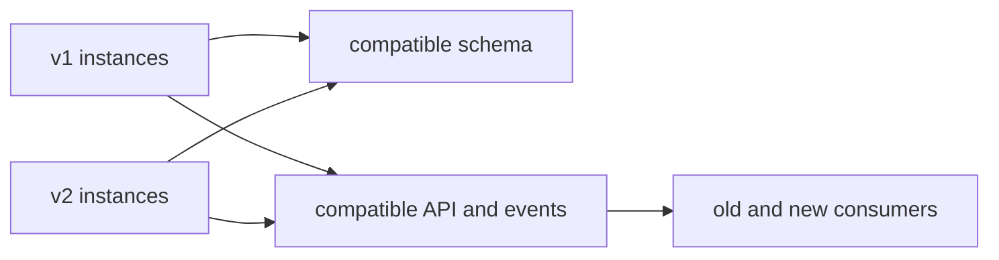
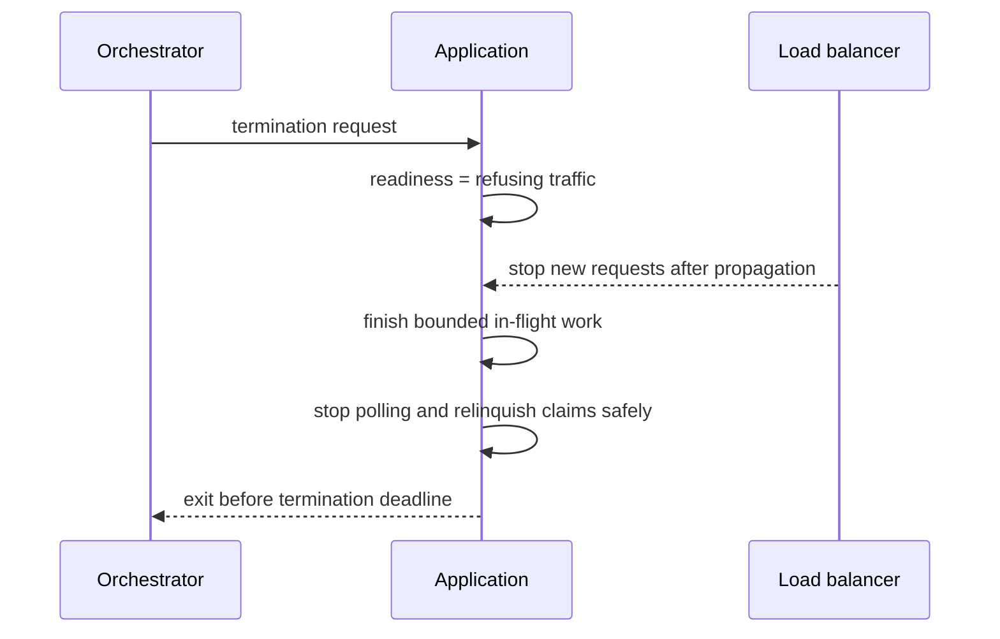

# Zero-Downtime Delivery

Zero downtime means eligible users continue receiving the agreed service while a
version changes. It does not mean every feature is always available or that a
deployment can never fail. It requires explicit SLOs, compatible transition states,
health-based traffic control, and recovery when the new version is unsafe.

## The Mixed-Version Invariant

During a deployment, old and new binaries, clients, schemas, events, cache entries,
and background workers can coexist. Therefore every transition must answer:

- can the old application use the expanded schema?
- can the new application operate before backfill completes?
- can old consumers tolerate events from the new producer?
- can a rolled-back binary understand data written by the new binary?
- can duplicate, reordered, and in-flight work complete safely?
- can configuration and secrets rotate without synchronized restart?



Compatibility is a system property, not only a deployment-controller setting.

## Choose A Deployment Strategy

### Rolling deployment

Instances are replaced gradually:

```text
v1 v1 v1 v1
v2 v1 v1 v1
v2 v2 v1 v1
v2 v2 v2 v1
v2 v2 v2 v2
```

Use when versions can coexist, startup is predictable, capacity supports surge or
temporary unavailability, and risk is moderate. Configure `maxSurge` and
`maxUnavailable` from capacity and SLO evidence. A rolling update exposes users
while replacement continues; automatic health gates must stop a bad rollout.

### Blue-green deployment

Deploy and validate v2 in a separate environment, then switch traffic from blue
to green. It provides fast application traffic reversal and clear isolation but
doubles relevant infrastructure and does not reverse incompatible database or
external side effects. Validate production configuration, data access, network
policy, certificates, and capacity before switching.

### Canary deployment

Send a representative small cohort to v2 and expand only when technical and
business SLIs remain healthy:

```text
Stage 1: internal/synthetic traffic
Stage 2: 1% low-risk cohort
Stage 3: 5%
Stage 4: 25%
Stage 5: 50%
Stage 6: 100%
```

Canary is valuable for high-risk behavior and performance changes. Cohorts must be
comparable; sticky routing may be required for stateful journeys. Low volume can
hide rare failures, so use minimum sample size and time as well as percentages.

| Strategy | Strength | Cost or limitation |
|---|---|---|
| rolling | efficient and native to orchestrators | versions overlap; rollback is gradual |
| blue-green | fast traffic switch and environment isolation | duplicate capacity; shared data remains hard |
| canary | limits blast radius and proves production behavior | routing, statistics, and automation complexity |

Strategies can be combined: deploy a green environment, canary traffic to it, then
complete the switch.

## Health, Startup, And Shutdown

### Separate probe semantics

- **Startup:** allow slow initialization without premature liveness failure.
- **Readiness:** indicate whether the instance should receive new traffic.
- **Liveness:** indicate an internal state that cannot recover without restart.

Do not make liveness depend on a database or remote API; restarting every replica
during a shared dependency outage amplifies failure. Include a dependency in
readiness only when the instance truly cannot honor its traffic contract and the
fleet behavior will not remove all capacity unnecessarily.

For Spring Boot Actuator, liveness and readiness health groups are available at
`/actuator/health/liveness` and `/actuator/health/readiness`. If management runs on
a separate port, consider exposing probe paths on the main server so a healthy
management context does not hide a broken request path.

### Warm before admission

Readiness remains false while configuration is validated, required connections are
established, caches or models reach the minimum useful state, and startup runners
complete. Do not perform unbounded data migrations in every instance startup.

### Drain before termination



HTTP, Kafka consumers, schedulers, and executors need distinct drain behavior.
Processed Kafka records must align with committed offsets; unfinished work must be
retryable. Scheduled leases must expire or transfer. Set the platform termination
grace longer than the application's bounded shutdown phase and observe forced exits.

Spring Boot graceful shutdown permits in-flight requests to complete within
`spring.lifecycle.timeout-per-shutdown-phase`. Test real signal handling and
persistent connections; IDE termination may not represent production behavior.

## Evolve Databases With Expand And Contract

Renaming or dropping a column while v1 still uses it is unsafe. Use multiple
independently deployable phases.

### Phase 1: expand

```sql
ALTER TABLE customer ADD COLUMN full_name VARCHAR(255);
```

Add nullable/default-compatible structures, new indexes using an online-safe
method, and application code that tolerates both forms. Avoid long locks and
table rewrites; test against production-sized data.

### Phase 2: transition

- deploy code capable of reading old and new representation;
- define one authoritative write or carefully bounded dual-write mechanism;
- backfill in resumable, rate-limited batches with checkpoints;
- reconcile counts, checksums, and business invariants;
- switch reads and writes behind controlled configuration;
- observe old-field usage and data drift.

### Phase 3: contract

Only after every old binary, job, query, report, and rollback window has expired:

```sql
ALTER TABLE customer DROP COLUMN name;
```

Destructive cleanup belongs to a later release. Roll-forward is often safer after
new data has been written because an old binary may not understand it.

### Migration safety checklist

- migrations are versioned, repeatable where appropriate, and single-owner;
- DDL lock duration and replication lag are measured;
- backfill has rate, batch, pause, resume, and cancellation controls;
- old and new constraints do not reject each other's writes;
- indexes exist before queries depend on them;
- rollback or roll-forward behavior is tested;
- backups, restore, and business reconciliation are ready.

## Preserve API And Event Compatibility

Prefer additive changes. Add optional fields with explicit defaults; retain field
meaning; tolerate unknown fields; do not narrow accepted values silently. Test old
client/new server and new client/old server.

For events, test stored historical records as well as live messages. Preserve event
semantics, keys, partitioning, ordering, enum behavior, and schema identifiers. A
schema registry can validate structural compatibility but cannot detect changed
business meaning.

When a breaking semantic change is necessary:

1. introduce a new version or event type;
2. deploy tolerant consumers first;
3. publish both forms or translate at a controlled boundary;
4. measure adoption and replay behavior;
5. stop old production;
6. retire old handling only after the support window.

Consumer-driven contracts complement provider tests; they do not replace end-to-end
semantics, authorization, failure, and production validation.

## Separate Deployment From Release

Feature flags allow dormant compatible code to deploy before exposure. Use flags
for cohort, tenant, region, or percentage control, but define:

- owner and business purpose;
- safe default and behavior when flag service is unavailable;
- authorization for changing the flag;
- telemetry for both paths;
- interaction with other flags;
- expiry and cleanup date.

Flags do not make an incompatible schema safe and should not become permanent
branches multiplying the test matrix.

## Automate Rollout Gates

Evaluate both technical and business signals:

- readiness, startup time, restarts, and forced termination;
- request success, p95/p99, saturation, and dependency latency;
- checkout, payment, login, reservation, or other business success;
- database errors, locks, pool waits, replication lag, and migration progress;
- Kafka publish failure, consumer lag, duplicate effect, and workflow age;
- security denials, authorization anomalies, and data reconciliation;
- support contacts and cohort-specific customer impact.

Use a stable baseline and define abort thresholds before deployment. A canary whose
errors are hidden inside the fleet average is not protected.

## Rollback, Roll-Forward, And Reconciliation

Rollback is suitable when application code can revert without losing newly written
meaning. Roll-forward is safer when data, external side effects, or public contracts
have advanced. For every release, classify:

| Failure | Recovery |
|---|---|
| new binary crashes before serving | stop rollout and restore previous replica set |
| latency regression without data change | route away or roll back |
| schema expanded but unused | roll back binary; retain compatible schema |
| new representation already authoritative | fix forward or reintroduce compatible reader |
| partial external payment effect | reconcile and compensate; binary rollback is insufficient |

Recovery exercises must include in-flight work, caches, database state, events,
and jobs—not only container versions.

## Interview-Ready Answer

> I design zero-downtime delivery around mixed-version coexistence. Old and new
> applications, APIs, events, schemas, jobs, and data may overlap, so each transition
> must be backward compatible and have an explicit compatibility window.
>
> I select rolling, blue-green, canary, or a combination based on risk, capacity,
> and reversal needs. Startup and readiness prevent premature traffic; liveness only
> detects unrecoverable process state; graceful shutdown removes admission and drains
> HTTP, messaging, scheduled, and async work within a bound.
>
> Database changes use expand, transition, reconcile, and contract across releases.
> APIs and events evolve additively, and feature activation is separated from code
> deployment. Automated gates compare user and system SLIs, with predefined abort,
> rollback, roll-forward, and compensation paths. I consider the release complete
> only after compatibility code and flags are safely retired.

## Related Guides

- [API And Event Compatibility](../architecture/API-EVENT-COMPATIBILITY.md)
- [Database Migrations And Operations](../data/database-selection/DATABASE-MIGRATIONS-OPERATIONS.md)
- [Kubernetes Workload Engineering](../operations/KUBERNETES-WORKLOAD-ENGINEERING.md)
- [Production Lifecycle](../spring/internals-production/PRODUCTION-LIFECYCLE.md)

## Official References

- [Spring Boot Graceful Shutdown](https://docs.spring.io/spring-boot/reference/web/graceful-shutdown.html)
- [Spring Boot Application Availability](https://docs.spring.io/spring-boot/reference/features/spring-application.html#features.spring-application.application-availability)
- [Spring Boot Kubernetes Probes](https://docs.spring.io/spring-boot/reference/actuator/endpoints.html#actuator.endpoints.kubernetes-probes)
- [Kubernetes Deployments](https://kubernetes.io/docs/concepts/workloads/controllers/deployment/)
- [Kubernetes Probes](https://kubernetes.io/docs/concepts/configuration/liveness-readiness-startup-probes/)

