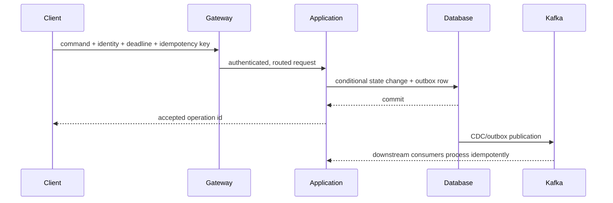

# Architect Runtime Internals And Design Selection

## Question 1: What Happens Internally?

A runtime explanation follows a unit of work across ownership boundaries. Use a request,
message, scheduled job, transaction, or deployment—not a list of components.

## Runtime Trace Template

For every step, name:

1. **Entry:** protocol, payload, identity, deadline, and idempotency key.
2. **Routing:** DNS/load balancer/gateway/partition selection and eligibility.
3. **Admission:** thread/event loop, queue, pool, rate limit, bulkhead, backpressure.
4. **Framework:** filter/interceptor/proxy/container callbacks and transaction boundary.
5. **Business state:** invariant check and state transition.
6. **Persistence:** query/index, lock/MVCC, log/replica, flush/commit/acknowledgement.
7. **Downstream:** remote call or event, serialization, timeout, retry, partial failure.
8. **Completion:** response/offset/commit, observable result, cleanup, cancellation.

Ask at every arrow: what thread owns it, what state is durable, what deadline remains, what
happens if the response is lost, and which metric proves progress?

## Four Internal Views

| View | Questions |
|---|---|
| execution | threads, event loops, queues, callbacks, locks, cancellation |
| data | source of truth, caches, logs, replicas, offsets, schema/version |
| network | name resolution, connection pool, TLS, routing, retry, timeout |
| lifecycle | startup, readiness, configuration, deployment, drain, shutdown, recovery |

A strong answer connects them. For example, a slow database call occupies a connection and
possibly a request thread, grows the caller queue, triggers deadlines/retries, increases DB
load, and can cause pod restarts if health is modeled incorrectly.

## Question 2: Why Was This Design Selected?

Start with a decision statement:

> We selected an outbox-backed asynchronous order event because accepted orders must survive
> analytics downtime, five consumers need independent progress, and the request must finish
> within 300 ms. We accept eventual consistency up to 60 seconds and operate replay/DLT.

## Decision Inputs

- business outcome and user journey;
- invariants such as no duplicate charge or no lost accepted order;
- functional and non-functional requirements;
- workload: rate, size, key distribution, burst, read/write ratio, retention;
- consistency, freshness, ordering, availability, RPO/RTO;
- security, privacy, residency, audit, and tenancy;
- team capability, operational ownership, delivery deadline, and cost;
- migration/compatibility and reversibility.

## Lightweight Decision Matrix

| Criterion | Weight | Option A | Option B | Evidence/uncertainty |
|---|---:|---:|---:|---|
| invariant fit | 5 | 5 | 3 | failure test required |
| p99 latency | 4 | 4 | 2 | load-test result |
| recovery | 5 | 4 | 2 | restore/replay drill |
| operational skill | 3 | 2 | 5 | ownership assessment |
| cost | 2 | 2 | 4 | measured forecast |

Scores structure discussion; they do not replace judgment. Record unacceptable thresholds,
unknowns, experiment plan, decider, date, and review trigger.

## Pattern Selection Versus Pattern Collection

Name a pattern only after the problem:

- circuit breaker because a failing remote dependency should not consume every caller;
- partitioning because one node cannot meet storage/throughput and the key distributes safely;
- cache because a measured read path is expensive and stale/error behavior is acceptable;
- CQRS because command invariants and read shape/lifecycle genuinely diverge;
- microservice because independent ownership/deployment outweigh network/data/platform cost.

“Best practice,” “industry standard,” and “scalable” are incomplete without workload,
failure behavior, owner, and evidence.

## Worked Example: Choosing Kafka Or REST

Use REST when the caller needs an authoritative immediate decision and can bound dependency
failure. Use Kafka when durable buffering, replay, fan-out, or temporal decoupling is required.
For payment authorization, the user workflow may need synchronous status; audit/notification
can consume events. A hybrid design is often correct, but it needs a clear source of truth and
duplicate/ordering semantics.

## Practice Drill

Choose one existing service operation. Draw the runtime sequence and annotate:

- thread/pool/queue at every hop;
- transaction and durability point;
- timeout/retry/idempotency owner;
- source of truth and derived state;
- selected design criteria and two uncertainties;
- decision reversal trigger.

## Interview Questions

**How deep should internals go?** Deep enough to explain correctness, bottleneck, failure,
resource ownership, and operational signal. Avoid trivia unrelated to the decision.

**How do you justify a design without production data?** State assumptions, use analogous
measurements, calculate bounds, build a time-boxed prototype/load/failure test, and record the
decision as reversible until evidence improves.

## Official References

- [AWS Architecture Decision Records guidance](https://docs.aws.amazon.com/prescriptive-guidance/latest/architectural-decision-records/welcome.html)
- [OpenTelemetry traces](https://opentelemetry.io/docs/concepts/signals/traces/)

## Recommended Next

Continue with [Failure Modeling, Diagnosis, And Incident Reasoning](./ARCHITECT-FAILURE-DIAGNOSIS.md).

