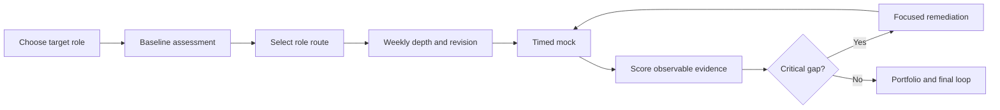

# Lead And Architect Preparation Dashboard

<DocLabels items={[
  {label: 'Canonical preparation index', tone: 'advanced'},
  {label: 'Role based', tone: 'interview'},
  {label: 'Revision control', tone: 'production'},
]} />

This dashboard turns the documentation library into one preparation programme. Do not read every
page in sidebar order. Select a role, establish a closed-book baseline, study the highest-priority
weak domains, revise through retrieval, and use scored interviews to decide what comes next.



## Start Here

1. Choose a target role in [Role-Based Preparation Routes](./ROLE-BASED-PREPARATION-ROUTES.md).
2. Complete the closed-book [Day-Zero Diagnostic Assessment](./DAY-ZERO-DIAGNOSTIC-ASSESSMENT.md).
3. Score and route it with the [Assessor Guide](./DAY-ZERO-ASSESSOR-SCORING-ROUTING.md) and
   [Revision And Readiness Scorecard](./REVISION-READINESS-SCORECARD.md).
4. Use the [MCQ Practice Center](./MCQ-PRACTICE-CENTER.mdx) for timed Java, Spring, Spring Cloud,
   and System Design retrieval checks. Each test selects 20 questions from a 200-question bank.
5. Use the [Twelve-Week Programme](./TWELVE-WEEK-PREPARATION-PROGRAM.md), or the six-week
   compressed schedule in the role-routes page.
6. Run the first mock before studying; it identifies reasoning and communication gaps that reading
   cannot expose.
7. Reassess every Sunday and allow evidence—not anxiety—to choose the next topic.

## Priority Model

| Priority | Meaning | Exit requirement |
|---|---|---|
| P0 mandatory | expected in nearly every Java lead/architect loop | explain internals, failure, diagnosis and trade-offs without notes |
| P1 differentiator | role/company dependent but highly valuable | defend a production design and incident response |
| P2 specialization | useful for a target platform/domain | complete only after P0 weaknesses are controlled |

## Master Coverage Matrix

| Domain | Priority | Canonical depth route | Rapid revision and interview route |
|---|---:|---|---|
| Java language, collections, concurrency, JVM | P0 | [Java Lead And Architect Path](../../java/JAVA-LEAD-ARCHITECT-PATH.md) | [Java Revision Sheet](../../java/JAVA-REVISION-SHEET.md) |
| programming and DSA patterns | P0 for coding rounds | [Java Programming Interview Path](../../data-structures/programming/JAVA-PROGRAMMING-INTERVIEW-PATH.md) | [DSA Question Bank](../../data-structures/DSA-INTERVIEW-QUESTION-BANK.mdx) |
| Spring, Boot, MVC, transactions and security | P0 | [Spring Architect Path](../../spring/SPRING-ARCHITECT-PATH.md) | [Spring Revision Sheet](../../spring/SPRING-REVISION-SHEET.md) |
| Spring Data, JPA and Hibernate | P0 | [Spring Data Architect Path](../../spring/SPRING-DATA-ARCHITECT-PATH.md) | [Spring Data Interview Revision](../../spring/data/SPRING-DATA-INTERVIEW-REVISION.md) |
| SQL, query plans, transactions, Oracle and Cassandra | P0 | [Database Production Mastery](../../data/DATABASE-PRODUCTION-MASTERY.md) | [Database Revision Sheet](../../data/DATABASE-REVISION-SHEET.md) |
| microservices and distributed correctness | P0 | [Microservices Architect Path](../../architecture/microservices/MICROSERVICES-ARCHITECT-PATH.md) | [Microservices Interview Workbook](../../architecture/microservices/MICROSERVICES-INTERVIEW-WORKBOOK.md) |
| Kafka and event-driven architecture | P0 for event roles | [Kafka Architect Path](../../integration/KAFKA-ARCHITECT-PATH.md) | [Kafka Revision Sheet](../../integration/KAFKA-REVISION-SHEET.md) |
| Docker, Kubernetes and production networking | P0 for lead/architect | [Docker Path](../../operations/DOCKER-ARCHITECT-PATH.md) and [Kubernetes Path](../../operations/KUBERNETES-ARCHITECT-PATH.md) | [Kubernetes Interview Revision](../../operations/kubernetes/KUBERNETES-TROUBLESHOOTING-INTERVIEW-REVISION.md) |
| observability, performance and incidents | P0 | [Observability Overview](../../observability/OBSERVABILITY-OVERVIEW.md) | [Observability Revision](../../observability/OBSERVABILITY-REVISION-SHEET.md) |
| system design, capacity, HLD and LLD | P0 | [System Design Interview Catalog](../../architecture/system-design-deep-dives/SYSTEM-DESIGN-INTERVIEW-CATALOG.md) | [Architecture Revision Sheet](../../architecture/ARCHITECTURE-REVISION-SHEET.md) |
| application and platform security | P1, P0 for architect | [Security Architect Path](../../security/platform/SECURITY-ARCHITECT-PATH.md) | [Security Revision Sheet](../../security/SECURITY-REVISION-SHEET.md) |
| Helm, GitOps, service mesh, gRPC and schema governance | P1 | [Helm And GitOps](../../operations/HELM-GITOPS-ARGOCD-PATH.md), [gRPC](../../architecture/GRPC-PROTOBUF-ARCHITECT-PATH.md), [Schema Governance](../../architecture/API-EVENT-SCHEMA-GOVERNANCE-PATH.md) | use each track's interview/revision page |
| leadership, migration and architecture decisions | P0 for lead/architect | [Architect Practice And Evidence](../ARCHITECT-PRACTICE-EVIDENCE-PATH.md) | [Leadership Interview Workbook](../LEADERSHIP-ARCHITECTURE-INTERVIEW-WORKBOOK.md) |
| financial and banking systems | P2, P1 for financial roles | [Financial Systems Architecture](../../architecture/financial/FINANCIAL-SYSTEMS-ARCHITECT-PATH.md) | [Financial Interview Workbook](../../architecture/financial/FINANCIAL-PRODUCTION-INTERVIEW.md) |

Cloud-provider detail, AI, Elasticsearch, RabbitMQ, TKGI, infrastructure as code, and other platform
specializations remain P2 unless the target job description explicitly makes them mandatory.

## Weekly Control Board

Copy this table into your notes once per week:

| Domain | Priority | Baseline 0–4 | Target | Last recall | Last mock | Critical error | Next action |
|---|---:|---:|---:|---|---|---|---|
| Java/JVM | P0 |  | 3 |  |  |  |  |
| Spring runtime | P0 |  | 3 |  |  |  |  |
| Data/transactions | P0 |  | 3 |  |  |  |  |
| Kafka/eventing | P0/P1 |  | 3 |  |  |  |  |
| microservices | P0 |  | 3 |  |  |  |  |
| platform/network | P0 |  | 3 |  |  |  |  |
| system design | P0 |  | 3 |  |  |  |  |
| security | P1/P0 |  | 3 |  |  |  |  |
| leadership | P0 |  | 3 |  |  |  |  |
| specialization | P2 |  | role-specific |  |  |  |  |

Do not average away a critical error. Unsafe data loss, broken authorization, invented consistency,
unbounded retry, or no recovery path blocks readiness even when other scores are high.

## Daily Study Loop

Use a 90-minute standard block when time is limited:

| Minutes | Activity | Evidence |
|---:|---|---|
| 15 | closed-book retrieval from yesterday/week | score questions before opening docs |
| 30 | one canonical concept page | annotated mental model and boundaries |
| 20 | trace one failure or production scenario | hypothesis, evidence, containment, recovery |
| 15 | answer two questions aloud | recording or written structured answer |
| 10 | update weakness log and next review | dated action, not “revise more” |

For a 45-minute block, do retrieval, one scenario, and one spoken answer. For a three-hour block,
add code/diagnostic evidence, capacity calculation, and a timed design segment.

## Revision Cadence

After first study, review at approximately:

```text
Day 1 -> Day 3 -> Day 7 -> Day 21 -> Day 42
```

Move the interval earlier after a failed recall. Revision means producing the answer or diagram
without notes, then correcting it. Re-reading is reference work, not proof of recall.

Each domain needs five artifacts:

1. one-page mental model;
2. ten retrieval questions;
3. failure/diagnosis matrix;
4. one architecture decision with rejected alternatives;
5. one scored spoken explanation.

## Interview Question Router

| Question shape | Route |
|---|---|
| “What happens internally?” | canonical internals/runtime page |
| “Why this design?” | decision matrix, invariant, ADR and rejected alternatives |
| “What fails?” | production mastery or failure-mode page |
| “How diagnose?” | runbook, metrics/logs/traces, commands and discriminating evidence |
| “How scale?” | capacity model, partition/concurrency/storage limits and load evidence |
| “How secure?” | trust boundary, identity, authorization, secrets and audit |
| “How prove it?” | tests, SLOs, dashboards, load/failure/recovery evidence |

## Portfolio Mapping

Prepare three sanitized cases rather than one case per technology:

| Case | Demonstrates |
|---|---|
| correctness and eventing | transactions, Kafka, idempotency, outbox, reconciliation |
| scale and failure | capacity, overload, Kubernetes, database and regional recovery |
| security and evolution | identity, authorization, secrets, schema/API migration and governance |

Financial-role candidates should make the first case a payment or ledger workflow. Every case needs
requirements, diagram, decisions, alternatives, failure model, migration, metrics, outcome, and learning.

## Exit Gates

Do not declare readiness from page completion. Require:

- every role-mandatory domain at score 3 or higher;
- no unresolved critical error in the last three mocks;
- three consecutive mocks at the target-role threshold;
- at least three defensible architecture/leadership cases;
- ability to draw the main Java, Spring, Kafka, database, Kubernetes, and system-design flows;
- production scenarios answered as evidence → containment → recovery → prevention;
- a concise explanation of gaps you still have and how you manage them.

## Recommended Next

Select [Role-Based Preparation Routes](./ROLE-BASED-PREPARATION-ROUTES.md), then record your first
baseline in the [Revision And Readiness Scorecard](./REVISION-READINESS-SCORECARD.md).
