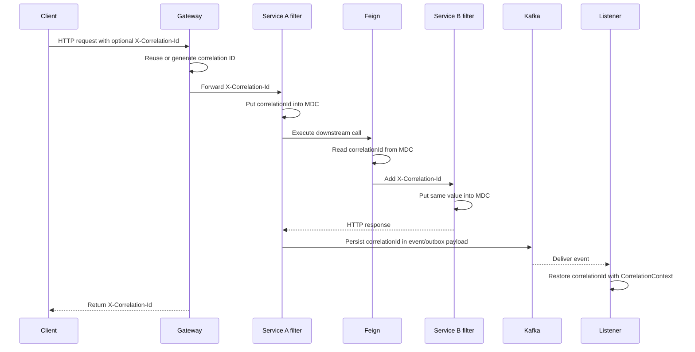

# Correlation Identifiers And HTTP Propagation

<DocLabels items={[{label: 'Advanced', tone: 'advanced'}, {label: 'Shopverse', tone: 'shopverse'}, {label: 'Production', tone: 'production'}]} />

## Why Shopverse Needs A Correlation ID

One client operation can cross several independently deployed services:

```text
Client
  -> API Gateway
  -> Auth Service
  -> User Service
```

Checkout continues through both HTTP and asynchronous messaging:

```text
Client
  -> API Gateway
  -> Order Service
  -> Kafka
  -> Inventory Service
  -> Kafka
  -> Payment Service
  -> Kafka
  -> Order and Inventory Services
```

Without a shared identifier, logs from these components are mixed with logs
from every other request and SAGA. Shopverse uses:

```http
X-Correlation-Id: abc-123
```

The corresponding structured log field is:

```text
correlationId=abc-123
```

This allows an operator to connect the business journey:

```text
api-gateway       correlationId=abc-123  Gateway request started
order-service     correlationId=abc-123  Checkout created
inventory-service correlationId=abc-123  Inventory reserved
payment-service   correlationId=abc-123  Payment completed
order-service     correlationId=abc-123  Order confirmed
```

The correlation ID is especially important for a SAGA because the business
journey can continue after the original HTTP request and technical trace have
finished.

## Four Different Identifiers

| Identifier | Scope | Created by | Main use |
|---|---|---|---|
| Idempotency key | One retryable business command | Client or command producer | Ensure retries return one durable business outcome |
| Correlation ID | Business journey | Gateway/service or caller | Find all checkout logs and events |
| Trace ID | One distributed technical trace | Micrometer Tracing | Connect HTTP/Kafka spans in Zipkin |
| Span ID | One operation in a trace | Micrometer Tracing | Identify a specific server, client, or messaging operation |

A SAGA can outlive one HTTP trace. Its correlation ID remains stable while trace IDs may differ between delayed Kafka operations.

These values are not substitutes merely because they are UUID-like:

- an idempotency key changes database/business behavior and must be persisted
  with a scoped command fingerprint and outcome;
- a correlation ID groups a business journey for support, logs, events and
  recovery, but does not prevent duplicate work;
- a trace ID groups one instrumented technical execution tree and is propagated
  using tracing standards such as W3C `traceparent`;
- a span ID identifies the current operation inside that trace and normally
  changes at every server, client, database or messaging span.

The `traceparent` header transports trace context, including a trace ID and the
upstream parent span ID. The receiving tracing library creates its own local
span ID. Application code should not invent or copy span IDs manually.

## Idempotency Key Is Not An Observability Identifier

For order creation:

```http
POST /api/v1/orders/checkout
Idempotency-Key: <stable-key-for-this-command>
X-Correlation-Id: <business-journey-reference>
traceparent: 00-<trace-id>-<parent-span-id>-01
```

If the client times out and retries, it reuses the idempotency key for the same
command. A retry can start a new trace and therefore have a different trace ID.
Shopverse can retain the same correlation ID when the retry belongs to the same
checkout journey, while each service operation receives a new span ID.

Do not use a trace ID or correlation ID as the database uniqueness key for an
Order. Trace sampling, retries, async boundaries and support workflows have
different lifecycles from the business command. Conversely, do not use the
idempotency key as a tracing parent or metric label.

## Do We Need All Four?

| Context | Recommended identifiers |
|---|---|
| simple synchronous read in a small service | trace/span when tracing is enabled; separate correlation ID is optional |
| synchronous mutation that cannot cause duplicate harm | trace/span; correlation ID if a client support reference is valuable |
| retryable order, payment, booking or reservation command | idempotency key plus trace/span |
| long-running Shopverse checkout SAGA | idempotency key, correlation ID, trace ID and span ID |
| scheduled or message-driven business workflow | stable command/message idempotency key, business correlation ID, and instrumentation-owned trace/span context |

You do not add all four headers manually to every endpoint. Require an
idempotency key only on retry-sensitive commands. Keep a separate correlation ID
when a business journey can cross multiple traces or must be exposed to support.
Let Micrometer/OpenTelemetry create and propagate trace and span IDs whenever
distributed tracing is enabled. In a small synchronous system, the trace ID can
also serve log-correlation needs, eliminating a separate correlation ID.

For Shopverse checkout, all four concepts are useful because they answer four
different questions:

| Question | Identifier |
|---|---|
| Did this retry already create an Order? | idempotency key |
| Which logs/events belong to the complete checkout SAGA? | correlation ID |
| Where did this particular execution travel and spend time? | trace ID |
| Which exact call/listener/database operation was slow or failed? | span ID |

Treat all incoming identifiers as untrusted metadata: validate accepted
correlation/idempotency formats and lengths, allowlist tracing propagation
formats, and never use any identifier for authentication or authorization.
Keep high-cardinality IDs out of metric labels; retain them in logs, traces and
appropriately indexed business records.

## Why Correlation ID Is Not Just A Trace ID

Correlation IDs and trace IDs are sometimes used interchangeably in small
systems because one HTTP request can produce one trace and one request
identifier. Shopverse keeps them separate because checkout is both a technical
trace and a business workflow.

Trace ID is owned by Micrometer Tracing and the tracing backend. It is best for
answering:

- which services were called;
- which spans were slow;
- where latency was introduced;
- how one instrumented HTTP or Kafka execution behaved.

Correlation ID is owned by the application. It is best for answering:

- what happened to one checkout or SAGA;
- which logs belong to this customer operation;
- which Kafka events, outbox rows, DLT records, and timeline rows belong
  together;
- which identifier should be returned to the client for support.

In a synchronous request, both identifiers can point to the same user action:

```text
Client -> Gateway -> User Service -> Response
traceId=6a1e...
correlationId=abc-123
```

In a SAGA, one business operation can cross several traces:

```text
Checkout request
  traceId=trace-http-1
  correlationId=SAGA-ORD-1003

Outbox publisher later sends order.created
  traceId=trace-kafka-2
  correlationId=SAGA-ORD-1003

Payment listener later completes payment
  traceId=trace-kafka-3
  correlationId=SAGA-ORD-1003
```

The practical rule in Shopverse is:

| Use | Identifier |
|---|---|
| Zipkin span tree, timing, and latency | `traceId` |
| Loki logs across services | `correlationId` or `traceId` depending on scope |
| complete checkout/SAGA journey | `correlationId` |
| Kafka event payloads, outbox, DLT, and replay | `correlationId` |
| client support reference | `X-Correlation-Id` |

Use both. Let Micrometer generate and propagate `traceId`; let Shopverse carry
`correlationId` through headers, MDC, Kafka events, logs, response headers,
timeline rows, and recovery records.

## End-To-End Propagation

The complete rule is:

> Transport the correlation ID across process boundaries, then restore it into
> the local logging context at each execution boundary.

MDC itself does not cross an HTTP connection, Kafka topic, process, container,
or arbitrary thread. Shopverse explicitly transports the value:

| Boundary | Transport |
|---|---|
| Client to gateway | `X-Correlation-Id` HTTP header |
| Gateway to service | `X-Correlation-Id` HTTP header |
| Feign service call | Feign `RequestInterceptor` adds the HTTP header |
| Kafka event | `correlationId` field in the event payload |
| Local logs | MDC field or explicit structured key/value |
| Client response | `X-Correlation-Id` response header |



## Gateway Boundary

The API Gateway is normally the first Shopverse component that receives a
client request. It accepts a nonblank caller value or creates a UUID:

```java
String correlationId = Optional
        .ofNullable(exchange.getRequest()
                .getHeaders()
                .getFirst(CORRELATION_HEADER))
        .filter(value -> !value.isBlank())
        .orElseGet(() -> UUID.randomUUID().toString());
```

Spring Cloud Gateway uses immutable WebFlux request objects, so the filter
creates a mutated exchange containing the header:

```java
ServerWebExchange correlatedExchange = exchange.mutate()
        .request(request -> request.headers(headers ->
                headers.set(CORRELATION_HEADER, correlationId)))
        .build();
```

The same value is added to the response:

```java
correlatedExchange.getResponse()
        .getHeaders()
        .set(CORRELATION_HEADER, correlationId);
```

Returning the value lets a client or support engineer report the identifier
for the exact operation.

The reactive gateway currently records `correlationId` explicitly with
SLF4J fluent logging:

```java
log.atInfo()
        .addKeyValue("correlationId", correlationId)
        .addKeyValue("method", method)
        .addKeyValue("path", path)
        .log("Gateway request started");
```

This is deliberate: reactive execution can move between threads, while classic
MDC is thread-associated. Servlet services use scoped MDC as described below.

## Servlet Service Filter

Auth, User, Order, Inventory, and Payment services use a
`OncePerRequestFilter`. The filter runs once for an HTTP request dispatch,
reads the forwarded header, returns it to the caller, and establishes the MDC
scope:

```java
String correlationId = correlationId(request);
response.setHeader(CorrelationConstants.HEADER_NAME, correlationId);

try (MDC.MDCCloseable ignored =
             MDC.putCloseable(CorrelationConstants.MDC_KEY, correlationId)) {
    filterChain.doFilter(request, response);
}
```

The important steps are:

1. Read `X-Correlation-Id`.
2. Generate a UUID only when the header is absent or blank.
3. Return the same identifier in the response.
4. Store it under the consistent MDC key `correlationId`.
5. Run the remaining security, controller, service, and persistence chain.
6. Remove the MDC value automatically when the scope closes.

Every same-thread log inside `filterChain.doFilter(...)` can include:

```json
{
  "application": "ORDER-SERVICE",
  "message": "Checkout created",
  "correlationId": "abc-123"
}
```

The filter must reuse an incoming value. Generating a new ID in every service
would break the cross-service chain.

## Recommended Next

Return to [Correlation And Trace Propagation](./MDC-CORRELATION-TRACING.md) to select the next focused guide.


## Official References

- [Micrometer documentation](https://docs.micrometer.io/micrometer/reference/)
- [OpenTelemetry documentation](https://opentelemetry.io/docs/)
