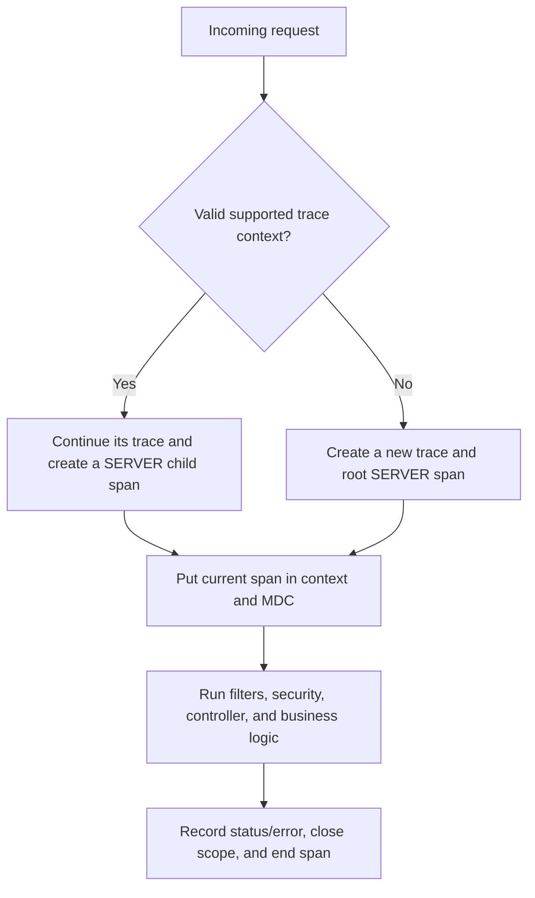
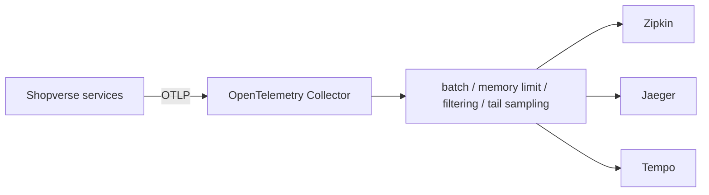

# Distributed Tracing Internals And Performance Analysis

Distributed tracing reconstructs one request across HTTP, threads, messaging,
databases, caches, and downstream services. It does not require an API gateway:
the first instrumented service that receives a request can start the trace.

This guide owns the tracing details that complement the
[implementation guide](OBSERVABILITY-IMPLEMENTATION-GUIDE.md) and the
[context-propagation route](MDC-CORRELATION-TRACING.md).

## What Each Component Owns

| Component | Responsibility | Not its responsibility |
|---|---|---|
| Micrometer Observation and Tracing | Spring-facing instrumentation API, observations, spans, context propagation, and bridge integration | Durable trace storage and a trace UI |
| OpenTelemetry | Vendor-neutral APIs, SDK, semantic conventions, propagators, OTLP, and exporters | A complete trace backend by itself |
| OpenTelemetry Collector | Receive, batch, filter, sample, enrich, and route telemetry | Long-term storage or visualization |
| Zipkin, Jaeger, or Tempo | Store, query, and visualize trace data | Instrumenting Shopverse application code |

Shopverse currently uses Micrometer with the OpenTelemetry bridge and exports
directly to Zipkin. A collector can later provide one OTLP destination and route
data to a different backend without coupling every service to that backend.

## How A Trace Starts And Continues

An instrumented HTTP server follows this decision:



With a gateway, the gateway normally creates the root span and injects context
into the downstream request. With a direct call such as `Client -> user-service`,
`user-service` creates the trace when no valid parent context exists.

The usual W3C header looks like this:

```text
traceparent: 00-4bf92f3577b34da6a3ce929d0e0e4736-00f067aa0ba902b7-01
             |  |                                |                |
          version            trace ID        parent span ID   flags
```

The receiving service retains the trace ID and creates a new span ID. B3 headers
are another supported propagation format when explicitly configured. All
services must agree on propagators; otherwise the request silently starts a new
trace at the incompatible boundary.

Trace headers are observability input, not identity or authorization evidence.
Validate their format and size, and never trust baggage or trace IDs for access
control. At a public edge, define whether externally supplied context is
accepted, restarted, or linked according to the threat model.

## IDs, Relationships, And Span Kinds

- A **trace ID** identifies the entire distributed request and remains stable
  across its spans.
- A **span ID** identifies one timed operation and changes for every new span.
- A **parent span ID** reconstructs the call tree.
- A **root span** has no recorded parent in the local trace.

Common span kinds explain the boundary being measured:

| Kind | Example |
|---|---|
| `SERVER` | Order service handling `POST /orders` |
| `CLIENT` | Order service calling inventory over HTTP |
| `PRODUCER` | Publishing `OrderCreated` to Kafka |
| `CONSUMER` | Consuming `OrderCreated` |
| `INTERNAL` | Coupon evaluation inside one process |

A span can also contain low-cardinality attributes, events, error information,
and status. Do not attach passwords, tokens, full request bodies, customer PII,
or unbounded values such as raw order IDs as metric tags.

## What Micrometer Does At Runtime

Spring instrumentation creates an `Observation` around supported server and
client operations. Observation handlers supplied by the tracing bridge create
and scope spans. The bridge delegates to the configured tracing implementation,
such as OpenTelemetry.

While a span is current, tracing context is made available to downstream
instrumentation and its trace and span IDs are placed in logging MDC. On an
instrumented outgoing call, the client creates a child `CLIENT` span and injects
its context into the carrier. The receiver extracts that context and creates a
`SERVER` child span.

Use Spring-managed, auto-configured builders so instrumentation customizers are
applied:

```java
@Bean
RestTemplate inventoryRestTemplate(RestTemplateBuilder builder) {
    return builder.build();
}
```

The same principle applies to `RestClient.Builder` and `WebClient.Builder`.
Creating clients directly with `new RestTemplate()` or an uncustomized builder
can omit observation interceptors and break propagation. Feign, Spring Cloud
Gateway, Kafka, and database clients are instrumented only when the matching
integration and dependencies are present; verify rather than assume.

Thread hops and message brokers need explicit context propagation. Use the
[MDC, Kafka, and async guide](MDC-KAFKA-ASYNC-PROPAGATION.md) for executors,
virtual threads, Reactor, Kafka headers, and cleanup rules.

## Custom Business Observations And Spans

Auto-instrumentation sees framework boundaries, but it may not distinguish
coupon validation from inventory allocation. Prefer an `Observation` when the
same business operation should contribute both metrics and traces:

```java
return Observation.createNotStarted("checkout.inventory.allocate", observationRegistry)
    .lowCardinalityKeyValue("operation", "reserve")
    .observe(() -> inventoryAllocator.allocate(command));
```

`@Observed` can reduce boilerplate when its aspect is configured, but explicit
observations make the measured boundary and tags obvious in critical workflows.

Use Micrometer's `Tracer` for trace-only control:

```java
Span span = tracer.nextSpan().name("checkout.coupon.evaluate").start();
try (Tracer.SpanInScope ignored = tracer.withSpan(span)) {
    couponEvaluator.evaluate(command);
} catch (RuntimeException exception) {
    span.error(exception);
    throw exception;
} finally {
    span.end();
}
```

Always end manually started spans and restore the previous scope. Create spans
around meaningful latency or failure boundaries, not every method, loop
iteration, or database row. Excess spans raise cost and hide the critical path.

## Baggage And Correlation IDs

Baggage is custom context propagated with a trace, for example a carefully
controlled `tenant-region` or workflow class. It is not automatically a span
attribute and only configured remote baggage fields cross process boundaries.

Use a strict allowlist and tiny values. Baggage increases every downstream
request or message, may reach third parties, and can expose sensitive data. It
must never carry secrets or authorize an action.

A correlation ID is different: Shopverse can retain it as a business-support
lookup key across retries or asynchronous traces. A trace ID belongs to one
trace; an idempotency key prevents one business command from executing twice.
The [identifier guide](CORRELATION-IDENTIFIERS-HTTP-PROPAGATION.md) defines their
ownership and propagation rules.

## Sampling

Head sampling decides near trace creation whether spans will be recorded and
exported. The Shopverse development configuration uses:

```yaml
management:
  tracing:
    sampling:
      probability: 1.0
```

This is useful for verification but is normally too expensive at production
volume. The decision propagates to child spans. An unsampled request may still
have trace context and IDs for propagation, so an ID in logs does not guarantee
that the trace exists in Zipkin.

Tail sampling makes a decision after enough of a trace reaches a collector or
backend. It can retain errors, slow traces, and selected business flows, but it
requires buffering and enough collector capacity. A common production design is
moderate head sampling plus policy-based tail sampling, validated against cost,
incident, and compliance requirements.

Never treat a sampled trace set as an unbiased count of requests unless the
sampling policy and weights are accounted for. Metrics remain the primary source
for traffic, error rate, percentiles, and SLO calculations.

## Collector And Backend Choices



| Backend | Good fit |
|---|---|
| Zipkin | Simple local stack, learning, and Shopverse's current implementation |
| Jaeger | Distributed-tracing operations and backend querying |
| Tempo | Grafana-centric operation and object-storage-oriented trace retention |

Choose through operational needs: deployment model, retention, query behavior,
multi-tenancy, cost, and existing dashboards. Do not run three backends merely
because exporters exist.

## Finding Performance Bottlenecks Correctly

Traces explain **where representative request time went**. Metrics and controlled
load tests establish throughput and p50/p95/p99 latency. A few traces are not a
benchmark and tracing overhead must be included when comparing test runs.

Use this investigation sequence:

1. Confirm the regression with request-rate, error-rate, and latency metrics.
2. Filter traces by endpoint, service, error, and latency range.
3. Inspect the critical path: the chain of work that determines completion time.
4. Separate service self-time from child time and uninstrumented gaps.
5. Correlate the trace with logs, JVM metrics, connection pools, Kafka lag, and
   database evidence.
6. Change one cause, rerun the same load profile, and compare metrics plus traces.

Do not add all child durations to calculate request duration: parallel spans
overlap, and a parent normally includes its children. A long parent with short
children may indicate CPU work, lock waiting, queueing, thread-pool starvation,
or missing instrumentation. Confirm CPU with JFR/profiling and queueing with
executor/connection-pool metrics.

Useful patterns include:

- one slow database span: inspect the execution plan, locks, and indexes;
- many repeated database spans: investigate N+1 access;
- a long downstream `CLIENT` span: separate network, connection-pool wait, retry,
  and remote `SERVER` time;
- overlapping client spans: parallel work, where the slowest critical branch
  matters more than the sum;
- repeated spans: retry storm or duplicated messaging;
- long producer-to-consumer gap: broker/consumer lag rather than handler time;
- cache miss followed by a slow query: cache effectiveness and fallback cost.

Database tracing must parameterize or sanitize statements. Never export bind
values containing PII. Use trace-to-log links and exemplars where supported so a
latency spike can lead to a representative trace without high-cardinality metric
labels.

## When Zipkin Is Empty

Diagnose by layer instead of changing random properties:

| Evidence | Likely area |
|---|---|
| No trace/span IDs in request logs | Tracing bridge, server instrumentation, or context scope |
| IDs in logs but no trace in Zipkin | Sampling, exporter, endpoint, network, or backend query window |
| One service appears as a separate trace | Propagator mismatch or uninstrumented outgoing client |
| HTTP works but Kafka/async trace breaks | Message or executor context propagation |

Check in this order:

1. Generate real traffic and confirm the service name plus trace/span IDs in logs.
2. Confirm the Actuator, tracing bridge, and exporter dependencies are managed by
   the project's Spring Boot BOM; do not mix arbitrary versions.
3. Check the canonical pinned-version property in the
   [implementation guide](OBSERVABILITY-IMPLEMENTATION-GUIDE.md). Shopverse uses
   `management.tracing.export.zipkin.endpoint`.
4. From the **service container**, reach `http://zipkin:9411/api/v2/spans`.
   `localhost:9411` inside that container points back to the service itself.
5. Temporarily use `probability: 1.0`, then restore the production sampling policy.
6. Inspect exporter warnings, authentication/TLS failures, queue drops, and
   collector health. Allow for batch-export delay.
7. In Zipkin, select the right time window and service name and account for clock
   skew between hosts.
8. Verify outgoing clients come from Spring-managed builders and that all services
   use compatible W3C or B3 propagators.

Enable exporter debug logs only for a bounded investigation; they can be noisy
and may expose operational metadata.

## End-To-End Verification Matrix

| Test | Expected result |
|---|---|
| Direct request to user service without trace headers | User service creates a new root trace |
| Request through gateway | Same trace ID; distinct gateway and service span IDs |
| Service-to-service HTTP call | `CLIENT` and downstream `SERVER` spans share a trace |
| Kafka publish and consume | Producer and consumer context is connected according to messaging semantics |
| `@Async` or executor handoff | Context is propagated and worker MDC is restored/cleared |
| Failed endpoint | Span records error/status without secrets |
| Sampling below `1.0` | Export rate falls while request metrics remain complete |
| Zipkin or collector outage | Business request remains governed by its own resilience policy; telemetry failure is visible |

## Official References

- [Spring Boot tracing reference](https://docs.spring.io/spring-boot/reference/actuator/tracing.html)
- [Micrometer Observation reference](https://docs.micrometer.io/micrometer/reference/observation.html)
- [Micrometer Tracing reference](https://docs.micrometer.io/tracing/reference/)
- [OpenTelemetry context propagation](https://opentelemetry.io/docs/concepts/context-propagation/)
- [W3C Trace Context](https://www.w3.org/TR/trace-context/)
- [OpenTelemetry Collector](https://opentelemetry.io/docs/collector/)

