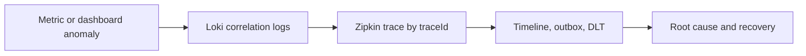

# Grafana

Grafana is Shopverse's visualization and investigation interface. It queries
Prometheus, Loki, and Zipkin. Grafana does not collect or permanently store the
underlying application telemetry.

## Provisioned Datasources

| Datasource | URL inside Compose | Use |
|---|---|---|
| Prometheus | `http://prometheus:9090` | metrics, SLOs, alerts |
| Loki | `http://loki:3100` | structured logs |
| Zipkin | `http://zipkin:9411` | distributed traces |

Loki derived fields recognize JSON `traceId` and `correlationId`. Trace IDs link
to Zipkin; correlation IDs open a filtered Loki Explore query.

## Provisioned Dashboards

- **Shopverse Observability Overview**: target health, request rate, and recent
  logs.
- **Shopverse Commerce Operations**: SAGA transitions, payment outcomes,
  reservation conflicts, expiry, and operational signals.

Provisioned JSON is mounted read-only. Durable dashboard changes should be
made in source-controlled provisioning files rather than only through the UI.

## Explore Workflow

1. Set the exact incident time range.
2. Start with Prometheus to identify affected service and symptom.
3. Open Loki Explore and filter by application and correlation ID.
4. Inspect structured fields and exception context.
5. Follow `traceId` to Zipkin.
6. Inspect timeline, outbox, and DLT for business/recovery state.



## Dashboard Variables

Useful bounded variables:

```text
application
environment
status
outcome
stage
```

Avoid variables populated by every correlation ID, trace ID, order number, or
username. Those belong in an ad hoc Explore query or data link.

## Panel Selection

| Question | Panel |
|---|---|
| Is it up? | stat/table using `up` |
| Is traffic changing? | time series rate |
| What proportion fails? | time series or stat |
| Which service is slow? | p95 time series |
| Current pool use | gauge or time series |
| Event outcomes | bar chart/table |
| Exact log context | logs panel |

Always define units, legend, time range behavior, thresholds, and a useful
no-data state.

## Useful Queries

Service health:

```promql
up{job="shopverse-services"}
```

Request rate:

```promql
sum by (application) (
  rate(http_server_requests_seconds_count[5m])
)
```

p95:

```promql
histogram_quantile(
  0.95,
  sum by (le, application) (
    rate(http_server_requests_seconds_bucket[5m])
  )
)
```

Application errors:

```logql
{application=~"$application"}
| json
| level="ERROR"
```

Correlation:

```logql
{log_type="application"}
| json
| correlationId="$correlationId"
```

## Data Links

Use `traceId` for Zipkin:

```text
log line -> derived trace field -> Zipkin trace
```

Use correlation ID for Loki:

```text
timeline/order panel -> Loki Explore filtered by correlationId
```

A correlation ID is not a Zipkin trace ID and can span multiple traces.

## Alerts

Prometheus currently evaluates Shopverse rules. Grafana can display alert
state, but a production system also needs:

- notification policies and contact points;
- ownership and escalation;
- silence/maintenance rules;
- runbook URLs;
- deduplication and grouping;
- testing of firing and resolved notifications.

## Troubleshooting Empty Panels

1. Confirm datasource health.
2. Run the raw query in Explore.
3. widen the time range.
4. remove dashboard-variable filters.
5. verify labels with Prometheus/Loki.
6. trigger traffic for lazy custom metrics.
7. check histogram availability for percentile panels.
8. inspect query errors and transformations.

Do not change the application because a dashboard query is wrong.

## Production Practices

- Source-control provisioned dashboards and datasources.
- Separate overview, service, and business-operation dashboards.
- Keep variables bounded.
- Prefer recording rules for expensive repeated PromQL.
- Link panels to logs, traces, and runbooks.
- Display data freshness and no-data states.
- Secure Grafana authentication and datasource access.
- Back up dashboard and alert configuration.
- Review dashboard usefulness during real incidents.

## Related Guides

- [Observability architecture](OBSERVABILITY.md)
- [Prometheus](PROMETHEUS.md)
- [Loki](LOKI.md)
- [Promtail](PROMTAIL.md)
- [Debugging](../development/DEBUGGING.md)
