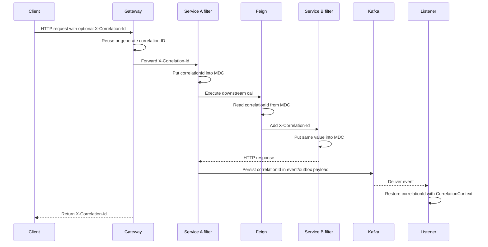

# MDC, Correlation IDs, And Tracing

import {DocFigure} from '@site/src/components/DocumentationLanding';

For a framework-generic explanation of MDC, `ThreadLocal` behavior,
`MDC.putCloseable`, cleanup, asynchronous propagation, dependencies, and
production practices, see [Mapped Diagnostic Context (MDC)](MDC-GENERIC.md).

## Why Shopverse Needs A Correlation ID

One client operation can cross several independently deployed services:

```text
Client
  -> API Gateway
  -> Auth Service
  -> User Service
```

Checkout continues through both HTTP and asynchronous messaging:

```text
Client
  -> API Gateway
  -> Order Service
  -> Kafka
  -> Inventory Service
  -> Kafka
  -> Payment Service
  -> Kafka
  -> Order and Inventory Services
```

Without a shared identifier, logs from these components are mixed with logs
from every other request and SAGA. Shopverse uses:

```http
X-Correlation-Id: abc-123
```

The corresponding structured log field is:

```text
correlationId=abc-123
```

This allows an operator to connect the business journey:

```text
api-gateway       correlationId=abc-123  Gateway request started
order-service     correlationId=abc-123  Checkout created
inventory-service correlationId=abc-123  Inventory reserved
payment-service   correlationId=abc-123  Payment completed
order-service     correlationId=abc-123  Order confirmed
```

The correlation ID is especially important for a SAGA because the business
journey can continue after the original HTTP request and technical trace have
finished.

## Three Identifiers

| Identifier | Scope | Created by | Main use |
|---|---|---|---|
| Correlation ID | Business journey | Gateway/service or caller | Find all checkout logs and events |
| Trace ID | One distributed technical trace | Micrometer Tracing | Connect HTTP/Kafka spans in Zipkin |
| Span ID | One operation in a trace | Micrometer Tracing | Identify a specific server, client, or messaging operation |

A SAGA can outlive one HTTP trace. Its correlation ID remains stable while trace IDs may differ between delayed Kafka operations.

## Why Correlation ID Is Not Just A Trace ID

Correlation IDs and trace IDs are sometimes used interchangeably in small
systems because one HTTP request can produce one trace and one request
identifier. Shopverse keeps them separate because checkout is both a technical
trace and a business workflow.

Trace ID is owned by Micrometer Tracing and the tracing backend. It is best for
answering:

- which services were called;
- which spans were slow;
- where latency was introduced;
- how one instrumented HTTP or Kafka execution behaved.

Correlation ID is owned by the application. It is best for answering:

- what happened to one checkout or SAGA;
- which logs belong to this customer operation;
- which Kafka events, outbox rows, DLT records, and timeline rows belong
  together;
- which identifier should be returned to the client for support.

In a synchronous request, both identifiers can point to the same user action:

```text
Client -> Gateway -> User Service -> Response
traceId=6a1e...
correlationId=abc-123
```

In a SAGA, one business operation can cross several traces:

```text
Checkout request
  traceId=trace-http-1
  correlationId=SAGA-ORD-1003

Outbox publisher later sends order.created
  traceId=trace-kafka-2
  correlationId=SAGA-ORD-1003

Payment listener later completes payment
  traceId=trace-kafka-3
  correlationId=SAGA-ORD-1003
```

The practical rule in Shopverse is:

| Use | Identifier |
|---|---|
| Zipkin span tree, timing, and latency | `traceId` |
| Loki logs across services | `correlationId` or `traceId` depending on scope |
| complete checkout/SAGA journey | `correlationId` |
| Kafka event payloads, outbox, DLT, and replay | `correlationId` |
| client support reference | `X-Correlation-Id` |

Use both. Let Micrometer generate and propagate `traceId`; let Shopverse carry
`correlationId` through headers, MDC, Kafka events, logs, response headers,
timeline rows, and recovery records.

## End-To-End Propagation

The complete rule is:

> Transport the correlation ID across process boundaries, then restore it into
> the local logging context at each execution boundary.

MDC itself does not cross an HTTP connection, Kafka topic, process, container,
or arbitrary thread. Shopverse explicitly transports the value:

| Boundary | Transport |
|---|---|
| Client to gateway | `X-Correlation-Id` HTTP header |
| Gateway to service | `X-Correlation-Id` HTTP header |
| Feign service call | Feign `RequestInterceptor` adds the HTTP header |
| Kafka event | `correlationId` field in the event payload |
| Local logs | MDC field or explicit structured key/value |
| Client response | `X-Correlation-Id` response header |



## Gateway Boundary

The API Gateway is normally the first Shopverse component that receives a
client request. It accepts a nonblank caller value or creates a UUID:

```java
String correlationId = Optional
        .ofNullable(exchange.getRequest()
                .getHeaders()
                .getFirst(CORRELATION_HEADER))
        .filter(value -> !value.isBlank())
        .orElseGet(() -> UUID.randomUUID().toString());
```

Spring Cloud Gateway uses immutable WebFlux request objects, so the filter
creates a mutated exchange containing the header:

```java
ServerWebExchange correlatedExchange = exchange.mutate()
        .request(request -> request.headers(headers ->
                headers.set(CORRELATION_HEADER, correlationId)))
        .build();
```

The same value is added to the response:

```java
correlatedExchange.getResponse()
        .getHeaders()
        .set(CORRELATION_HEADER, correlationId);
```

Returning the value lets a client or support engineer report the identifier
for the exact operation.

The reactive gateway currently records `correlationId` explicitly with
SLF4J fluent logging:

```java
log.atInfo()
        .addKeyValue("correlationId", correlationId)
        .addKeyValue("method", method)
        .addKeyValue("path", path)
        .log("Gateway request started");
```

This is deliberate: reactive execution can move between threads, while classic
MDC is thread-associated. Servlet services use scoped MDC as described below.

## Servlet Service Filter

Auth, User, Order, Inventory, and Payment services use a
`OncePerRequestFilter`. The filter runs once for an HTTP request dispatch,
reads the forwarded header, returns it to the caller, and establishes the MDC
scope:

```java
String correlationId = correlationId(request);
response.setHeader(CorrelationConstants.HEADER_NAME, correlationId);

try (MDC.MDCCloseable ignored =
             MDC.putCloseable(CorrelationConstants.MDC_KEY, correlationId)) {
    filterChain.doFilter(request, response);
}
```

The important steps are:

1. Read `X-Correlation-Id`.
2. Generate a UUID only when the header is absent or blank.
3. Return the same identifier in the response.
4. Store it under the consistent MDC key `correlationId`.
5. Run the remaining security, controller, service, and persistence chain.
6. Remove the MDC value automatically when the scope closes.

Every same-thread log inside `filterChain.doFilter(...)` can include:

```json
{
  "application": "ORDER-SERVICE",
  "message": "Checkout created",
  "correlationId": "abc-123"
}
```

The filter must reuse an incoming value. Generating a new ID in every service
would break the cross-service chain.

## MDC Internals

SLF4J MDC is a thread-associated key/value context. Logback's structured encoder reads MDC values when it creates a log event.

```java
try (MDC.MDCCloseable ignored = MDC.putCloseable("correlationId", correlationId)) {
    action.run();
}
```

`putCloseable` guarantees cleanup when the scope exits. Cleanup is essential because servlet, scheduler, and Kafka threads are reused. A leaked MDC value can attach one customer's identifier to another request.

## Feign Propagation

Feign creates a new outgoing HTTP request. The incoming request header is not
automatically copied as an application-specific business header. Shopverse
uses a `RequestInterceptor`:

```java
@Bean
RequestInterceptor correlationIdRequestInterceptor() {
    return template -> {
        String correlationId = MDC.get(CorrelationConstants.MDC_KEY);
        if (correlationId != null && !correlationId.isBlank()) {
            template.header(CorrelationConstants.HEADER_NAME, correlationId);
        }
    };
}
```

Line-by-line behavior:

1. OpenFeign invokes the interceptor while constructing an outgoing request.
2. `MDC.get(...)` reads the identifier established by the service filter.
3. The blank check prevents an empty header.
4. `template.header(...)` adds `X-Correlation-Id` to the downstream request.
5. The downstream service filter reads the header and creates its own local MDC
   scope with the same value.

For example:

```text
Gateway -> Auth Service -> Feign interceptor -> User Service
Gateway -> Order Service -> Feign interceptor -> Inventory Service
```

The Feign interceptor propagates the business correlation ID. Micrometer
instrumentation independently propagates W3C tracing headers such as
`traceparent`; the two mechanisms serve different purposes.

## Kafka Flow

Kafka processing does not inherit the HTTP worker thread or its MDC. Shopverse
stores the correlation ID in the SAGA event and durable outbox record:

```java
outboxService.enqueue(
        "ORDER",
        order.getOrderNumber(),
        "OrderCreatedEvent",
        topic,
        order.getOrderNumber(),
        event,
        correlationId
);
```

Each listener deserializes the event and restores MDC through
`CorrelationContext.run(...)` before business logic logs anything:

```java
OrderCreatedEvent event = objectMapper.readValue(payload, OrderCreatedEvent.class);
CorrelationContext.run(event.correlationId(), () -> sagaService.handle(event));
```

The second argument is a `Runnable` lambda. `CorrelationContext` places the
event correlation ID into MDC, invokes the lambda, and removes the value even
if the handler throws. See the
[Kafka listener example](MDC-GENERIC.md#kafka-listener-example) for the
line-by-line flow.

This gives asynchronous logs the same business identifier even when the event
is processed seconds later, retried, handled by another replica, or replayed
from a DLT.

## Micrometer Trace Propagation

<DocFigure
  src="/img/diagrams/shopverse-zipkin-tracing-flow.svg"
  alt="Shopverse distributed tracing flow through gateway, services, Feign, Micrometer tracing, and Zipkin"
  caption="Trace and span propagation for synchronous calls, with correlation IDs retained across asynchronous business events."
/>

Spring Boot Actuator and Micrometer Observation auto-configure instrumentation for supported HTTP clients, servers, Kafka templates, and listeners. The active observation creates spans, injects tracing headers, and places `traceId` and `spanId` in the logging context. Zipkin export is configured through:

```yaml
management:
  tracing:
    sampling:
      probability: 1.0
    export:
      zipkin:
        endpoint: http://localhost:9411/api/v2/spans
```

Application code should not manually generate trace IDs. It does explicitly manage correlation IDs because those are business identifiers.

## Correlation ID Versus Trace ID

```text
Business checkout correlation ID: abc-123

HTTP trace:
  traceId=trace-http-1
  Gateway span -> Order HTTP span

Later Kafka trace:
  traceId=trace-kafka-2
  Producer span -> Inventory listener span

Later payment trace:
  traceId=trace-kafka-3
  Producer span -> Payment listener span
```

All three traces can retain `correlationId=abc-123`. Use:

- correlation ID to search the complete business journey;
- trace ID to inspect one technical span tree and latency path;
- span ID to isolate one operation inside that trace.

Do not use correlation IDs, trace IDs, or span IDs as credentials,
authorization evidence, or unguessable secrets.

## Async Boundaries

MDC is not automatically copied to arbitrary executor threads. Prefer:

- passing correlation data in Kafka events;
- restoring MDC at the listener or scheduled task boundary;
- using Micrometer context propagation for instrumented frameworks;
- avoiding unbounded custom executors.

`@Async`, `CompletableFuture`, parallel streams, and arbitrary executors do not
automatically inherit MDC. If an asynchronous task is necessary, explicitly
pass the identifier or use a controlled context-propagation mechanism and
restore/clear the scope in the worker.

## Production Practices

1. Accept or generate the ID at the first trusted boundary.
2. Reuse the same ID in downstream services.
3. Return it to the client for support and troubleshooting.
4. Use one header name and one structured log field across services.
5. Validate caller-provided values for length and allowed characters.
6. Reject control characters and avoid directly trusting arbitrary log input.
7. Do not put JWTs, passwords, cookies, payment details, or personal data in
   MDC.
8. Use try-with-resources or `finally` for cleanup.
9. Carry the ID explicitly in asynchronous event contracts or headers.
10. Let Micrometer own `traceId` and `spanId`.
11. Test missing headers, supplied headers, downstream propagation, exception
    cleanup, Kafka restoration, and asynchronous boundaries.
12. Use low-cardinality correlation fields in logs, not metric labels.

The current Shopverse filters accept any nonblank caller value. Adding a
length and allowed-character policy is a production hardening item.

## Queries

Loki JSON field query:

```logql
{job=~"shopverse-.*|docker-containers"} | json | correlationId="CORRELATION_ID"
```

Trace field:

```logql
{job=~"shopverse-.*|docker-containers"} | json | traceId="TRACE_ID"
```

Use Zipkin for the span tree and Loki for detailed application events.

## Related Guides

- [Generic MDC behavior](MDC-GENERIC.md)
- [Spring Cloud OpenFeign](../spring/SPRING-OPENFEIGN.md)
- [Spring Kafka](../spring/SPRING-KAFKA.md)
- [API Gateway](../development/API-GATEWAY-GENERIC.md)
- [Structured logging](STRUCTURED-LOGGING.md)
- [Loki](LOKI.md)
- [Promtail](PROMTAIL.md)
