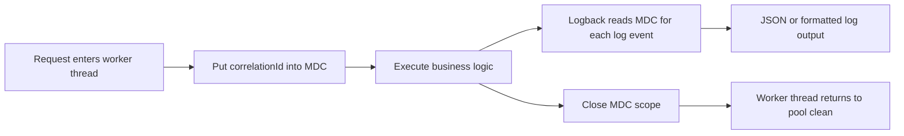
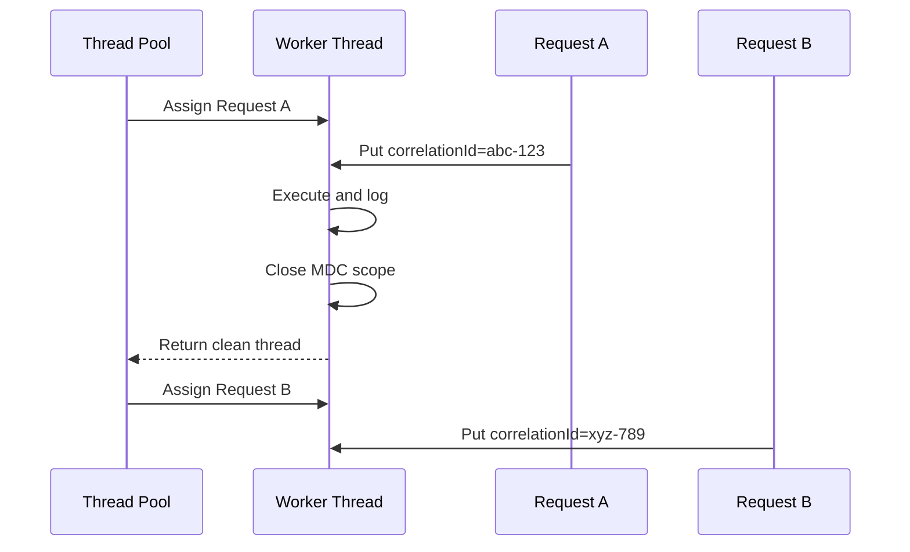
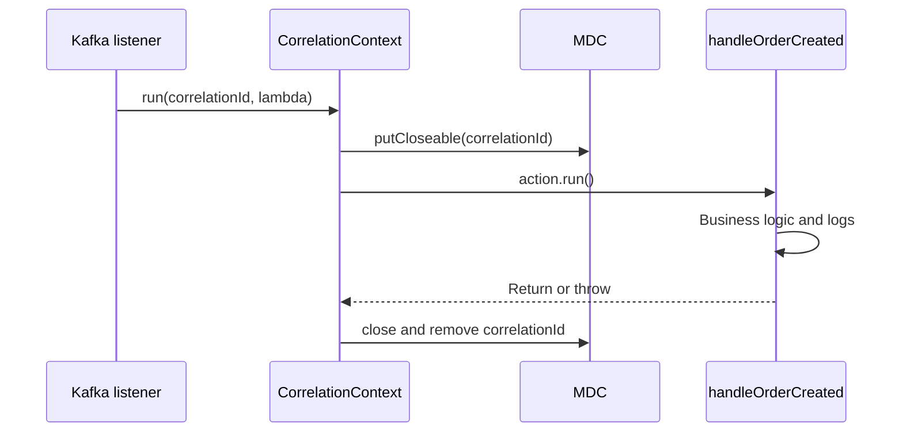

# Mapped Diagnostic Context (MDC)

MDC means **Mapped Diagnostic Context**. It is a logging feature exposed by SLF4J and implemented by logging frameworks such as Logback and Log4j.

MDC stores contextual key/value data associated with the current execution thread. Logging configuration can include these values automatically in every log event produced while that context is active.

Common MDC fields include:

- `correlationId`
- `requestId`
- `userId`
- `tenantId`
- `operation`

Trace libraries may also place `traceId` and `spanId` in the logging context. Application code should generally let the tracing library manage those fields.

## Why MDC Is Useful

Without contextual fields, logs from concurrent requests appear mixed together:

```text
Creating order
Reserving inventory
Creating order
Payment completed
```

With a correlation ID, logs can be grouped by request or business journey:

```text
correlationId=abc-123 Creating order
correlationId=abc-123 Reserving inventory
correlationId=xyz-789 Creating order
correlationId=abc-123 Payment completed
```

This makes it possible to search one operation in local files or centralized systems such as Loki, Elasticsearch, Splunk, or Datadog.

## How MDC Works

Conceptually, MDC maintains a map for the current thread:

```text
Thread: http-worker-7
MDC:
  correlationId -> abc-123
  userId         -> user-42
```

When the thread logs a message, the logging framework reads the current MDC map and copies its values into the log event.



MDC behaves like thread-local state in traditional servlet applications. Values placed on one thread do not automatically appear on another thread.

## `putCloseable` And Automatic Cleanup

```java
try (var ignored = MDC.putCloseable("correlationId", correlationId)) {
    processRequest();
}
```

`MDC.putCloseable(...)` performs two operations:

1. it puts the key/value pair into MDC;
2. it returns an `MDC.MDCCloseable` scope.

`MDCCloseable` implements `AutoCloseable`, so Java's try-with-resources statement calls `close()` when the block exits. This happens on normal completion, an early return, or an exception.

Closing the scope removes the MDC key. This matters because application-server threads are reused.



Without cleanup, Request B could inherit `abc-123`, producing misleading logs and potentially exposing another request's context.

## Reusable Context Utility

```java
public final class CorrelationContext {

    private CorrelationContext() {
    }

    public static void run(String correlationId, Runnable action) {
        try (MDC.MDCCloseable ignored =
                     MDC.putCloseable("correlationId", correlationId)) {
            action.run();
        }
    }
}
```

### Code Explanation

`private CorrelationContext()` prevents creation of utility-class instances.

`run(String correlationId, Runnable action)` accepts the value to expose and the work that must execute inside its scope.

`MDC.putCloseable(...)` inserts the correlation ID and returns the cleanup handle.

The variable is named `ignored` because the code needs its lifecycle but does not call methods on it directly.

`action.run()` executes the business operation. Every log created on the same thread during this call can contain the correlation ID.

When the block exits, Java closes `ignored` and removes the MDC entry automatically.

Example:

```java
CorrelationContext.run(event.correlationId(), () -> {
    inventoryService.reserve(event.productId(), event.quantity());
    log.info("Inventory reserved");
});
```

### Kafka Listener Example

```java
CorrelationContext.run(
        event.correlationId(),
        () -> handleOrderCreated(event)
);
```

The call passes:

1. `event.correlationId()`, the value placed in MDC;
2. `() -> handleOrderCreated(event)`, a lambda implementing `Runnable`.

The lambda is work passed to the utility. `CorrelationContext` executes it
inside the MDC scope:

```java
public static void run(String correlationId, Runnable action) {
    try (MDC.MDCCloseable ignored =
                 MDC.putCloseable("correlationId", correlationId)) {
        action.run();
    }
}
```



Every same-thread log inside `handleOrderCreated(event)` can contain that
event's correlation ID. If the handler throws, cleanup still occurs and the
exception continues to the Kafka container. This prevents correlation data
from leaking when listener threads are reused.

## Dependencies

Spring Boot applications using the logging starter already receive SLF4J and Logback:

```gradle
implementation 'org.springframework.boot:spring-boot-starter-web'
```

The direct API is:

```java
import org.slf4j.MDC;
```

For a non-Spring application, use an SLF4J API and exactly one compatible logging provider:

```gradle
implementation 'org.slf4j:slf4j-api'
runtimeOnly 'ch.qos.logback:logback-classic'
```

Avoid declaring several SLF4J providers because provider conflicts can make logging behavior unpredictable.

## Logback Output

For text logs, an MDC value can be rendered with `%X`:

```xml
<pattern>%d %-5level correlationId=%X{correlationId:-} %logger - %msg%n</pattern>
```

For structured JSON logging, configure an encoder that includes MDC fields. JSON makes the correlation ID independently searchable instead of embedding it only inside the message.

```json
{
  "level": "INFO",
  "message": "Inventory reserved",
  "correlationId": "abc-123"
}
```

## Servlet Filter Pattern

A request filter is a suitable place to create or accept a correlation ID:

```java
String correlationId = Optional
        .ofNullable(request.getHeader("X-Correlation-Id"))
        .filter(value -> !value.isBlank())
        .orElseGet(() -> UUID.randomUUID().toString());

response.setHeader("X-Correlation-Id", correlationId);

try (MDC.MDCCloseable ignored =
             MDC.putCloseable("correlationId", correlationId)) {
    filterChain.doFilter(request, response);
}
```

Validate caller-provided values. Apply a length limit and reject control characters so untrusted headers cannot corrupt logs.

## Asynchronous And Reactive Code

MDC does not automatically cross arbitrary thread boundaries:

```java
MDC.put("correlationId", "abc-123");
executor.execute(() -> log.info("Async operation"));
```

The executor thread may not contain the caller's MDC context. Production options include:

- explicitly passing the correlation ID with the task or event;
- restoring MDC at the consumer boundary;
- using a `TaskDecorator` for a controlled Spring executor;
- using Micrometer Context Propagation;
- using Reactor Context in reactive applications.

Do not assume `@Async`, `CompletableFuture`, parallel streams, Kafka listeners, or custom executors inherit MDC.

For Kafka and other message brokers, include the business correlation ID in message headers or the event contract, then restore the MDC scope in the consumer.

## Nested Context

Nested scopes are valid:

```java
try (var requestScope = MDC.putCloseable("correlationId", correlationId)) {
    try (var operationScope = MDC.putCloseable("operation", "reserve-stock")) {
        log.info("Operation started");
    }
}
```

Keep scopes small and predictable. Avoid clearing the entire MDC from a library method because the caller may own other context fields.

## Production Practices

1. Establish MDC near the request, message, or scheduled-task boundary.
2. Use try-with-resources or `finally` for guaranteed cleanup.
3. Propagate context explicitly across asynchronous boundaries.
4. Use stable field names across all services.
5. Validate and limit externally supplied correlation IDs.
6. Keep secrets, passwords, tokens, session IDs, and sensitive personal data out of MDC.
7. Prefer immutable identifiers instead of changing values throughout a request.
8. Use structured JSON fields for centralized querying.
9. Let the tracing framework own `traceId` and `spanId`.
10. Test cleanup and async propagation behavior.

## Correlation ID Versus Trace ID

| Field | Purpose |
|---|---|
| Correlation ID | Application or business identifier for a complete operation |
| Trace ID | Tracing-system identifier connecting spans in one distributed trace |
| Span ID | Identifier for one operation within a trace |

A correlation ID may survive retries, delayed messages, or several traces. A trace ID is normally created and propagated by the tracing library.

## Common Mistakes

- using `MDC.put(...)` without cleanup;
- storing complete JWTs, credentials, or payment data;
- expecting MDC to propagate to executor or reactive threads automatically;
- generating a new correlation ID in every downstream service;
- manually overwriting tracing-library fields;
- putting high-volume values in formatted messages instead of structured fields;
- using MDC as business state rather than logging context.

## Testing Cleanup

```java
@Test
void removesCorrelationIdAfterAction() {
    CorrelationContext.run("abc-123", () ->
            assertThat(MDC.get("correlationId")).isEqualTo("abc-123")
    );

    assertThat(MDC.get("correlationId")).isNull();
}
```

Also test the exception path to confirm cleanup still occurs when `action.run()` throws.

## Further Reading

- [SLF4J MDC manual](https://www.slf4j.org/manual.html#mdc)
- [Logback MDC manual](https://logback.qos.ch/manual/mdc.html)
- [Generic application logging](LOGGING-GENERIC.md)
- [Shopverse MDC, correlation, and tracing implementation](MDC-CORRELATION-TRACING.md)
