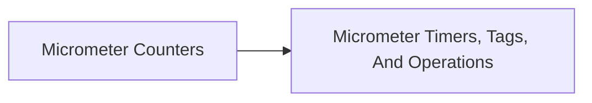

<!-- split-guide-index -->
# Micrometer Metrics

<DocLabels items={[{label: 'Focused guides', tone: 'advanced'}, {label: 'Shopverse', tone: 'shopverse'}, {label: 'Architect route', tone: 'production'}]} />

Design counters, timers, tags, queries, and production metric operations. The original long-form material is preserved without duplication across the focused pages below.

<TopicCards items={[
  {title: 'Micrometer Counters', href: '/observability/MICROMETER-COUNTERS', description: 'Part 1 of the focused Micrometer Metrics learning route.', icon: 'route', tags: ['Focused', 'Advanced']},
  {title: 'Micrometer Timers, Tags, And Operations', href: '/observability/MICROMETER-TIMERS-TAGS-OPERATIONS', description: 'Part 2 of the focused Micrometer Metrics learning route.', icon: 'security', tags: ['Focused', 'Advanced']},
]} />

<DocCallout type="tip" title="Use the index as the stable entry point">

Each focused page owns one concern. Cross-links point to the canonical explanation instead of repeating the same material.

</DocCallout>

## Recommended Learning Order

1. [Micrometer Counters](./MICROMETER-COUNTERS.md)
2. [Micrometer Timers, Tags, And Operations](./MICROMETER-TIMERS-TAGS-OPERATIONS.md)

## Reading Strategy

Use **Micrometer Metrics** as a decision and verification guide inside **Micrometer Metrics**. Start by naming the invariant or operational outcome, then follow the runtime flow and identify the owning component. For every example, record the expected success evidence, the most important failure mode, and the metric or test that proves recovery. This keeps the material useful for implementation reviews, production incidents, and architect interviews instead of treating it as isolated syntax.

Within **Micrometer Metrics**, apply the Shopverse guidance incrementally: verify the current behavior, introduce one bounded change, test the unhappy path, and preserve a rollback or reconciliation route. Follow links to canonical pages when a concept belongs to another track; do not copy that explanation into this page. This ownership rule keeps the focused guides short while retaining technical depth and traceability.

## Official References

- [Micrometer documentation](https://docs.micrometer.io/micrometer/reference/)
- [OpenTelemetry documentation](https://opentelemetry.io/docs/)
