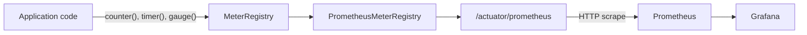
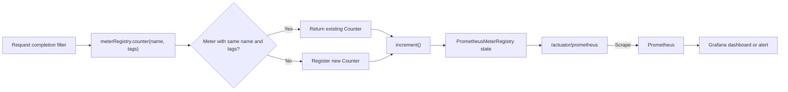

# Micrometer Metrics

Micrometer is the metrics instrumentation facade used by Spring Boot. Application code records measurements through Micrometer APIs without coupling business code directly to Prometheus.

Read this page if you want to understand:

- what `MeterRegistry` does;
- when to use counters, timers, gauges, and summaries;
- how Spring Boot exposes metrics through `/actuator/prometheus`;
- how Prometheus scrapes metrics and Grafana visualizes them;
- how Shopverse records request, outbox, inventory, and gateway metrics.

`MeterRegistry` is Micrometer's main entry point for creating, finding, and managing meters such as:

- counters;
- timers;
- gauges;
- distribution summaries;
- long-task timers.

## Metrics Flow



The responsibilities are separate:

1. application code records a measurement through `MeterRegistry`;
2. `PrometheusMeterRegistry` keeps the metric in Prometheus-compatible form;
3. Spring Boot Actuator exposes the registry at `/actuator/prometheus`;
4. Prometheus periodically pulls, or scrapes, that endpoint;
5. Grafana queries Prometheus and visualizes the resulting time series.

Micrometer does not push these metrics to Grafana. Grafana also does not collect them directly.

## Counter Example

Shopverse records successful outbox publications with:

```java
meterRegistry.counter(
        "shopverse.outbox.publish",
        "outcome",
        "success"
).increment();
```

### Line-By-Line Explanation

`meterRegistry.counter(...)` asks the registry for a counter with the supplied name and tags.

```java
"shopverse.outbox.publish"
```

This is the logical Micrometer metric name. Micrometer converts dots to the naming convention required by the monitoring backend.

```java
"outcome", "success"
```

This creates the tag `outcome=success`. Tags provide bounded dimensions for grouping and filtering.

```java
.increment()
```

This increases the counter by one. A counter represents a cumulative value and should only increase.

The Prometheus representation is similar to:

```text
shopverse_outbox_publish_total{outcome="success",application="ORDER-SERVICE"} 12
```

The `_total` suffix follows Prometheus counter conventions. The shared configuration adds the `application` tag.

Calling `counter(...)` repeatedly with the same name and tag set returns the same logical meter rather than creating an unrelated counter for every invocation.

## What Is A Counter Metric?

A counter is a cumulative metric that measures how many times an event has
happened.

Examples include:

- requests received;
- orders created;
- payments completed;
- authentication failures;
- retries attempted;
- messages moved to a DLT;
- outbox publications.

A counter starts at zero and only moves upward:

```text
0 -> 1 -> 2 -> 3 -> 4
```

It must not be used for a value that can naturally decrease. Current queue
depth, active requests, available inventory, and memory usage are gauges
rather than counters.

The counter value is local to one application process. Restarting that process
resets its counter. Prometheus functions such as `rate()` and `increase()`
understand normal counter resets when calculating values over time.

## Gateway Request Counter

Shopverse API Gateway records completed requests with:

```java
meterRegistry.counter(
        "shopverse.gateway.requests.logged",
        "method", method,
        "status", String.valueOf(status),
        "outcome", outcome(status)
).increment();
```

### Metric Name

```java
"shopverse.gateway.requests.logged"
```

This is the backend-neutral Micrometer meter name. Prometheus normalizes the
dots to underscores and adds its conventional counter suffix:

```text
shopverse_gateway_requests_logged_total
```

Application code should use the Micrometer name. PromQL queries should use the
exported Prometheus name.

### Tags

```java
"method", method,
"status", String.valueOf(status),
"outcome", outcome(status)
```

Micrometer interprets these as key/value tag pairs. For a successful GET
request, the complete meter identity is conceptually:

```text
name=shopverse.gateway.requests.logged
method=GET
status=200
outcome=SUCCESS
```

Prometheus sees a time series similar to:

```text
shopverse_gateway_requests_logged_total{
  application="API-GATEWAY",
  method="GET",
  status="200",
  outcome="SUCCESS"
} 42
```

The value `42` means that this gateway process has observed 42 requests with
that exact tag combination since the process started.

### Increment

```java
.increment();
```

`increment()` adds one to the counter. Micrometer also supports a positive
amount:

```java
counter.increment(5);
```

Negative increments are invalid because a counter is monotonic.

## Service Request Counter

A servlet-based service can record request completion with:

```java
meterRegistry.counter(
        "shopverse.service.requests.logged",
        "service", "DISCOVERY-SERVER",
        "method", request.getMethod(),
        "status", String.valueOf(status),
        "outcome", outcome(status)
).increment();
```

Line by line:

```java
"shopverse.service.requests.logged"
```

Defines the common logical metric name used by participating services.

```java
"service", "DISCOVERY-SERVER"
```

Identifies the service producing the measurement. Shopverse also configures a
common `application` tag through Spring Boot, so using both `service` and
`application` may be redundant. Production metrics should choose one
consistent service-identity tag.

```java
"method", request.getMethod()
```

Records a bounded HTTP method such as `GET` or `POST`.

```java
"status", String.valueOf(status)
```

Records the HTTP response status.

```java
"outcome", outcome(status)
```

Groups statuses into a smaller business-friendly category such as `SUCCESS`,
`CLIENT_ERROR`, or `SERVER_ERROR`.

The exported series is similar to:

```text
shopverse_service_requests_logged_total{
  application="DISCOVERY-SERVER",
  service="DISCOVERY-SERVER",
  method="GET",
  status="200",
  outcome="SUCCESS"
} 18
```

Every unique combination of name and tags is a separate time series:

```text
GET + 200 + SUCCESS
GET + 404 + CLIENT_ERROR
POST + 201 + SUCCESS
POST + 500 + SERVER_ERROR
```

## How `MeterRegistry.counter(...)` Works Internally



`MeterRegistry` identifies a meter using:

- meter name;
- meter type;
- complete tag set.

When `counter(...)` is called:

1. Micrometer builds the meter identity from the name and tags.
2. the registry looks for an existing counter with that identity.
3. it returns the existing counter or registers a new one.
4. `increment()` updates the process-local counter state.
5. `PrometheusMeterRegistry` exposes the current value in Prometheus format.
6. Actuator serves that representation at `/actuator/prometheus`.
7. Prometheus periodically scrapes and stores the sample with a timestamp.
8. Grafana queries Prometheus; it does not read the Java counter directly.

Micrometer does not create a new counter object representing an independent
metric on every request when the name and tags are unchanged.

## Counter PromQL

Raw request counters normally keep increasing. Operational dashboards usually
query a rate or increase rather than displaying the raw value.

Gateway requests per second:

```promql
sum(rate(shopverse_gateway_requests_logged_total[5m]))
```

Gateway request rate by outcome:

```promql
sum by (outcome) (
  rate(shopverse_gateway_requests_logged_total[5m])
)
```

Service requests during the last 15 minutes:

```promql
sum by (application) (
  increase(shopverse_service_requests_logged_total[15m])
)
```

Server errors:

```promql
sum by (application) (
  rate(shopverse_service_requests_logged_total{status=~"5.."}[5m])
)
```

Error percentage:

```promql
100 *
sum(rate(shopverse_service_requests_logged_total{status=~"5.."}[5m]))
/
clamp_min(
  sum(rate(shopverse_service_requests_logged_total[5m])),
  0.001
)
```

## Custom Counter Versus Built-In HTTP Metrics

Spring Boot already publishes HTTP server metrics such as:

```text
http_server_requests_seconds_count
http_server_requests_seconds_sum
http_server_requests_seconds_bucket
```

These provide request counts and duration information. A custom
`shopverse.*.requests.logged` counter is justified only when it has a distinct
semantic purpose, such as counting requests that pass a specific gateway
logging policy.

Avoid adding custom counters that duplicate built-in metrics without providing
different labels, filtering, or business meaning. Duplicate metrics increase
storage, dashboard maintenance, and confusion during incidents.

## Counter Production Practices

1. Increment the counter after the outcome is known.
2. keep tag values bounded and predictable.
3. use the same tag keys for every occurrence of one metric name.
4. do not tag with path variables, query strings, exception messages, user
   names, correlation IDs, trace IDs, or order numbers.
5. use `rate()` or `increase()` for dashboards and alerts.
6. expect process restarts and counter resets.
7. avoid redundant `service` and `application` tags.
8. use a timer when duration matters.
9. use a gauge when the value can increase and decrease.
10. compare custom counters with built-in Spring metrics before creating them.

## Querying The Counter

Total successful publications:

```promql
sum(shopverse_outbox_publish_total{outcome="success"})
```

Successful publication rate by service:

```promql
sum by (application) (
  rate(shopverse_outbox_publish_total{outcome="success"}[5m])
)
```

Failures during the last 15 minutes:

```promql
sum by (application) (
  increase(shopverse_outbox_publish_total{outcome="failed"}[15m])
)
```

Use `rate()` for per-second trends and `increase()` for the approximate number of events in a time window. A process restart resets its local counter, but Prometheus query functions account for normal counter resets.

## Choosing The Correct Meter

| Meter | Use |
|---|---|
| Counter | completed events, failures, retries, orders created |
| Timer | request, database, provider, or Kafka processing duration |
| Gauge | current queue depth, active reservations, executor usage |
| Distribution summary | payload size, order value, batch size |
| Long-task timer | operations that remain active for a long period |

Do not use a counter for a value that can decrease. Active jobs or queue depth should use a gauge.

## Timer Example

```java
Timer.Sample sample = Timer.start(meterRegistry);

try {
    paymentProvider.charge(request);
} finally {
    sample.stop(meterRegistry.timer(
            "shopverse.payment.provider.duration",
            "provider", "stub"
    ));
}
```

A timer records both invocation count and total duration. When histogram configuration is enabled, Prometheus can calculate percentiles such as p95.

Prefer framework-provided HTTP, Kafka, datasource, and JVM metrics before creating duplicate custom timers.

## Gateway Duration Timer

A counter answers **how many requests occurred**. A Timer additionally records:

- how many operations completed;
- total elapsed time;
- maximum observed time for the current publishing interval;
- histogram buckets when enabled.

A custom gateway Timer could be recorded as:

```java
Timer.builder("shopverse.gateway.request.duration")
        .tags(
                "method", method,
                "status", String.valueOf(status),
                "outcome", outcome(status)
        )
        .publishPercentileHistogram()
        .register(meterRegistry)
        .record(durationNanos, TimeUnit.NANOSECONDS);
```

`Timer.builder(...)` defines a Timer meter.

`tags(...)` adds bounded dimensions. Do not use the raw request path because
IDs embedded in paths can create an unbounded number of time series.

`publishPercentileHistogram()` publishes histogram buckets. Prometheus uses
those buckets to calculate aggregatable percentiles across application
instances.

`register(meterRegistry)` returns the existing Timer for the same name and tags
or registers it when first encountered.

`record(...)` adds one duration sample. Recording the original nanosecond
duration avoids converting to milliseconds and then losing precision.

The Prometheus output includes series similar to:

```text
shopverse_gateway_request_duration_seconds_count
shopverse_gateway_request_duration_seconds_sum
shopverse_gateway_request_duration_seconds_max
shopverse_gateway_request_duration_seconds_bucket
```

Average latency:

```promql
sum(rate(shopverse_gateway_request_duration_seconds_sum[5m]))
/
clamp_min(
  sum(rate(shopverse_gateway_request_duration_seconds_count[5m])),
  0.001
)
```

p95 latency:

```promql
histogram_quantile(
  0.95,
  sum by (le) (
    rate(shopverse_gateway_request_duration_seconds_bucket[5m])
  )
)
```

p99 latency:

```promql
histogram_quantile(
  0.99,
  sum by (le) (
    rate(shopverse_gateway_request_duration_seconds_bucket[5m])
  )
)
```

To compare API groups, use a bounded route identifier such as
`routeId=order-service`, not `/api/v1/orders/123`. "Slowest APIs" is only
reliable when the grouping label has controlled values and histogram buckets
are enabled.

### Do We Need This Custom Timer?

Not always. Spring Boot and Spring Cloud Gateway already publish HTTP request
duration metrics through Micrometer. Shopverse also enables percentile
histograms for `http.server.requests`:

```yaml
management:
  metrics:
    distribution:
      percentiles-histogram:
        http.server.requests: true
```

Use the built-in metric when it already provides the required method, status,
route, and duration dimensions. Add a custom Timer only when it represents a
different boundary or business meaning, such as duration after excluding
Actuator traffic or timing a specific gateway policy.

Creating both without a clear distinction duplicates storage and can produce
conflicting dashboard definitions.

## Tag Cardinality

Every unique tag combination creates another time series. Use bounded values:

```text
outcome=success|failed
stage=ORDER_CREATED|PAYMENT_COMPLETED
service=order|inventory|payment
```

Do not use unbounded identifiers as metric tags:

```text
correlationId
traceId
orderNumber
username
email
raw exception message
full URL containing IDs
```

Those fields belong in logs or traces. High-cardinality metrics consume memory in the application and substantially increase Prometheus storage and query cost.

## Spring Boot Dependencies

Actuator supplies the metric infrastructure:

```gradle
implementation 'org.springframework.boot:spring-boot-starter-actuator'
```

The Prometheus registry adapts Micrometer meters to Prometheus:

```gradle
runtimeOnly 'io.micrometer:micrometer-registry-prometheus'
```

The endpoint must be exposed:

```yaml
management:
  endpoints:
    web:
      exposure:
        include: health,info,prometheus
  metrics:
    tags:
      application: ${spring.application.name}
```

## Production Practices

1. Use a stable namespace such as `shopverse.<domain>.<measurement>`.
2. Record business outcomes at the point where the outcome is known.
3. Keep tag names and possible values bounded.
4. Use a consistent tag set for every occurrence of one metric name.
5. Prefer counters for events and timers for durations.
6. Avoid recording secrets or personal data.
7. Add alerts only for actionable conditions.
8. Query rates over time instead of relying on raw cumulative counters.
9. Document each custom metric and its labels.
10. Test that critical metrics appear on `/actuator/prometheus`.

Micrometer meter names may be normalized differently by each monitoring backend. Use the Micrometer name in Java and the exported Prometheus name in PromQL.

## Shopverse Metrics

Examples currently recorded by Shopverse include:

- `shopverse.saga.transitions`;
- `shopverse.payment.outcomes`;
- `shopverse.inventory.reservation.conflicts`;
- `shopverse.inventory.reservations.expired`;
- `shopverse.outbox.publish`;
- `shopverse.kafka.dlt.events`;
- `shopverse.kafka.dlt.replays`.

See [Prometheus](PROMETHEUS.md) for queries and [Observability architecture](OBSERVABILITY.md) for the complete telemetry stack.
