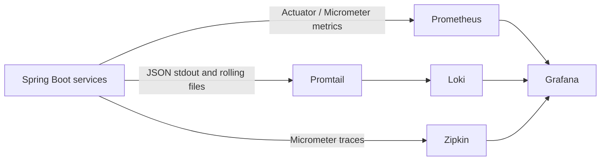

# Observability Implementation Guide

This guide explains how observability is added to Shopverse services from the
application dependencies up to Grafana dashboards. It is implementation-focused:
use [Shopverse observability operations](SHOPVERSE-OBSERVABILITY-OPERATIONS.md)
when you need commands, troubleshooting order, and runtime checks.

## Shopverse Observability Stack

Observability helps us understand what is happening inside a running
distributed system. Shopverse uses three main signals:

- **metrics** for rates, latency, availability, saturation, and alerts;
- **logs** for exact events, errors, and business context;
- **traces** for request flow and span latency across services.

The current Shopverse stack is:

| Component | Role in Shopverse |
|---|---|
| Grafana | Visualizes metrics, logs, and traces from Prometheus, Loki, and Zipkin. It also hosts dashboards and Explore views. |
| Micrometer | Application instrumentation library used by Spring Boot to create counters, timers, gauges, and observations. |
| Spring Boot Actuator | Exposes operational endpoints such as `/actuator/health`, `/actuator/info`, and `/actuator/prometheus`. |
| Prometheus | Scrapes service metrics from Actuator and stores time-series data for PromQL queries and alerts. |
| Loki | Stores application logs and makes them searchable from Grafana with LogQL. |
| Promtail | Reads Docker/service logs, parses useful fields, labels bounded values, and pushes log batches to Loki. |
| Zipkin | Stores and visualizes distributed traces emitted by Spring Boot tracing integration. |
| OpenTelemetry | Not currently wired as the Shopverse tracing SDK. It is a future option if we want vendor-neutral trace, metric, and log export. |
| Tempo | Not currently used. It is a future replacement or addition for trace storage if we want to align with the Grafana Tempo stack. |

The Programming Techie article uses Grafana, Loki, Prometheus, and Tempo.
Shopverse currently uses Grafana, Loki, Promtail, Prometheus, Micrometer, and
Zipkin. Tempo can be introduced later without changing the high-level
observability model.




## Implementation Plan

1. Add observability dependencies to each Spring Boot service.
2. Expose health, info, and Prometheus Actuator endpoints.
3. Add common metric tags so every time series has a service name.
4. Enable tracing and send spans to Zipkin.
5. Emit structured logs with correlation IDs, trace IDs, and span IDs.
6. Configure Prometheus scrape targets for every service.
7. Configure Promtail and Loki for centralized log collection.
8. Provision Grafana data sources.
9. Create Grafana dashboards for service health, traffic, latency, errors,
   JVM health, logs, and traces.
10. Verify the full path from request to metrics, logs, traces, and dashboard
    panels.

## Step 1: Add Service Dependencies

Every observable Spring Boot service needs Actuator and the Prometheus
Micrometer registry:

```gradle
implementation 'org.springframework.boot:spring-boot-starter-actuator'
runtimeOnly 'io.micrometer:micrometer-registry-prometheus'
```

Actuator exposes operational endpoints. The Prometheus registry converts
Micrometer meters into Prometheus text format at `/actuator/prometheus`.

For tracing, Shopverse currently uses Spring Boot's Zipkin integration:

```gradle
implementation 'org.springframework.boot:spring-boot-starter-zipkin'
```

Services that call other services through OpenFeign should also include Feign
Micrometer instrumentation:

```gradle
implementation 'io.github.openfeign:feign-micrometer'
```

This helps client-side HTTP calls participate in metrics and trace propagation.

## Step 2: Expose Actuator Endpoints

Put shared observability settings in centralized Spring Cloud Config so the
services stay consistent:

```yaml
management:
  endpoints:
    web:
      exposure:
        include: health,info,prometheus
```

The main endpoints are:

| Endpoint | Purpose |
|---|---|
| `/actuator/health` | Used by Docker health checks and human verification. |
| `/actuator/info` | Exposes service metadata when configured. |
| `/actuator/prometheus` | Exposes metrics for Prometheus scraping. |

Security configuration must allow Prometheus and health checks to access these
endpoints without a customer JWT.

## Step 3: Add Common Metric Tags

Dashboards need a stable service dimension. Add the Spring application name as
a common metric tag:

```yaml
management:
  metrics:
    tags:
      application: ${spring.application.name}
```

Without this tag, a query may show many raw container targets but not a clean
service-level view. Keep metric labels bounded. Good labels include
`application`, `method`, `status`, `outcome`, `stage`, and `reason`. Do not use
`orderNumber`, `username`, `correlationId`, `traceId`, raw URLs, or exception
messages as metric tags.

## Step 4: Configure Tracing

Enable tracing and send spans to Zipkin:

```yaml
management:
  tracing:
    enabled: ${TRACING_ENABLED:true}
    sampling:
      probability: ${TRACING_SAMPLING_PROBABILITY:1.0}
    zipkin:
      endpoint: ${ZIPKIN_ENDPOINT:http://localhost:9411/api/v2/spans}
```

Use `1.0` sampling in local development and demos so every request is visible.
Production should use a deliberate sampling policy that keeps error and
critical business flows while controlling trace volume.

Trace identifiers and correlation identifiers are related but not identical:

| Identifier | Meaning |
|---|---|
| `traceId` | Technical distributed trace generated by tracing instrumentation. |
| `spanId` | One operation inside a trace, such as a server request or client call. |
| `correlationId` | Shopverse business/request identifier carried through HTTP, Kafka events, logs, and timeline records. |

## Step 5: Emit Structured Logs

Shopverse services should write structured logs to stdout and service log
files. Promtail collects those logs and sends them to Loki. This avoids adding a
Loki appender dependency to every service.

A useful log event includes:

```json
{
  "timestamp": "2026-06-26T10:15:30.000Z",
  "level": "INFO",
  "application": "ORDER-SERVICE",
  "correlationId": "checkout-observe-101",
  "traceId": "6a1e660de4db49fe47911954296ecce5",
  "spanId": "47911954296ecce5",
  "message": "Order checkout started"
}
```

Use structured key/value logging for business fields:

```java
log.atInfo()
        .addKeyValue("orderNumber", orderNumber)
        .addKeyValue("stage", "checkout")
        .log("Order checkout started");
```

Do not log passwords, tokens, card data, full request bodies, or secrets.

## Step 6: Configure Prometheus

Prometheus needs one scrape target per service:

```yaml
scrape_configs:
  - job_name: order-service
    metrics_path: /actuator/prometheus
    static_configs:
      - targets: ['order-service:8083']
        labels:
          application: ORDER-SERVICE
```

In Docker, targets should use service names on the Docker network. When a
service runs on the host outside Docker, use a host-reachable address only for
local development.

After startup, verify targets in Prometheus:

```text
http://localhost:9090/targets
```

Every business service should be `UP`.

## Step 7: Configure Loki And Promtail

The Shopverse log pipeline is:

```text
Spring Boot service
  -> structured stdout / rolling file
  -> Docker log stream or mounted log file
  -> Promtail
  -> Loki
  -> Grafana
```

Promtail should:

- discover service logs;
- parse JSON fields;
- attach bounded labels such as `application` and `log_type`;
- leave high-cardinality values such as `correlationId` and `traceId` as parsed
  fields instead of Loki labels.

Use Grafana Explore with the Loki data source to test ingestion:

```logql
{log_type="application"}
```

Then narrow to one service or correlation ID:

```logql
{log_type="application", application="ORDER-SERVICE"}
```

```logql
{log_type="application"} | json | correlationId="checkout-observe-101"
```

## Step 8: Provision Grafana Data Sources

Grafana reads provisioned data sources from:

```text
observability/grafana/provisioning/datasources/datasources.yml
```

Shopverse provisions:

| Data source | Used for |
|---|---|
| Prometheus | Metrics, PromQL dashboards, and alert queries. |
| Loki | Logs and LogQL searches. |
| Zipkin | Distributed traces. |

The Loki data source also defines derived fields so a `traceId` in a log can
open the related Zipkin trace, and a `correlationId` can open a filtered Loki
search.

## Step 9: Create Grafana Dashboards

Dashboard JSON files live under:

```text
observability/grafana/dashboards
```

Grafana loads them through:

```text
observability/grafana/provisioning/dashboards/dashboards.yml
```

Recommended dashboard sections:

| Section | Panels |
|---|---|
| Service health | Prometheus `up`, unhealthy targets, service availability. |
| HTTP traffic | request rate, status code split, gateway route traffic. |
| Latency | average latency, p95 latency, slowest services. |
| Errors | 4xx/5xx rates, recent error logs from Loki. |
| JVM health | heap usage, CPU, threads, GC pause time. |
| Business operations | checkout count, payment failure count, inventory reservation failures, SAGA failures, outbox failures. |
| Investigation links | Open Loki Explore, open Zipkin, filter by correlation ID. |

Useful PromQL queries:

```promql
up
```

```promql
sum(rate(http_server_requests_seconds_count[5m])) by (application, method)
```

```promql
sum(rate(http_server_requests_seconds_count{status=~"5.."}[5m])) by (application)
```

```promql
histogram_quantile(
  0.95,
  sum(rate(http_server_requests_seconds_bucket[5m])) by (le, application)
)
```

```promql
sum(jvm_memory_used_bytes{area="heap"}) by (application)
/
sum(jvm_memory_max_bytes{area="heap"}) by (application)
```

Useful LogQL queries:

```logql
{log_type="application"} | json | level="ERROR"
```

```logql
{log_type="application"} | json | correlationId="checkout-observe-101"
```

```logql
{log_type="application"} | json | traceId="6a1e660de4db49fe47911954296ecce5"
```

## Step 10: Verify End To End

Start the observability stack:

```powershell
docker compose up -d prometheus loki promtail zipkin grafana
```

Generate a real checkout request with a known `X-Correlation-Id`, then verify:

1. each service health endpoint returns `UP`;
2. each `/actuator/prometheus` endpoint returns metrics;
3. Prometheus targets are `UP`;
4. Grafana can query Prometheus, Loki, and Zipkin;
5. Loki contains logs for the correlation ID;
6. Zipkin contains traces for the same time window;
7. Grafana dashboards show non-empty service, traffic, latency, error, and JVM
   panels.

## Future: Tempo And OpenTelemetry

Tempo and OpenTelemetry are good future improvements, but they should be
introduced deliberately.

Tempo would replace or supplement Zipkin as the trace backend:

```text
Services -> Micrometer tracing exporter -> Tempo -> Grafana
```

OpenTelemetry would make telemetry export more vendor-neutral:

```text
Services -> OpenTelemetry SDK/agent -> OpenTelemetry Collector -> Prometheus/Loki/Tempo or another backend
```

Do this as a separate migration so dashboards, data sources, trace links, and
runbooks are updated together.

## Related Guides

- [Observability architecture](OBSERVABILITY.md)
- [Shopverse observability operations](SHOPVERSE-OBSERVABILITY-OPERATIONS.md)
- [Micrometer metrics](MICROMETER-METRICS.md)
- [Prometheus](PROMETHEUS.md)
- [Loki](LOKI.md)
- [Promtail](PROMTAIL.md)
- [Grafana](GRAFANA.md)
- [Structured logging](STRUCTURED-LOGGING.md)
- [MDC, correlation IDs, and tracing](MDC-CORRELATION-TRACING.md)
