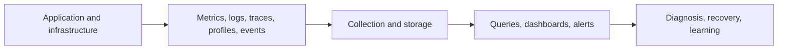

# Observability Engineering Overview

Observability is the ability to explain a system's internal state and user impact
from emitted evidence. It begins with operational questions and service objectives,
not with installing a dashboard product.

## Signals

| Signal | Best for | Main risk |
|---|---|---|
| metrics | aggregate rates, latency distributions, saturation, SLOs, alerts | high-cardinality labels and misleading averages |
| logs | detailed discrete events and diagnostic context | volume, sensitive data, unstructured messages |
| traces | request path and latency across boundaries | sampling gaps and expensive high-cardinality attributes |
| profiles | CPU, allocation, locks, and runtime hot paths | overhead and insufficient business context |
| business state | authoritative workflow and recovery outcome | may require controlled database access and domain knowledge |
| deployment/config events | explain changes correlated with symptoms | incomplete ownership or missing version identity |

## Core Concepts

- **SLI:** measured behavior such as successful-request ratio or latency.
- **SLO:** target for an SLI over a defined window.
- **error budget:** allowed unreliability implied by an SLO.
- **cardinality:** number of distinct label combinations; uncontrolled values can
  make metric systems expensive or unusable.
- **correlation ID:** stable workflow/request identity used across logs and events.
- **trace context:** standardized parent/child propagation for distributed spans.
- **RED:** request rate, errors, and duration for services.
- **USE:** utilization, saturation, and errors for resources.

## Instrument From Questions

For every critical flow ask:

1. Is traffic arriving?
2. Is it succeeding, failing, or timing out?
3. How long does it take at p50, p95, and p99?
4. Which dependency or resource is saturated?
5. Which tenant, operation, partition, or deployment is affected?
6. Did the business effect complete?
7. Can an operator prove recovery?

Use bounded labels for metrics. Put identifiers such as order ID, user ID, offset,
and stack trace in protected logs or traces rather than metric labels.

## Alert Design

Alert on user impact, SLO burn, imminent exhaustion, and loss of safety margin.
Every alert needs an owner, severity, evidence link, runbook, silence policy, and
recovery condition. A dashboard without a decision or an alert without an action is
not operational coverage.

## Investigation Loop

1. Establish user impact and time window.
2. Check recent deployments, configuration, traffic, and dependency events.
3. Use service metrics to narrow the failing layer.
4. Follow representative traces and correlated logs.
5. Verify authoritative business state.
6. Mitigate safely, observe recovery, and record evidence.
7. Convert findings into tests, alerts, capacity, or design improvements.

## Security And Cost

Telemetry is production data. Apply access control, encryption, retention,
redaction, tenant isolation, audit, sampling, and deletion policies. Never log
tokens, passwords, private keys, or unnecessary personal data.

## Recommended Route

1. [Observability](./OBSERVABILITY.md)
2. [Structured Logging](./STRUCTURED-LOGGING.md)
3. [MDC Correlation And Tracing](./MDC-CORRELATION-TRACING.md)
4. [Micrometer Metrics](./MICROMETER-METRICS.md)
5. [Distributed Tracing Internals](./DISTRIBUTED-TRACING-INTERNALS-PERFORMANCE.md)
6. [Prometheus](./PROMETHEUS.md)
7. [Grafana](./GRAFANA.md)
8. [Shopverse Observability Operations](./SHOPVERSE-OBSERVABILITY-OPERATIONS.md)
9. [Observability Revision Sheet](./OBSERVABILITY-REVISION-SHEET.md)

## Completion Check

- define SLIs/SLOs from user-visible outcomes;
- select metrics, logs, traces, profiles, and business evidence appropriately;
- keep metric cardinality and sensitive data controlled;
- propagate and clear correlation context safely;
- build actionable alerts and runbooks;
- diagnose a distributed incident from evidence;
- balance fidelity, retention, sampling, and cost.
