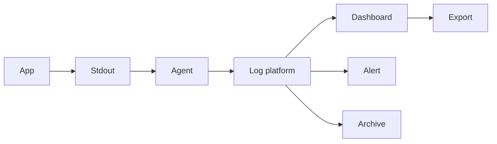

# PII-Safe Logging And Data Classification

PII means **personally identifiable information**: information that can identify,
distinguish, trace, or be linked to a person, alone or in combination. The exact
legal category varies by jurisdiction and context; involve privacy/legal owners
when defining policy. “Not secret” does not mean “safe to log.”

## Classify Before Logging

| Class | Examples | Default logging treatment |
|---|---|---|
| public | product name, public catalog ID | permitted with normal integrity controls |
| internal | service name, non-sensitive feature flag, build version | permitted when operationally useful |
| personal/PII | name, email, phone, address, IP/device/user identifiers, precise location | omit, tokenize, or minimize; access and retention controlled |
| sensitive personal | health, biometrics, government identifiers, financial/employment details | do not log directly; exceptional approved handling only |
| credentials/secrets | password, JWT, session ID, API key, private key, reset token | never log; revoke/rotate if exposed |
| payment authentication data | full card data, CVV, provider credentials | never log; follow payment/security requirements |

An internal customer ID may be pseudonymous rather than anonymous: anyone with
access to the lookup table can reconnect it to a person. Hashing low-entropy data
such as email addresses can often be reversed by guessing, so hashing is not
automatically anonymization.

## Why Logs Increase Privacy Risk

Logs are copied to stdout, agents, queues, indexes, dashboards, alerts, tickets,
exports, archives, backups, and third-party observability systems. They often
have broader access and longer retention than the source application. One unsafe
log statement can therefore create many uncontrolled copies.



PII in logs affects confidentiality, breach scope, data-subject requests,
retention/deletion, cross-border transfer, incident response, vendor contracts,
and production support access.

## What To Log Instead

Prefer event metadata that explains behavior without reproducing the record:

```json
{
  "event": "checkout_rejected",
  "orderId": "ord_8f1d",
  "actorId": "usr_42a1",
  "reasonCode": "INVENTORY_UNAVAILABLE",
  "correlationId": "corr_019a",
  "service": "order-service",
  "durationMs": 47
}
```

`actorId` is still potentially personal/pseudonymous and must be protected, but
it is normally safer than logging name, email, address, JWT, and the full request.

| Need | Safer field |
|---|---|
| correlate a request | generated correlation/trace ID |
| identify business object | opaque order/product ID |
| classify failure | stable error/reason code |
| analyze latency | duration and route template, not raw URL query |
| investigate actor activity | protected internal actor ID with audited lookup |
| group client behavior | coarse region/device class where approved, not precise location/fingerprint |

## Omit, Mask, Tokenize, Hash, Or Encrypt?

| Treatment | Use | Limitation |
|---|---|---|
| omit | value is unnecessary for the logging purpose | strongest default; cannot support later lookup |
| mask/redact | operator needs a small recognizable fragment | remaining characters may still identify; inconsistent masking leaks |
| tokenize | controlled system maps random token to original | token service/map becomes sensitive; access must be audited |
| keyed HMAC | stable grouping without storing raw value | still pseudonymous; protect/rotate key and resist guessing |
| encrypt | approved reversible access is necessary | key/access/retention complexity; plaintext appears after decryption |
| plain hash | integrity/dedup for high-entropy values | poor protection for guessable email/phone/name values |

Sanitize carriage returns, line feeds, delimiters, and control characters to
prevent log injection. Do not let user input control log templates or field names.

## Spring/Java Guardrails

Avoid:

```java
log.info("Create user request={}", request);
log.debug("Authorization={}", authorizationHeader);
log.error("Payment failed", exceptionContainingProviderPayload);
```

Prefer an allowlisted structured event:

```java
log.atInfo()
        .addKeyValue("event", "user_created")
        .addKeyValue("actorId", actorId)
        .addKeyValue("correlationId", correlationId)
        .addKeyValue("result", "SUCCESS")
        .log("User creation completed");
```

Controls:

- use DTO `toString()` carefully; never auto-print complete entities or requests;
- configure HTTP/client logging to exclude bodies and authorization/cookie headers;
- redact at the application source; pipeline redaction is defense in depth, not the first control;
- keep PII and secrets out of MDC, metric labels, span attributes, exception
  messages, SQL bind logging, audit payloads, and message headers;
- lint/test forbidden field names and canary secret values in captured test logs;
- disable verbose framework/driver logging in production unless a bounded,
  approved diagnostic window exists.

## Logging Policy Template

For every event family document:

```text
purpose and owner
allowed fields and classification
prohibited fields
mask/tokenization method
who can read/search/export
retention and deletion policy
regions and third-party processors
integrity/tamper controls
incident and access-review process
```

Apply least privilege to log platforms. Separate ordinary operational access
from sensitive audit access. Encrypt in transit/at rest, record access/export,
limit broad wildcard searches, and enforce retention in indexes and archives/backups.

## Audit Log Versus Diagnostic Log

| Diagnostic/operational log | Security/business audit log |
|---|---|
| troubleshoot health and code paths | prove who performed a sensitive action and outcome |
| sampled/level-controlled and relatively short retention | protected, append-oriented, defined retention and integrity |
| should contain minimal metadata | may require approved actor/target identifiers but still no secrets |
| not authoritative business state | evidence linked to authoritative transactions |

Do not omit required audit events in the name of privacy. Minimize fields,
restrict access, protect integrity, define lawful retention, and separate them
from broadly accessible diagnostics.

## Incident: PII Or Secret Was Logged

1. Stop the source safely: change configuration/code without destroying evidence.
2. Identify data categories, affected people/tenants, time window, services,
   environments, destinations, exports, alerts, tickets, archives, and backups.
3. Restrict access and preserve an incident audit trail.
4. Rotate/revoke credentials and tokens immediately; PII cannot be “rotated,” so
   apply the organization's privacy/breach process.
5. Purge or quarantine copies according to legal, retention, and forensic guidance.
6. Notify security/privacy/legal owners and meet applicable notification duties.
7. Add regression detection, reduce retention/access, and document the root cause.

Do not quietly edit centralized records if integrity or investigation obligations
require preservation. Follow the approved incident and privacy process.

## Review Checklist

- Is each field necessary for a documented operational/security purpose?
- Can combined fields identify or profile a person?
- Are raw bodies, headers, query strings, exceptions, SQL binds, and events controlled?
- Are identifiers opaque and access to re-identification audited?
- Are log access, transport, storage, exports, backups, and vendors protected?
- Does retention end when the purpose/obligation ends?
- Can the organization find and respond to sensitive-data exposure?
- Do tests fail if passwords, JWTs, keys, emails, phones, or payment patterns appear?

## References

- [NIST definition of personally identifiable information](https://csrc.nist.gov/glossary/term/personally_identifiable_information)
- [NIST SP 800-122: Protecting PII confidentiality](https://www.nist.gov/publications/guide-protecting-confidentiality-personally-identifiable-information-pii)
- [OWASP Logging Cheat Sheet](https://cheatsheetseries.owasp.org/cheatsheets/Logging_Cheat_Sheet.html)
