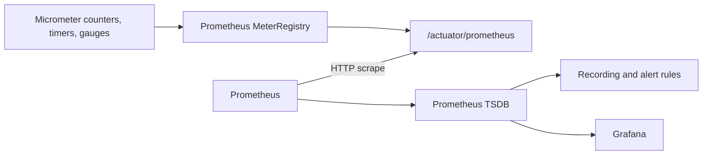

# Prometheus

Prometheus is a pull-based monitoring system and time-series database.
Shopverse services expose metrics at `/actuator/prometheus`; Prometheus scrapes
them every 15 seconds, stores labeled samples, evaluates rules, and supplies
Grafana.

## Internal Flow



Prometheus does not receive a push from normal Shopverse application meters.
It periodically pulls the current exposition.

## Time Series

A metric name plus its complete label set identifies a series:

```text
http_server_requests_seconds_count{
  application="ORDER-SERVICE",
  method="POST",
  status="201"
}
```

Every additional unbounded label value creates more series and memory/storage
cost. Never label metrics with order number, user, trace ID, correlation ID, or
raw request path.

## Metric Types

| Type | Use |
|---|---|
| Counter | cumulative events such as requests or failures |
| Gauge | current value such as active connections |
| Timer/Histogram | count and duration distribution |
| Distribution summary | distribution of non-time values |

Counters normally end in `_total` in Prometheus. Query their rate or increase,
not the raw value alone.

## PromQL Basics

| Function/operator | Purpose |
|---|---|
| `rate(counter[5m])` | per-second average counter rate |
| `increase(counter[1h])` | estimated events during a range |
| `sum by (...)` | aggregate while retaining selected labels |
| `histogram_quantile` | estimate percentile from histogram buckets |
| `clamp_min` | avoid unsafe division by zero |
| `avg_over_time` | average gauge samples over a range |
| `max_over_time` | maximum gauge sample over a range |

Use a rate window several times larger than the 15-second scrape interval.

## Target And Service Health

All targets:

```promql
up
```

Shopverse services:

```promql
up{job="shopverse-services"}
```

Unavailable services:

```promql
up{job="shopverse-services"} == 0
```

`up=1` means Prometheus scraped the endpoint successfully. It does not prove a
complete checkout works.

## HTTP Traffic

Request rate:

```promql
sum by (application) (
  rate(http_server_requests_seconds_count[5m])
)
```

Rate by method and status:

```promql
sum by (application, method, status) (
  rate(http_server_requests_seconds_count[5m])
)
```

5xx rate:

```promql
sum by (application) (
  rate(http_server_requests_seconds_count{status=~"5.."}[5m])
)
```

Client-error rate:

```promql
sum by (application) (
  rate(http_server_requests_seconds_count{status=~"4.."}[5m])
)
```

Availability:

```promql
1 -
(
  sum(rate(http_server_requests_seconds_count{status=~"5.."}[5m]))
  /
  clamp_min(sum(rate(http_server_requests_seconds_count[5m])), 0.001)
)
```

## Latency

p50:

```promql
histogram_quantile(
  0.50,
  sum by (le, application) (
    rate(http_server_requests_seconds_bucket[5m])
  )
)
```

p95:

```promql
histogram_quantile(
  0.95,
  sum by (le, application) (
    rate(http_server_requests_seconds_bucket[5m])
  )
)
```

p99:

```promql
histogram_quantile(
  0.99,
  sum by (le, application) (
    rate(http_server_requests_seconds_bucket[5m])
  )
)
```

Average duration:

```promql
sum by (application) (
  rate(http_server_requests_seconds_sum[5m])
)
/
clamp_min(
  sum by (application) (
    rate(http_server_requests_seconds_count[5m])
  ),
  0.001
)
```

Percentiles require histogram buckets. Shopverse enables HTTP server
percentile histograms centrally.

## Business Metrics

SAGA transitions:

```promql
sum by (stage) (
  increase(shopverse_saga_transitions_total[15m])
)
```

Checkout failure transitions:

```promql
sum(
  increase(
    shopverse_saga_transitions_total{
      stage=~"PAYMENT_FAILED|INVENTORY_REJECTED"
    }[15m]
  )
)
```

Payment outcomes:

```promql
sum by (status) (
  increase(shopverse_payment_outcomes_total[15m])
)
```

Reservation conflicts:

```promql
sum by (reason) (
  increase(shopverse_inventory_reservation_conflicts_total[15m])
)
```

Expired reservations:

```promql
sum(
  increase(shopverse_inventory_reservations_expired_total[15m])
)
```

Outbox publication:

```promql
sum by (outcome) (
  increase(shopverse_outbox_publish_total[15m])
)
```

DLT persistence:

```promql
sum by (service) (
  increase(shopverse_kafka_dlt_events_total[1h])
)
```

DLT replay:

```promql
sum by (service) (
  increase(shopverse_kafka_dlt_replays_total[1h])
)
```

## JVM And Process

Heap use:

```promql
sum by (application) (
  jvm_memory_used_bytes{area="heap"}
)
```

Heap utilization:

```promql
sum by (application) (jvm_memory_used_bytes{area="heap"})
/
clamp_min(
  sum by (application) (jvm_memory_max_bytes{area="heap"}),
  1
)
```

Live threads:

```promql
sum by (application) (jvm_threads_live_threads)
```

Process CPU:

```promql
process_cpu_usage
```

JVM pause rate:

```promql
sum by (application) (
  rate(jvm_gc_pause_seconds_count[5m])
)
```

## Datasource Pool

Depending on exported Micrometer/Hikari names:

```promql
hikaricp_connections_active
```

```promql
hikaricp_connections_pending
```

```promql
hikaricp_connections_timeout_total
```

Verify exact names in `/actuator/prometheus`. Pending connections or timeouts
can explain slow listeners and HTTP requests.

## Kafka Metrics

Available Kafka client metric names depend on the client and Micrometer
binding. Search:

```promql
{__name__=~".*kafka.*"}
```

Useful categories:

- producer send/error/retry rate;
- producer request latency;
- consumer records rate;
- fetch latency;
- assigned partitions;
- listener processing observations.

Kafka group lag is best collected using a Kafka-aware exporter or platform
integration. Current Shopverse Prometheus rules do not provide complete
consumer-lag alerting.

## Recording Rules

Shopverse precomputes:

```text
shopverse:http_requests:availability_5m
shopverse:http_requests:p95_seconds_5m
shopverse:checkout_failures:rate_5m
```

Recording rules simplify dashboards and expensive repeated queries. Name them
consistently and preserve enough labels for investigation.

## Alert Rules

Implemented alerts:

| Alert | Condition |
|---|---|
| `ShopverseServiceDown` | target down for two minutes |
| `ShopverseHighServerErrorRate` | availability below 99% |
| `ShopverseHighP95Latency` | p95 above one second |
| `ShopverseOutboxPublishFailures` | failed publication observed |
| `ShopverseDeadLetterEvents` | DLT event observed |

An alert needs:

- actionable symptom;
- owner;
- severity;
- sustained `for` duration;
- runbook link;
- notification route;
- recovery condition.

The POC lacks Alertmanager routing, so rules evaluate without a complete
production paging pipeline.

## SLO Guidance

Define service-level indicators such as:

```text
availability = successful requests / valid requests
latency      = proportion below target duration
correctness  = successfully completed checkout SAGAs
freshness    = time from outbox creation to publication
```

Production SLOs should use multi-window burn-rate alerts and minimum-traffic
guards. A five-minute 99% threshold is useful for demonstration but noisy for
low traffic.

## Troubleshooting Missing Metrics

1. Open the service `/actuator/prometheus`.
2. Search the normalized Prometheus metric name.
3. Trigger the code path; custom meters may be created lazily.
4. Open Prometheus **Status → Targets**.
5. Inspect scrape errors and labels.
6. Widen the query time range.
7. Check label filters and spelling.
8. Confirm the meter is not denied by a filter.

Prometheus cannot search a correlation ID because IDs must not be labels. Use
Loki for per-request context.

## Production Practices

- Protect actuator endpoints from untrusted networks.
- Keep labels bounded.
- Add retention, backup, and disk-capacity planning.
- Use Alertmanager with ownership and runbooks.
- Monitor Prometheus itself.
- Add Kafka lag and oldest-outbox-age metrics.
- use recording rules for repeated expensive queries.
- use remote write or highly available architecture when required.
- test alerts and their recovery, not only query syntax.

## Related Guides

- [Micrometer metrics](MICROMETER-METRICS.md)
- [Grafana](GRAFANA.md)
- [Loki](LOKI.md)
- [Debugging](../development/DEBUGGING.md)
- [Official PromQL documentation](https://prometheus.io/docs/prometheus/latest/querying/basics/)
