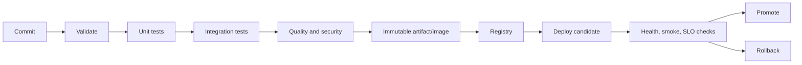

# CI/CD Automation

Continuous Integration validates every change. Continuous Delivery keeps a
releasable artifact ready for controlled promotion. Continuous Deployment
automatically promotes every qualified change to production.



## Pipeline Stages

| Stage | Expected result |
|---|---|
| Checkout | exact commit and complete metadata |
| Validate | configuration and syntax are valid |
| Compile | source builds reproducibly |
| Unit test | local behavior is correct |
| Integration test | real database/broker contracts work |
| Static analysis | quality, dependency, secret, and security checks pass |
| Package | versioned artifact is produced once |
| Image | immutable deployable container is built |
| Publish | artifact is pushed to trusted registry |
| Deploy | same artifact is promoted to an environment |
| Verify | readiness, smoke tests, migrations, metrics are healthy |
| Promote/rollback | exposure increases or returns to known-good version |

Build once and promote the same artifact. Rebuilding per environment can
produce different binaries.

## Automation Approaches

| Approach | Examples | Best fit |
|---|---|---|
| Hosted repository CI | GitHub Actions, GitLab CI | low operations overhead |
| Self-hosted automation | Jenkins | private networks and customized agents |
| Cloud platform pipeline | Azure DevOps, AWS CodePipeline, Google Cloud Build | deep cloud integration |
| Cloud-native pipeline | Tekton | Kubernetes-native execution |
| Pull-based GitOps | Argo CD, Flux | declarative Kubernetes deployment |
| Infrastructure automation | Terraform, Pulumi, CloudFormation | provision infrastructure |
| Configuration automation | Ansible | host and software configuration |
| Kubernetes packaging | Helm, Kustomize | environment-aware manifests |

## Push-Based CD

The CI system connects to the target and deploys:

```text
CI runner -> SSH/cloud/Kubernetes API -> environment
```

It is direct and simple but gives the CI system deployment credentials and
network access.

## Pull-Based GitOps

CI updates a deployment repository. An in-cluster controller reconciles the
desired state:

```text
CI -> Git desired state <- Argo CD/Flux <- cluster
```

Benefits:

- Git audit trail;
- cluster credentials stay inside the cluster;
- automatic drift reconciliation;
- rollback by reverting desired state.

It still requires secret management, policy, progressive delivery, and
database migration design.

## Trigger Options

- pull request for validation;
- push to main for integration;
- release tag for immutable release;
- manual dispatch for controlled operations;
- schedule for dependency/full verification;
- webhook from another system;
- environment approval for production;
- path-based trigger for monorepo affected services.

## Deployment Strategies

- rolling for gradual replacement;
- blue-green for fast traffic switching;
- canary for small initial exposure;
- feature flags to separate deployment from release;
- shadow traffic for response comparison without serving candidate results.

Automate rollback using deployment health, technical SLOs, and business
signals. Avoid rollback solely from one noisy metric.

## Database And Event Compatibility

Use expand-and-contract migrations:

1. add backward-compatible schema;
2. deploy code supporting old and new forms;
3. backfill;
4. switch reads/writes;
5. remove old schema later.

Kafka producers and consumers must tolerate rolling-version overlap and stored
event replay.

## Supply-Chain Controls

- dependency and license scanning;
- secret scanning;
- SAST and IaC scanning;
- container vulnerability scanning;
- SBOM generation;
- artifact provenance;
- signing and verification;
- least-privilege workload identity;
- protected branch and environment policy.

## Pipeline Performance

Improve feedback without weakening gates:

- detect affected services;
- run independent jobs in bounded parallelism;
- cache Gradle, Docker, and package dependencies safely;
- separate unit, integration, and E2E layers;
- fail fast on cheap validation;
- cancel obsolete branch builds;
- set job timeouts;
- retain diagnostics only when useful;
- reuse Testcontainers per suite where isolation permits.

## DORA Metrics

| Metric | Meaning |
|---|---|
| Deployment frequency | how often production changes are released |
| Lead time for changes | commit-to-production duration |
| Change failure rate | percentage of deployments causing failure/remediation |
| Failed deployment recovery time | time to recover from a failed production change |

Also measure pipeline queue time, execution time, flaky-test rate, cache hit
rate, rollback rate, and environment failure rate.

## Shopverse Automation

Shopverse uses both:

- GitHub Actions for hosted affected-service CI, Testcontainers, image
  publication, documentation deployment, and optional SSH deployment;
- Jenkins for self-hosted Pipeline-as-Code, image builds, and local Compose
  deployment demonstrations.

This is educational overlap. A production team should define clear ownership
instead of running duplicate CI systems without purpose.

## Recommended Shopverse Evolution

1. Keep GitHub Actions as the primary pull-request gate.
2. Use immutable GHCR SHA tags.
3. Protect the production environment with approval.
4. Add source/dependency/image scanning and SBOM generation.
5. Replace direct host deployment with Kubernetes plus Argo CD when the POC
   intentionally moves to orchestration.
6. Add automated post-deployment SAGA smoke tests and metric checks.
7. Document and test rollback.

## Related Guides

- [Helm, GitOps, And Argo CD Architect Path](./HELM-GITOPS-ARGOCD-PATH.md)
- [Docker](DOCKER.md)
- [Jenkins](JENKINS.md)
- [GitHub Actions](GITHUB-ACTIONS.md)
- [Deployment Strategies](DEPLOYMENT-STRATEGIES.md)
- [Spring Boot Testing](../spring/SPRING-BOOT-TESTING.md)
