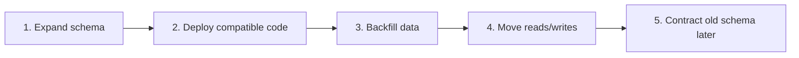

# Contracts And Release Gates

<DocLabels items={[{label: 'Advanced', tone: 'advanced'}, {label: 'Shopverse', tone: 'shopverse'}, {label: 'Production', tone: 'production'}]} />

## Database Deployment

Use expand-and-contract:

1. add compatible schema;
2. deploy code that supports old and new representations;
3. backfill data;
4. move reads and writes;
5. remove old schema in a later release.



Never combine a destructive schema change with code that assumes the change
has already completed across every instance.

| Unsafe | Safer |
|---|---|
| rename column and deploy code at the same time | add new column, write both, migrate reads, remove old later |
| drop column used by old pods | keep column until all old pods are gone |
| make nullable column required immediately | backfill first, then add constraint |
| change enum values without compatibility | add new value and keep consumers tolerant |

Database rollback is difficult because data has moved forward. Prefer
backward-compatible migrations and compensating migrations.

## Kafka Contract Deployment

- add optional fields;
- tolerate unknown fields;
- deploy consumers before producers when a new event is required;
- avoid changing existing field meaning;
- retain replay compatibility for stored events.

Kafka adds a deployment concern that HTTP-only systems may not have: old events
can be replayed after new code is deployed.

Rules:

- consumers should ignore unknown fields;
- producers should avoid removing fields until consumers no longer require
  them;
- add schema versioning for meaningful changes;
- deploy tolerant consumers before stricter producers;
- keep old event meanings stable;
- replay DLT/outbox records against compatible code.

## Health Checks And Readiness Gates

Deployment automation should wait for readiness before sending traffic.

| Probe | Meaning |
|---|---|
| Liveness | process is alive and should not be restarted |
| Readiness | instance can receive traffic |
| Startup | slow-starting app is still booting |

Readiness should fail when the service cannot handle requests safely. Examples:

- database unavailable;
- required migration failed;
- Config Server dependency missing during bootstrap;
- Kafka listener required for the service is not ready, if traffic depends on
  it.

Do not make liveness too strict. If liveness fails for a temporary database
issue, the orchestrator may restart every instance and worsen the outage.

## Smoke Tests

After deployment, run a small set of high-value tests:

- health endpoint;
- login or token validation;
- one read API;
- one write API in a safe test scope;
- checkout/SAGA smoke path in non-production or controlled data;
- metrics endpoint;
- logs and traces visible.

Smoke tests should be fast and deterministic. They are not a replacement for
full integration tests.

## Automated Rollback Signals

Use multiple signals, not one noisy metric:

- deployment health;
- readiness failures;
- HTTP 5xx rate;
- p95/p99 latency;
- business conversion/success rate;
- Kafka lag and DLT events;
- outbox failure count;
- error log rate;
- database connection pool exhaustion.

Example rule:

```text
if canary 5xx rate > stable 5xx rate by threshold
and request volume is sufficient
and condition lasts for N minutes
then stop rollout or route traffic back
```

### Release Gate Design

A useful gate compares candidate with stable and checks absolute safety limits:

```text
promote only if
  candidate request count >= minimum sample
  AND candidate 5xx rate <= absolute limit
  AND candidate 5xx rate - stable 5xx rate <= allowed regression
  AND candidate p95 latency <= allowed regression
  AND saturation remains below safety limit
  AND checkout/payment success remains healthy
```

Use a longer window for low-volume business outcomes and a shorter emergency
stop for severe security, corruption, or correctness signals. Treat missing
telemetry as a failed gate, not success.

## Failure Scenarios To Rehearse

| Failure | Expected control |
|---|---|
| Candidate never becomes ready | Progress deadline stops rollout; logs and events explain why |
| Old instance receives traffic while draining | Readiness removal precedes shutdown; graceful termination completes requests |
| Candidate overloads the database | Canary/concurrency limit contains load; pool and database alarms stop promotion |
| New producer breaks old consumer | Consumer-first compatible contract deployment and schema checks |
| Rollback cannot read migrated data | Expand-and-contract or roll-forward plan |
| Queue workers run in both blue and green | Explicit consumer ownership, partitioning, or paused candidate consumers |
| Metrics look healthy but checkout fails | Business KPI and synthetic transaction gate |
| Flag service is unavailable | Defined cached/default behavior and operational alarm |
| Retry storm begins during rollout | Bounded retry budgets, jitter, circuit breaker, and load shedding |

Run these as game-day exercises. A rollback document that has never been
executed is an assumption, not a recovery capability.

## Microservices Deployment Rules

For microservices:

1. Keep APIs backward compatible during rolling overlap.
2. Use idempotency for retryable commands.
3. Keep consumers tolerant of old and new event shapes.
4. Use expand-and-contract for database changes.
5. Avoid cross-service release locks where possible.
6. Deploy consumers before producers for new required event fields.
7. Keep SAGA compensation compatible with both versions.
8. Use immutable image tags.
9. Keep readiness accurate.
10. Preserve observability before increasing traffic.

## Shopverse Current State

| Capability | Status |
|---|---|
| Docker Compose local deployment | Implemented |
| GitHub Actions image build and GHCR push | Implemented |
| Optional SSH Docker-host deployment | Implemented baseline |
| Jenkins local image build/deploy demonstration | Implemented baseline |
| Kubernetes rolling deployment | Planned |
| Canary or blue-green automation | Planned |

Shopverse currently demonstrates local and CI/CD deployment fundamentals:

```text
source code
  -> CI test/build
  -> Docker image
  -> Docker Compose or Jenkins local deploy
  -> observability checks
```

Planned production-style improvements:

- Kubernetes manifests or Helm chart;
- rolling deployment with readiness/liveness probes;
- immutable versioned image tags;
- blue-green or canary route control;
- Alertmanager-driven release gates;
- environment-specific secret management;
- migration preflight checks;
- rollback runbook per service.

## Release Gate

- unit and integration tests pass;
- image build succeeds;
- schema migration is compatible;
- vulnerability and secret scans pass;
- SAGA smoke test passes;
- dashboards and alerts exist for changed behavior;
- rollback procedure is known;
- release uses immutable image tags rather than only `latest`.

## Deployment Checklist

Before deployment:

- confirm target environment;
- confirm artifact tag and commit SHA;
- review config differences;
- review database migrations;
- verify event/API compatibility;
- check dependency availability;
- confirm rollback or roll-forward plan.

During deployment:

- watch readiness;
- watch logs;
- watch p95/p99 latency;
- watch error rate;
- watch Kafka lag, outbox failures, and DLT events;
- verify expected number of instances.

After deployment:

- run smoke tests;
- verify dashboards;
- verify no unexpected alerts;
- verify business metrics;
- record deployed version and timestamp.

## Interview Questions

<ExpandableAnswer title="Deployment vs release?">

Deployment puts code into an environment. Release exposes behavior to users.
Feature flags and traffic routing can separate the two.

</ExpandableAnswer>
<ExpandableAnswer title="Why is rolling deployment risky with databases?">

Old and new versions may run simultaneously. The schema must support both
versions until the rollout and rollback window are closed.

</ExpandableAnswer>
<ExpandableAnswer title="Why use blue-green?">

It allows full validation of the new environment and fast traffic switching.
The tradeoff is higher infrastructure cost and database compatibility
complexity.

</ExpandableAnswer>
<ExpandableAnswer title="What is a canary deployment?">

A canary gradually exposes a new version to a small percentage of traffic and
increases exposure only if metrics remain healthy.

</ExpandableAnswer>
<ExpandableAnswer title="Why are feature flags useful?">

They allow behavior rollback without redeploying. They also separate code
deployment from feature release.

</ExpandableAnswer>
<ExpandableAnswer title="Why is rollback sometimes unsafe?">

Data migrations, emitted events, external side effects, and changed contracts
may make the old version incompatible with current state.

</ExpandableAnswer>

## Related Guides

- [Docker](DOCKER.md)
- [CI/CD Automation](CI-CD-AUTOMATION.md)
- [Jenkins](JENKINS.md)
- [GitHub Actions](GITHUB-ACTIONS.md)

## Official References

- [Kubernetes documentation](https://kubernetes.io/docs/)
- [Docker documentation](https://docs.docker.com/)
- [Google SRE Book](https://sre.google/sre-book/table-of-contents/)

## Recommended Next

Return to [Deployment Strategies](./DEPLOYMENT-STRATEGIES.md) to select the next focused guide.
