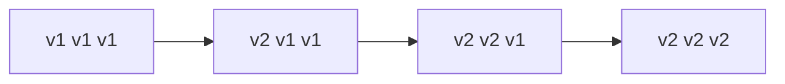
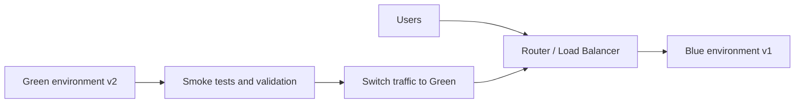
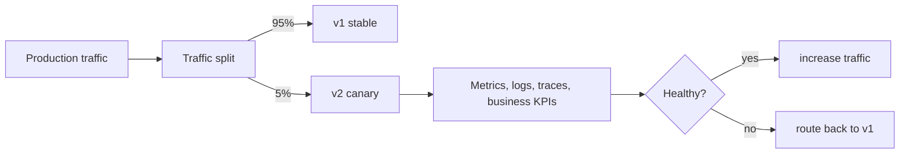
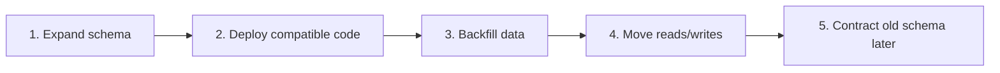

# Deployment Strategies

Deployment is the act of placing a built artifact into an environment where it
can run. Release is the act of exposing functionality to users.

```text
build artifact -> deploy to environment -> verify -> release traffic/feature
```

Deployment and release should be separated when possible. This allows code to
be deployed safely while behavior is enabled later through routing, traffic
weight, or feature flags.

## Artifact, Environment, And Promotion

| Term | Meaning |
|---|---|
| Build artifact | compiled application, JAR, image, chart, or package |
| Deployment artifact | exact deployable unit, usually an immutable image tag |
| Environment | dev, test, staging, production, or local Docker environment |
| Promotion | moving the same verified artifact to the next environment |
| Rollback | returning traffic/runtime to a known-good version |
| Roll-forward | deploying a new fix instead of returning to the old version |

Prefer promoting the same immutable artifact instead of rebuilding different
artifacts per environment.

```text
commit SHA
  -> CI tests
  -> image: shopverse/order-service:2026.06.19-abc123
  -> staging
  -> production
```

## Deployment Prerequisites

Before a deployment:

- tests pass;
- image or package is built from a known commit;
- database migration is reviewed for compatibility;
- configuration and secrets are available;
- health endpoints exist;
- rollback path is known;
- dashboards and logs are available;
- downstream contracts are compatible;
- traffic and error-rate baselines are understood.

## Strategy Comparison

| Strategy | Downtime | Risk | Cost | Rollback speed | Best fit |
|---|---|---|---|---|---|
| Recreate | yes | high | low | medium | local POC, simple internal tools |
| Rolling | low/no | medium | low | medium | most stateless services |
| Blue-green | low/no | low | high | fast | critical services with traffic switch |
| Canary | low/no | low | medium | controlled | gradual production exposure |
| Shadow | no user impact | low for users | high | not direct | compatibility/performance testing |
| Feature flags | no redeploy required | low | medium | very fast | separating deployment from release |

## Recreate

Stop the old version, then start the new version.

```text
v1 stopped -> downtime -> v2 started
```

Simple and suitable for local POCs, but it causes downtime.

## Rolling Deployment

Replace instances gradually:

```text
v1 v1 v1
v2 v1 v1
v2 v2 v1
v2 v2 v2
```



Requirements:

- backward-compatible APIs and events;
- readiness probes;
- graceful shutdown;
- database migrations compatible with both versions.

Rolling deployment is the common default for Kubernetes-style workloads. The
main risk is version overlap: v1 and v2 run at the same time, so APIs, events,
database schema, and configuration must tolerate both versions.

## Blue-Green

Maintain two complete environments:

```text
Blue: current production
Green: candidate version
```



Traffic switches after validation. Rollback is fast but infrastructure cost is
higher. Database compatibility still matters because both environments often
share or migrate the same data.

Rollback is usually a traffic switch back to blue, provided the database and
external side effects remain compatible.

## Canary

Send a small percentage of production traffic to the new version:

```text
95% -> v1
 5% -> v2
```



Increase exposure only when error rate, latency, and business metrics remain
healthy. Canary needs traffic control and automated analysis.

Canary decisions should consider:

- HTTP 5xx rate;
- p95/p99 latency;
- JVM/resource usage;
- Kafka lag and DLT activity;
- outbox failures;
- checkout success rate;
- payment failure rate;
- error logs and traces.

## Feature Flags

Deploy code disabled, then enable behavior independently:

```text
deployment != feature release
```

Flags reduce deployment risk but require ownership, expiry, testing of both
paths, and protection against stale flag accumulation.

Feature flags are useful when rollback should be immediate:

```text
bad behavior detected -> disable flag -> users return to old path
```

They do not replace testing. Both enabled and disabled paths must be tested.
Every flag should have an owner and expiry plan.

## Shadow Traffic

Copy production requests to a new version without using its responses. This is
useful for compatibility and performance evaluation, but write operations must
be suppressed or isolated.

Use shadow traffic for:

- validating a new API implementation;
- comparing latency under real traffic shape;
- checking serialization/deserialization compatibility;
- testing read-only code paths.

Do not let shadow traffic create orders, payments, emails, inventory changes,
or external side effects.

## Rollback Strategies

Rollback means returning the system to a known-good runtime state. Rollback can
target different layers.

| Layer | Rollback action |
|---|---|
| Application | redeploy previous image tag |
| Traffic | route traffic back to old version |
| Feature | disable feature flag |
| Configuration | restore previous config version |
| Database | apply safe compensating migration, if possible |
| Kafka contract | restore compatible producer/consumer behavior |

Application rollback is easy only when state and contracts remain compatible.

## Rollback vs Roll-Forward

Rollback is better when:

- the previous version is compatible with current data;
- no irreversible migration was applied;
- the issue is broad and immediate;
- the old version is known healthy.

Roll-forward is better when:

- database state is no longer compatible with the old version;
- external side effects already occurred;
- the fix is small and safer than reverting;
- rollback would lose data or break consumers.

In distributed systems, roll-forward is often safer than pretending every
effect can be undone.

## Database Deployment

Use expand-and-contract:

1. add compatible schema;
2. deploy code that supports old and new representations;
3. backfill data;
4. move reads and writes;
5. remove old schema in a later release.



Never combine a destructive schema change with code that assumes the change
has already completed across every instance.

| Unsafe | Safer |
|---|---|
| rename column and deploy code at the same time | add new column, write both, migrate reads, remove old later |
| drop column used by old pods | keep column until all old pods are gone |
| make nullable column required immediately | backfill first, then add constraint |
| change enum values without compatibility | add new value and keep consumers tolerant |

Database rollback is difficult because data has moved forward. Prefer
backward-compatible migrations and compensating migrations.

## Kafka Contract Deployment

- add optional fields;
- tolerate unknown fields;
- deploy consumers before producers when a new event is required;
- avoid changing existing field meaning;
- retain replay compatibility for stored events.

Kafka adds a deployment concern that HTTP-only systems may not have: old events
can be replayed after new code is deployed.

Rules:

- consumers should ignore unknown fields;
- producers should avoid removing fields until consumers no longer require
  them;
- add schema versioning for meaningful changes;
- deploy tolerant consumers before stricter producers;
- keep old event meanings stable;
- replay DLT/outbox records against compatible code.

## Health Checks And Readiness Gates

Deployment automation should wait for readiness before sending traffic.

| Probe | Meaning |
|---|---|
| Liveness | process is alive and should not be restarted |
| Readiness | instance can receive traffic |
| Startup | slow-starting app is still booting |

Readiness should fail when the service cannot handle requests safely. Examples:

- database unavailable;
- required migration failed;
- Config Server dependency missing during bootstrap;
- Kafka listener required for the service is not ready, if traffic depends on
  it.

Do not make liveness too strict. If liveness fails for a temporary database
issue, the orchestrator may restart every instance and worsen the outage.

## Smoke Tests

After deployment, run a small set of high-value tests:

- health endpoint;
- login or token validation;
- one read API;
- one write API in a safe test scope;
- checkout/SAGA smoke path in non-production or controlled data;
- metrics endpoint;
- logs and traces visible.

Smoke tests should be fast and deterministic. They are not a replacement for
full integration tests.

## Automated Rollback Signals

Use multiple signals, not one noisy metric:

- deployment health;
- readiness failures;
- HTTP 5xx rate;
- p95/p99 latency;
- business conversion/success rate;
- Kafka lag and DLT events;
- outbox failure count;
- error log rate;
- database connection pool exhaustion.

Example rule:

```text
if canary 5xx rate > stable 5xx rate by threshold
and request volume is sufficient
and condition lasts for N minutes
then stop rollout or route traffic back
```

## Microservices Deployment Rules

For microservices:

1. Keep APIs backward compatible during rolling overlap.
2. Use idempotency for retryable commands.
3. Keep consumers tolerant of old and new event shapes.
4. Use expand-and-contract for database changes.
5. Avoid cross-service release locks where possible.
6. Deploy consumers before producers for new required event fields.
7. Keep SAGA compensation compatible with both versions.
8. Use immutable image tags.
9. Keep readiness accurate.
10. Preserve observability before increasing traffic.

## Shopverse Current State

| Capability | Status |
|---|---|
| Docker Compose local deployment | Implemented |
| GitHub Actions image build and GHCR push | Implemented |
| Optional SSH Docker-host deployment | Implemented baseline |
| Jenkins local image build/deploy demonstration | Implemented baseline |
| Kubernetes rolling deployment | Planned |
| Canary or blue-green automation | Planned |

Shopverse currently demonstrates local and CI/CD deployment fundamentals:

```text
source code
  -> CI test/build
  -> Docker image
  -> Docker Compose or Jenkins local deploy
  -> observability checks
```

Planned production-style improvements:

- Kubernetes manifests or Helm chart;
- rolling deployment with readiness/liveness probes;
- immutable versioned image tags;
- blue-green or canary route control;
- Alertmanager-driven release gates;
- environment-specific secret management;
- migration preflight checks;
- rollback runbook per service.

## Release Gate

- unit and integration tests pass;
- image build succeeds;
- schema migration is compatible;
- vulnerability and secret scans pass;
- SAGA smoke test passes;
- dashboards and alerts exist for changed behavior;
- rollback procedure is known;
- release uses immutable image tags rather than only `latest`.

## Deployment Checklist

Before deployment:

- confirm target environment;
- confirm artifact tag and commit SHA;
- review config differences;
- review database migrations;
- verify event/API compatibility;
- check dependency availability;
- confirm rollback or roll-forward plan.

During deployment:

- watch readiness;
- watch logs;
- watch p95/p99 latency;
- watch error rate;
- watch Kafka lag, outbox failures, and DLT events;
- verify expected number of instances.

After deployment:

- run smoke tests;
- verify dashboards;
- verify no unexpected alerts;
- verify business metrics;
- record deployed version and timestamp.

## Interview Questions

### Deployment vs release?

Deployment puts code into an environment. Release exposes behavior to users.
Feature flags and traffic routing can separate the two.

### Why is rolling deployment risky with databases?

Old and new versions may run simultaneously. The schema must support both
versions until the rollout and rollback window are closed.

### Why use blue-green?

It allows full validation of the new environment and fast traffic switching.
The tradeoff is higher infrastructure cost and database compatibility
complexity.

### What is a canary deployment?

A canary gradually exposes a new version to a small percentage of traffic and
increases exposure only if metrics remain healthy.

### Why are feature flags useful?

They allow behavior rollback without redeploying. They also separate code
deployment from feature release.

### Why is rollback sometimes unsafe?

Data migrations, emitted events, external side effects, and changed contracts
may make the old version incompatible with current state.

## Related Guides

- [Docker](DOCKER.md)
- [CI/CD Automation](CI-CD-AUTOMATION.md)
- [Jenkins](JENKINS.md)
- [GitHub Actions](GITHUB-ACTIONS.md)
