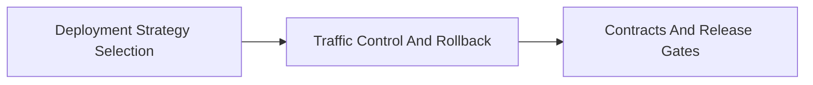

<!-- split-guide-index -->
# Deployment Strategies

<DocLabels items={[{label: 'Focused guides', tone: 'advanced'}, {label: 'Shopverse', tone: 'shopverse'}, {label: 'Architect route', tone: 'production'}]} />

Select, operate, and verify safe deployment strategies for Shopverse services. The original long-form material is preserved without duplication across the focused pages below.

<TopicCards items={[
  {title: 'Deployment Strategy Selection', href: '/operations/DEPLOYMENT-STRATEGY-SELECTION', description: 'Part 1 of the focused Deployment Strategies learning route.', icon: 'route', tags: ['Focused', 'Advanced']},
  {title: 'Traffic Control And Rollback', href: '/operations/DEPLOYMENT-TRAFFIC-ROLLBACK', description: 'Part 2 of the focused Deployment Strategies learning route.', icon: 'layers', tags: ['Focused', 'Advanced']},
  {title: 'Contracts And Release Gates', href: '/operations/DEPLOYMENT-CONTRACTS-RELEASE-GATES', description: 'Part 3 of the focused Deployment Strategies learning route.', icon: 'security', tags: ['Focused', 'Advanced']},
]} />

<DocCallout type="tip" title="Use the index as the stable entry point">

Each focused page owns one concern. Cross-links point to the canonical explanation instead of repeating the same material.

</DocCallout>

## Recommended Learning Order

1. [Deployment Strategy Selection](./DEPLOYMENT-STRATEGY-SELECTION.md)
2. [Traffic Control And Rollback](./DEPLOYMENT-TRAFFIC-ROLLBACK.md)
3. [Contracts And Release Gates](./DEPLOYMENT-CONTRACTS-RELEASE-GATES.md)

## Reading Strategy

Use **Deployment Strategies** as a decision and verification guide inside **Deployment Strategies**. Start by naming the invariant or operational outcome, then follow the runtime flow and identify the owning component. For every example, record the expected success evidence, the most important failure mode, and the metric or test that proves recovery. This keeps the material useful for implementation reviews, production incidents, and architect interviews instead of treating it as isolated syntax.

Within **Deployment Strategies**, apply the Shopverse guidance incrementally: verify the current behavior, introduce one bounded change, test the unhappy path, and preserve a rollback or reconciliation route. Follow links to canonical pages when a concept belongs to another track; do not copy that explanation into this page. This ownership rule keeps the focused guides short while retaining technical depth and traceability.

## Official References

- [Docusaurus documentation](https://docusaurus.io/docs)
- [Git documentation](https://git-scm.com/docs)
