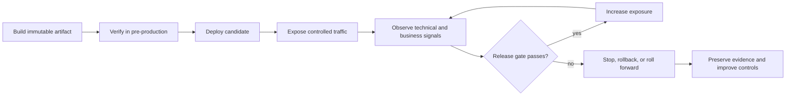
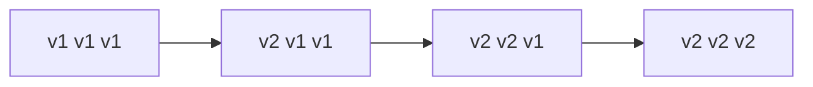
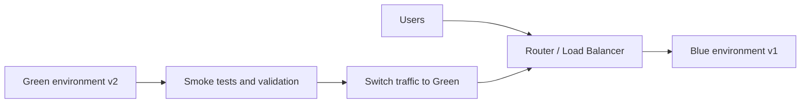
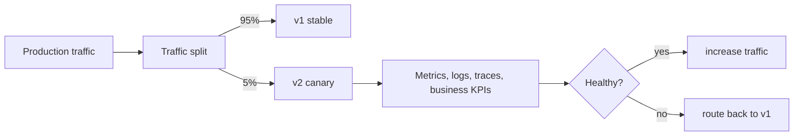

# Deployment Strategy Selection

<DocLabels items={[{label: 'Advanced', tone: 'advanced'}, {label: 'Shopverse', tone: 'shopverse'}, {label: 'Production', tone: 'production'}]} />

## Learning Route

Use this page in three passes:

1. Learn the vocabulary and compare strategies.
2. Follow one strategy from preparation through promotion or rollback.
3. Apply the database, event-contract, observability, and failure checklists.

## The Deployment Control Loop

Every safe deployment is a feedback loop rather than a file-copy operation.



The loop needs five independent controls:

| Control | Responsibility |
|---|---|
| Artifact control | Identify exactly what code, dependencies, and configuration are running |
| Instance control | Decide how candidate instances start, become ready, drain, and stop |
| Traffic control | Decide which requests or users reach stable and candidate versions |
| State control | Keep databases, messages, caches, and external side effects compatible |
| Evidence control | Decide whether metrics, logs, traces, and business outcomes permit promotion |

## Artifact, Environment, And Promotion

| Term | Meaning |
|---|---|
| Build artifact | compiled application, JAR, image, chart, or package |
| Deployment artifact | exact deployable unit, usually an immutable image tag |
| Environment | dev, test, staging, production, or local Docker environment |
| Promotion | moving the same verified artifact to the next environment |
| Rollback | returning traffic/runtime to a known-good version |
| Roll-forward | deploying a new fix instead of returning to the old version |

Prefer promoting the same immutable artifact instead of rebuilding different
artifacts per environment.

```text
commit SHA
  -> CI tests
  -> image: shopverse/order-service:2026.06.19-abc123
  -> staging
  -> production
```

## Deployment Prerequisites

Before a deployment:

- tests pass;
- image or package is built from a known commit;
- database migration is reviewed for compatibility;
- configuration and secrets are available;
- health endpoints exist;
- rollback path is known;
- dashboards and logs are available;
- downstream contracts are compatible;
- traffic and error-rate baselines are understood.

## Strategy Comparison

| Strategy | Downtime | Risk | Cost | Rollback speed | Best fit |
|---|---|---|---|---|---|
| Recreate | yes | high | low | medium | local POC, simple internal tools |
| Rolling | low/no | medium | low | medium | most stateless services |
| Blue-green | low/no | low | high | fast | critical services with traffic switch |
| Canary | low/no | low | medium | controlled | gradual production exposure |
| Shadow | no user impact | low for users | high | not direct | compatibility/performance testing |
| Feature flags | no redeploy required | low | medium | very fast | separating deployment from release |

### Choose By Constraint

| Dominant constraint | Usually start with | Why |
|---|---|---|
| Simplest non-production operation | Recreate | Few moving parts; downtime is accepted |
| Stateless service with compatible versions | Rolling | Efficient use of capacity and broad platform support |
| Very fast traffic rollback is essential | Blue-green | Old environment remains available during validation |
| Production behavior must be measured gradually | Canary | Limits exposure while collecting real signals |
| Validate a replacement without affecting responses | Shadow | Candidate receives production-shaped input but does not serve users |
| Release behavior to users/cohorts independently | Feature flags | Activation is separated from deployment |

Strategies can be combined: a rolling deployment can install dormant code,
then a feature flag can release it to a cohort. Blue-green environments can
also receive canary traffic before the final switch.

## Recreate

Stop the old version, then start the new version.

```text
v1 stopped -> downtime -> v2 started
```

Simple and suitable for local POCs, but it causes downtime.

### Recreate Sequence And Risks

1. Stop traffic or announce a maintenance window.
2. Stop the old process.
3. Apply backward-compatible migrations and configuration.
4. Start the candidate and wait for readiness.
5. Run smoke tests and reopen traffic.

The failure window begins when the old version stops. Recovery time includes
starting either version and restoring compatible state. Recreate is dangerous
for systems with a strict availability objective, long startup, irreversible
migrations, or asynchronous work that cannot be drained safely.

## Rolling Deployment

Replace instances gradually:

```text
v1 v1 v1
v2 v1 v1
v2 v2 v1
v2 v2 v2
```



Requirements:

- backward-compatible APIs and events;
- readiness probes;
- graceful shutdown;
- database migrations compatible with both versions.

### Rolling Parameters

Platforms expose these ideas with different names:

| Parameter | Meaning | Safety effect |
|---|---|---|
| Maximum unavailable | How much stable capacity may be absent | Lower values protect availability but slow rollout |
| Maximum surge | Extra candidate capacity allowed | More surge speeds rollout but costs capacity |
| Readiness gate | Evidence required before receiving traffic | Prevents traffic reaching an unready instance |
| Progress deadline | Maximum time without rollout progress | Detects a stuck deployment |
| Drain/termination grace | Time to finish in-flight work | Reduces interrupted requests and duplicate work |

Example with four replicas and one-at-a-time replacement:

```text
Step 0: v1 v1 v1 v1
Step 1: v2 v1 v1 v1  -> verify v2 readiness
Step 2: v2 v2 v1 v1  -> compare signals
Step 3: v2 v2 v2 v1
Step 4: v2 v2 v2 v2  -> close rollback window later
```

Stopping a rollout prevents more replacement; it does not automatically undo
already replaced instances or reverse database and external effects.

Rolling deployment is the common default for Kubernetes-style workloads. The
main risk is version overlap: v1 and v2 run at the same time, so APIs, events,
database schema, and configuration must tolerate both versions.

## Blue-Green

Maintain two complete environments:

```text
Blue: current production
Green: candidate version
```



Traffic switches after validation. Rollback is fast but infrastructure cost is
higher. Database compatibility still matters because both environments often
share or migrate the same data.

Rollback is usually a traffic switch back to blue, provided the database and
external side effects remain compatible.

### Blue-Green Runbook

1. Deploy green with production-equivalent configuration but no user traffic.
2. Verify startup, smoke paths, telemetry, security policy, and dependency access.
3. Warm caches or connections without creating duplicate business effects.
4. Shift internal/test traffic, then production traffic at the router.
5. Observe through a defined bake period.
6. Keep blue deployable and data-compatible until the rollback window closes.
7. Retire blue only after state and signals prove rollback is no longer needed.

Do not duplicate schedulers, message consumers, emails, or payment execution in
both environments unless ownership is explicitly partitioned. Traffic switching
controls HTTP requests; it does not automatically control background work.

## Canary

Send a small percentage of production traffic to the new version:

```text
95% -> v1
 5% -> v2
```



Increase exposure only when error rate, latency, and business metrics remain
healthy. Canary needs traffic control and automated analysis.


### Example Promotion Plan

| Stage | Candidate exposure | Minimum evidence | Action on failure |
|---|---:|---|---|
| Baseline | 0% | Stable-version baseline and healthy platform | Do not start |
| Internal | selected staff/test traffic | Functional smoke tests and clean logs | Remove candidate traffic |
| Initial canary | 1–5% | Sufficient requests; no severe correctness/security issue | Route to stable |
| Expansion | 10–25% | Candidate comparable to stable for errors and latency | Freeze or rollback |
| Majority | 50% | Healthy capacity and business KPI | Rollback if compatible |
| Complete | 100% | Bake period passes | Retain rollback option temporarily |

Percentage alone can mislead: five percent of low traffic may provide no useful
sample, while five percent of payment traffic may carry unacceptable business
risk. Use minimum event counts, duration, and cohort diversity together.

### Canary Versus A/B Testing

Canary deployment asks whether a new version is safe and healthy. A/B testing
asks which product experience performs better. Canary routing should minimize
risk and support rollback; A/B assignment should remain stable per user and
support statistically valid product analysis. Do not use conversion uplift to
hide a reliability regression.

Canary decisions should consider:

- HTTP 5xx rate;
- p95/p99 latency;
- JVM/resource usage;
- Kafka lag and DLT activity;
- outbox failures;
- checkout success rate;
- payment failure rate;
- error logs and traces.

## Recommended Next

Return to [Deployment Strategies](./DEPLOYMENT-STRATEGIES.md) to select the next focused guide.


## Official References

- [Docusaurus documentation](https://docusaurus.io/docs)
- [Git documentation](https://git-scm.com/docs)
