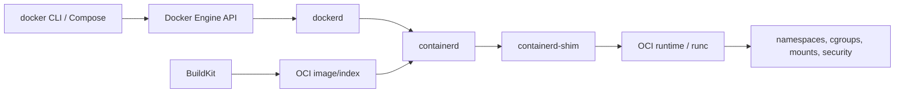

# Docker Beginner-To-Architect Path

Docker is a client/API/daemon ecosystem that builds OCI-compatible image content and starts
isolated Linux processes through a runtime stack. A container is not a small VM: it shares a
kernel and receives isolated views and resource controls from that kernel.

## Complete Route

1. [Engine, containerd, OCI Runtime, And Linux Isolation](./docker/DOCKER-ENGINE-RUNTIME-INTERNALS.md)
2. [OCI Images, Dockerfiles, BuildKit, Cache, And Registries](./docker/DOCKER-IMAGES-BUILDKIT-SUPPLY-CHAIN.md)
3. [Storage, Volumes, OverlayFS, Networking, And DNS](./docker/DOCKER-STORAGE-NETWORKING-INTERNALS.md)
4. [Security, Compose, Resources, Logging, And Production Operations](./docker/DOCKER-SECURITY-PRODUCTION-OPERATIONS.md)
5. [Troubleshooting, Incident Labs, Interviews, And Revision](./docker/DOCKER-TROUBLESHOOTING-INTERVIEW-REVISION.md)

Use [Docker](./DOCKER.md) for first commands and [Docker Internals, Layers, And Storage](./DOCKER-INTERNALS-LAYERS-STORAGE.md)
as the concise conceptual bridge. This track owns the complete deep route.

## Completion Standard

You should be able to trace `docker run` into kernel primitives, inspect OCI image/config/layers,
produce reproducible multi-platform builds, explain storage and packet paths, harden daemon and
workloads, diagnose cgroup/OOM/signal/DNS/NAT/disk/build failures, restore volume data and defend
when Docker/Compose is sufficient versus when orchestration is justified.

## Official References

- [Docker Engine](https://docs.docker.com/engine/)
- [Docker Build](https://docs.docker.com/build/)
- [Open Container Initiative](https://opencontainers.org/)

## Recommended Next

Begin with [Engine, containerd, OCI Runtime, And Linux Isolation](./docker/DOCKER-ENGINE-RUNTIME-INTERNALS.md).

