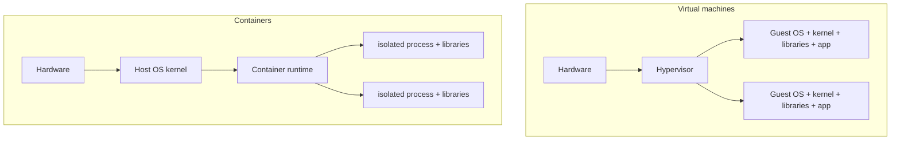
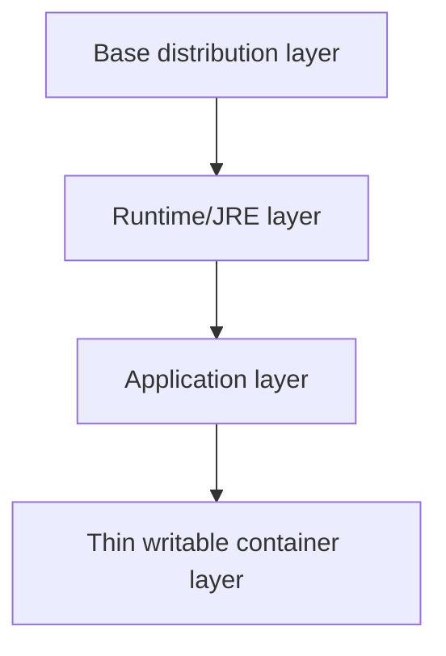

# Docker Internals, Layers, And Storage

Docker uses **operating-system-level virtualization**. A container is an
isolated process—not a small virtual machine—but it is still related to
virtualization because the host kernel presents isolated views of resources.

## Container Versus Virtual Machine



| Concern | Container | Virtual machine |
|---|---|---|
| kernel | shares the host kernel | boots a guest kernel |
| isolation boundary | OS process/resource isolation | virtual hardware and guest OS boundary |
| image contents | application, libraries, filesystem and metadata | usually a complete guest OS plus application |
| startup | normally process-start time | normally guest OS boot time |
| density | high when workloads are compatible | lower because each VM reserves/uses guest OS resources |
| portability boundary | requires a compatible kernel/architecture or an intermediate VM | guest OS can differ from host within hypervisor support |

Docker Desktop commonly runs Linux containers inside a managed Linux VM on
Windows or macOS. The container still shares that VM's Linux kernel, not the
Windows/macOS host kernel directly.

## How Isolation Works

On Linux, a runtime creates a process with kernel primitives such as:

- **namespaces:** isolated views of process IDs, mounts, networking, hostname,
  IPC, users, and other resources;
- **cgroups:** accounting and limits for CPU, memory, process count, and I/O;
- **capabilities:** split root privileges into smaller powers;
- **seccomp and security modules:** restrict system calls and apply policies such
  as AppArmor or SELinux;
- **mounts and layered filesystems:** assemble the root filesystem seen by the process.

The container is not automatically a perfect security boundary. Run as non-root,
drop capabilities, use read-only filesystems where possible, patch/scan images,
limit resources, protect the Docker socket, and avoid privileged containers.

## Why Containers Can Be Much Lighter

Containers avoid a guest kernel and complete guest OS per workload. Multiple
containers also share identical read-only image layers on the host. Each running
container adds a thin writable layer plus process memory and runtime metadata.

“A container is 1,000 times lighter than a VM” is not a reliable engineering
rule. A tiny native process may be orders of magnitude smaller than a general-
purpose VM, while a Java application with a large JRE, heap, and dependencies may
be only several times smaller. Compare measured disk, resident memory, startup,
CPU overhead, isolation, and operational requirements for the actual workload.

## Image And Container Layers



Filesystem-changing Dockerfile instructions produce immutable content-addressed
layers. Images that reference the same layer digest store/download that blob once
per image store. A container reads through the stacked view. On its first change
to a lower-layer file, a copy-on-write storage implementation copies that file
into the writable layer and modifies the copy.

Deleting a file in a later layer hides it but does not remove its bytes from an
earlier layer. Combine creation and cleanup in one `RUN` or use a multi-stage build:

```dockerfile
FROM eclipse-temurin:21-jdk AS build
WORKDIR /workspace
COPY gradlew settings.gradle build.gradle ./
COPY gradle ./gradle
RUN --mount=type=cache,target=/root/.gradle ./gradlew dependencies --no-daemon
COPY src ./src
RUN --mount=type=cache,target=/root/.gradle ./gradlew bootJar --no-daemon

FROM eclipse-temurin:21-jre
WORKDIR /app
COPY --from=build /workspace/build/libs/app.jar app.jar
USER 10001
ENTRYPOINT ["java", "-jar", "app.jar"]
```

The build tools and source stay in the discarded build stage; the runtime image
contains only what is copied into its final stage.

## Build Cache

Build cache and runtime layer sharing are related but different:

- **image layer sharing** saves pull and disk space when final images share digests;
- **build cache** reuses results of prior build steps;
- **cache mounts** preserve package/build-tool caches without placing them in the final image;
- **external cache** lets CI builders import/export reusable cache records.

An instruction is reusable only when its cache inputs match. When one layer is
invalidated, later dependent instructions rebuild. Put stable, expensive steps
before frequently changing source:

```dockerfile
COPY gradlew settings.gradle build.gradle ./
COPY gradle ./gradle
RUN --mount=type=cache,target=/root/.gradle ./gradlew dependencies --no-daemon

# Source changes frequently, so copy it later.
COPY src ./src
RUN --mount=type=cache,target=/root/.gradle ./gradlew bootJar --no-daemon
```

Keep the build context small with `.dockerignore`. Never pass secrets through
`ARG`, `ENV`, or copied files; use BuildKit secret mounts where appropriate.

## Optimize Storage Across Many Images

1. Standardize a small number of pinned base-runtime families so services share layers.
2. Use multi-stage builds and copy only the runtime artifact.
3. Keep ownership correct with `COPY --chown` instead of a later recursive `chown`.
4. Remove package metadata in the same layer that creates it.
5. Exclude `.git`, build outputs, caches, tests, and local assets via `.dockerignore`.
6. Separate frequently changed application bytes from stable runtime layers.
7. Use registry-backed BuildKit cache for ephemeral CI builders.
8. Set retention for old tags and unreferenced registry manifests/blobs.
9. Rotate container logs and put durable/write-heavy data in volumes.
10. Measure before choosing Alpine, distroless, `jlink`, or compression; compatibility,
    debugging, patching, startup, and memory can matter more than download size.

Inspect usage:

```powershell
docker system df -v
docker images --digests
docker history --no-trunc shopverse/order-service:local
docker buildx du
docker ps --size
```

Pruning is destructive. Review the inventory before running:

```powershell
docker image prune
docker builder prune
docker buildx prune --filter "until=168h"
docker system prune
```

`docker system prune -a --volumes` can remove images, stopped containers,
networks, build cache, and unused anonymous volumes. Do not run it casually on
a developer or CI host containing valuable database volumes or warm caches.

## Writable Layer, Volume, Bind Mount, Or tmpfs?

| Storage | Use for | Lifetime |
|---|---|---|
| writable container layer | disposable runtime files | removed with container |
| named volume | database data and durable service-owned local state | independent of container |
| bind mount | developer source/config or explicit host integration | host path controls lifetime |
| tmpfs | sensitive/temporary non-persistent data | memory; lost on stop/restart |

Write-intensive databases should use an appropriate volume rather than the
copy-on-write container layer. Back up and restore the data, not the container.

## Local Compose Workflow

Docker Compose creates a project network, service containers, DNS names,
volumes, environment, health checks, and dependency configuration from YAML:

```powershell
docker compose config --quiet
docker compose --profile apps --profile assets build
docker compose --profile apps --profile assets up -d
docker compose ps
docker compose logs -f --tail=100 order-service
docker compose down
```

Use `docker compose down -v` only when intentionally deleting named-volume data.
See [Local Docker Implementation Guide](./LOCAL-DOCKER-IMPLEMENTATION-GUIDE.md)
for the ShopVerse environment.

## References

- [Docker storage drivers and layers](https://docs.docker.com/engine/storage/drivers/)
- [Docker build-cache optimization](https://docs.docker.com/build/cache/optimize/)
- [Docker storage and mounts](https://docs.docker.com/engine/storage/)
