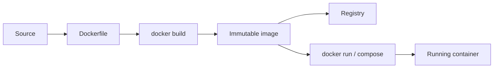

# Docker

This page teaches first use. For Engine/containerd/OCI runtime internals, BuildKit,
networking, security, production incidents, labs, interviews, and revision, use the
[Docker Beginner-To-Architect Path](./DOCKER-ARCHITECT-PATH.md).

Docker packages an application and its runtime dependencies into an image.
Containers are isolated processes created from that image.

For namespaces, cgroups, containers versus VMs, copy-on-write layers, shared
image storage, BuildKit cache, pruning, and multi-image optimization, continue
with [Docker Internals, Layers, And Storage](./DOCKER-INTERNALS-LAYERS-STORAGE.md).



## Core Concepts

| Concept | Meaning |
|---|---|
| Image | immutable layered filesystem and metadata |
| Container | running or stopped instance of an image |
| Layer | cached immutable result of a Dockerfile instruction |
| Registry | remote image storage such as GHCR or Docker Hub |
| Volume | persistent data managed outside a container lifecycle |
| Bind mount | host path mounted into a container |
| Network | isolated connectivity and DNS between containers |
| Compose | declarative multi-container application definition |

## Dockerfile Instructions

```dockerfile
# syntax=docker/dockerfile:1.7
FROM eclipse-temurin:21-jdk-jammy AS build
WORKDIR /workspace
COPY gradlew settings.gradle build.gradle ./
COPY gradle ./gradle
RUN --mount=type=cache,target=/root/.gradle ./gradlew dependencies --no-daemon
COPY src ./src
RUN --mount=type=cache,target=/root/.gradle ./gradlew bootJar --no-daemon

FROM eclipse-temurin:21-jre-jammy
WORKDIR /app
RUN groupadd --system app && useradd --system --gid app app
COPY --from=build --chown=app:app /workspace/build/libs/*.jar app.jar
USER app
EXPOSE 8080
HEALTHCHECK CMD curl -fsS http://localhost:8080/actuator/health || exit 1
ENTRYPOINT ["java", "-jar", "app.jar"]
```

| Instruction | Purpose |
|---|---|
| `FROM` | selects a base image and optionally names a build stage |
| `WORKDIR` | sets the working directory |
| `COPY` | copies build-context files into an image layer |
| `RUN` | executes during image build |
| `ENV` | defines image runtime defaults |
| `USER` | selects the non-root runtime user |
| `EXPOSE` | documents the listening port; it does not publish it |
| `HEALTHCHECK` | defines container health evaluation |
| `ENTRYPOINT` | defines the main executable |
| `CMD` | provides default command or arguments |

## ENTRYPOINT And CMD

```dockerfile
ENTRYPOINT ["java"]
CMD ["-jar", "app.jar"]
```

`docker run image -version` retains `java` and replaces `CMD`, producing
`java -version`. Use exec form when shell expansion is not required because
signals are delivered directly to the process.

## Efficient And Secure Images

1. Use multi-stage builds.
2. Copy dependency metadata before frequently changing source.
3. Use BuildKit cache mounts.
4. Use a JRE or minimal runtime image.
5. Run as a non-root user.
6. Use `COPY --chown` to avoid ownership-only duplicate layers.
7. Add `.dockerignore`.
8. Pin or deliberately manage base-image versions.
9. Scan images and generate an SBOM.
10. Never bake secrets into image layers.

### Build Context Rules

The Docker build context is the filesystem tree Docker can see during `COPY`.
If a Dockerfile needs files outside a service directory, the context must be
large enough to include them.

For a multi-module or composite build:

```yaml
order-service:
  build:
    context: .
    dockerfile: order-service/Dockerfile
```

Then the Dockerfile can copy both service code and shared platform modules:

```dockerfile
COPY order-service/src ./src
COPY shopverse-platform ../shopverse-platform
```

Use `.dockerignore` to keep the larger context from sending build outputs,
Gradle caches, `.git`, and other local files to Docker.

### Named Volumes And Runtime Users

When changing an image from root to a non-root runtime user, old named volumes
can keep root-owned files from previous containers. The image may be correct
but the mounted volume can still block writes.

Typical symptom:

```text
Permission denied: /app/logs/service.log
```

Fix the specific stale volume instead of deleting all data volumes. Avoid
`docker compose down -v` unless deleting databases and object storage is
intentional.

## Commands

### Images

```powershell
docker build -t shopverse/order-service:local .\order-service
docker image ls
docker image inspect shopverse/order-service:local
docker history shopverse/order-service:local
docker image rm shopverse/order-service:local
```

### Containers

```powershell
docker run --rm -p 8083:8083 shopverse/order-service:local
docker container ls
docker container ls -a
docker logs -f --tail 100 shopverse-order-service
docker exec -it shopverse-order-service sh
docker inspect shopverse-order-service
docker stop shopverse-order-service
docker rm shopverse-order-service
```

### Compose

```powershell
docker compose --profile apps --profile assets config --quiet
docker compose --profile apps --profile assets build
docker compose --profile apps --profile assets up -d
docker compose --profile apps up -d --build order-service
docker compose ps
docker compose logs -f order-service
docker compose restart order-service
docker compose down
docker compose down -v
```

### Common Flags

| Flag | Meaning |
|---|---|
| `-t` | image name and tag during build |
| `-d` | detached/background mode |
| `-f` | select a Compose file |
| `-p host:container` | publish a port with `docker run` |
| `-e` | set a container environment variable |
| `-v` | mount volume; with `compose down`, remove named volumes |
| `--rm` | remove container after exit |
| `--build` | build before Compose startup |
| `--no-cache` | ignore reusable build layers |
| `--force-recreate` | recreate container even when config appears unchanged |
| `--tail N` | show the last N log lines |
| `--since 10m` | show recent logs |

`docker compose down -v` deletes persisted data in named volumes. Treat it as
a destructive reset.

## Compose Reliability

`depends_on` startup order alone does not prove readiness. Use health checks:

```yaml
order-service:
  depends_on:
    config-server:
      condition: service_healthy
  healthcheck:
    test: ["CMD-SHELL", "curl -fsS http://localhost:8083/actuator/health"]
    interval: 15s
    timeout: 5s
    retries: 10
```

Applications must still tolerate dependencies restarting after initial
startup.

### Compose Profiles

Use Compose profiles when the full local stack is too heavy for every task:

```yaml
prometheus:
  profiles: ["observability"]

order-service:
  profiles: ["apps"]
```

Examples:

```powershell
docker compose up -d
docker compose --profile apps up -d
docker compose --profile apps --profile assets up -d
docker compose --profile apps --profile observability --profile assets up -d
```

Profiles reduce default startup time and memory pressure while keeping optional
services available when needed.

## Production Considerations

- set CPU and memory limits;
- use read-only filesystems where practical;
- drop Linux capabilities;
- avoid mounting the Docker socket;
- centralize logs rather than relying on an unbounded local JSON log;
- use secret managers;
- use immutable image digests/tags;
- define graceful shutdown and readiness;
- back up volumes and test restore;
- prefer an orchestrator for HA and rolling deployment.

## Shopverse Case Study

Shopverse uses multi-stage Java 21 images, BuildKit Gradle caches, non-root
runtime users, health checks, Compose networking, service-owned log volumes,
and environment-driven configuration.

Use the project guide for exact commands and line-by-line Compose explanations:

- [Shopverse Docker implementation](SHOPVERSE-DOCKER.md)
- [Local Docker implementation guide](LOCAL-DOCKER-IMPLEMENTATION-GUIDE.md)
- [Docker build context for platform modules](../reliability/problems/optimization/DOCKER-BUILD-CONTEXT-PLATFORM.md)
- [Docker image size optimization](../reliability/problems/optimization/DOCKER-IMAGE-SIZE-OPTIMIZATION.md)
- [Docker Compose profiles](../reliability/problems/optimization/DOCKER-COMPOSE-PROFILES.md)
- [Runtime optimization](../reliability/problems/optimization/RUNTIME-OPTIMIZATION.md)

## Recommended Next

Continue with [Docker Internals, Layers, And Storage](./DOCKER-INTERNALS-LAYERS-STORAGE.md).
