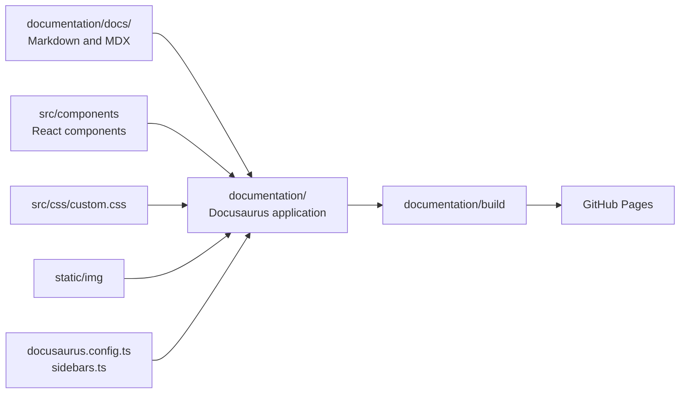
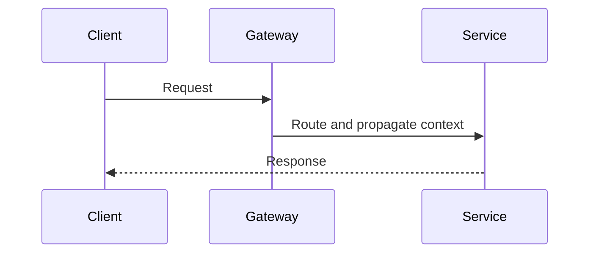

# Docusaurus Authoring And Navigation

<DocLabels items={[{label: 'Advanced', tone: 'advanced'}, {label: 'Shopverse', tone: 'shopverse'}, {label: 'Production', tone: 'production'}]} />

## Shopverse Documentation Architecture



Shopverse deliberately separates:

- `documentation/docs/`: reusable study material and Shopverse case-study content;
- `documentation/`: the application and content root;
- service READMEs: commands and contracts close to each service;
- `documentation/static/`: images copied unchanged into the generated site;
- `documentation/src/`: React components and custom CSS.

This lets GitHub render most Markdown directly while Docusaurus provides the
structured learning portal.

## Prerequisites

Use:

- Node.js 20 or later;
- npm supplied with Node.js;
- Git;
- a current browser.

Verify:

```powershell
node --version
npm --version
git --version
```

Shopverse currently pins Docusaurus packages in
`documentation/package.json` and commits `package-lock.json` for reproducible
installations.

## Set Up A New Docusaurus Site

For a new standalone project:

```powershell
npx create-docusaurus@latest my-documentation classic --typescript
Set-Location my-documentation
npm start
```

The `classic` template includes documentation, a blog, pages, navigation,
Prism highlighting, and a default theme. Remove unused features, such as the
blog, rather than maintaining empty sections.

For an existing Shopverse checkout, do not recreate the site. Install the
committed dependencies:

```powershell
Set-Location documentation
npm ci
```

Use `npm ci` in CI and clean local environments because it installs exactly
what is recorded in `package-lock.json`. Use `npm install` when intentionally
adding or updating a dependency.

## Run Locally

Development server with live reload:

```powershell
Set-Location documentation
npm start
```

Open:

```text
http://localhost:3000/shopverse/
```

Use another port when `3000` is already occupied:

```powershell
npm start -- --port 3001
```

The development server recompiles changed Markdown, MDX, React components, and
CSS. Restart it after changing dependencies or when configuration changes are
not detected.

## Important Commands

| Command | Purpose |
|---|---|
| `npm ci` | install the exact locked dependency graph |
| `npm start` | run the development server with live reload |
| `npm run typecheck` | validate TypeScript configuration and components |
| `npm run build` | create the optimized static production site |
| `npm run serve` | serve the generated `build/` directory locally |
| `npm run clear` | remove Docusaurus caches and generated metadata |

Recommended validation:

```powershell
npm run typecheck
npm run build
npm run serve -- --port 3001
```

`npm start` proves the development experience works. `npm run build` is the
authoritative check because it validates server rendering, routes, MDX,
sidebars, Mermaid diagrams, and production assets together.

## Repository Structure

```text
shopverse/
|-- documentation/
|   |-- docs/
|   |   |-- README.mdx
|   |   |-- architecture/
|   |   |-- spring/
|   |   |-- data/
|   |   |-- observability/
|   |   `-- operations/
|   |-- src/
|   |   |-- components/
|   |   `-- css/custom.css
|   |-- static/img/
|   |-- docusaurus.config.ts
|   |-- sidebars.ts
|   |-- package.json
|   `-- tsconfig.json
`-- .github/workflows/docs-site.yml
```

## Add A Documentation Page

Create a Markdown file under the correct topic:

```markdown
---
title: Transaction Isolation
sidebar_position: 6
---

# Transaction Isolation

Content starts here.
```

Then add its document ID to `documentation/sidebars.ts`:

```typescript
{
  type: 'category',
  label: 'Data And Caching',
  items: [
    'data/DATABASE-ENGINEERING',
    'data/TRANSACTION-ISOLATION',
  ],
}
```

The document ID is the path below `documentation/docs/` without the `.md` or `.mdx`
extension.

Use front matter for page metadata:

| Property | Purpose |
|---|---|
| `title` | page and sidebar title |
| `sidebar_position` | ordering when generated sidebars are used |
| `slug` | custom route |
| `description` | search and social metadata |
| `hide_title` | hide Docusaurus' automatic title |
| `hide_table_of_contents` | hide the right-side section index |

Shopverse uses `hide_title` on visual landing pages because their React hero
already contains the main `h1`.

## Markdown Versus MDX

Use `.md` when headings, prose, tables, code, and Mermaid are sufficient.

Use `.mdx` when the page needs React components:

```mdx
  DocFigure,
  ReadingGuide,
} from '@site/src/components/DocumentationLanding';

<ReadingGuide>

Read the architecture page before the implementation details.

</ReadingGuide>

<DocFigure
  src="/img/diagrams/system.svg"
  alt="System architecture"
  caption="High-level service topology."
/>
```

Prefer Markdown by default. MDX increases capability, but it also introduces
component imports, JSX syntax, and TypeScript/build dependencies.

## Add Mermaid Diagrams

Shopverse enables Mermaid in `docusaurus.config.ts`:

```typescript
markdown: {
  mermaid: true,
},
themes: ['@docusaurus/theme-mermaid'],
```

Use a fenced block:

````markdown

````

Mermaid is preferred for diagrams that change with code because the source
remains reviewable and version controlled. Use a prepared SVG or bitmap when
the diagram needs dense layout, visual grouping, or presentation-quality
labels.

## Add Images

Place static assets under:

```text
documentation/static/img/
```

A file at:

```text
documentation/static/img/diagrams/shopverse-architecture-flow.svg
```

is referenced as:

```markdown

```

Shopverse visual pages use `DocFigure` to add a caption and full-size link.

Image practices:

- use SVG for architecture and flow diagrams;
- provide meaningful `alt` text;
- avoid embedding important explanations only inside an image;
- keep source diagrams version controlled;
- verify light and dark modes;
- compress large bitmap images;
- use stable descriptive filenames.

## Modify Navigation

### Sidebar

Edit `documentation/sidebars.ts`:

```typescript
{
  type: 'category',
  label: '8. Delivery, Containers And CI/CD',
  items: [
    'operations/DOCKER',
    'operations/JENKINS',
    'operations/DOCUSAURUS',
  ],
}
```

### Navbar

Edit `themeConfig.navbar` in `documentation/docusaurus.config.ts`:

```typescript
navbar: {
  title: 'Backend Engineering',
  logo: {
    alt: 'Backend Engineering Knowledge Base',
    src: 'img/favicon.svg',
  },
  items: [
    {
      to: '/reference/LEARNING-PATH',
      label: 'Learning Path',
      position: 'left',
    },
  ],
},
```

### Footer

Edit `themeConfig.footer.links` to expose durable entry points. Avoid putting
every page in the footer; use the sidebar and search for detailed navigation.

## Recommended Next

Return to [Docusaurus Documentation Engineering](./DOCUSAURUS.md) to select the next focused guide.


## Official References

- [Docusaurus documentation](https://docusaurus.io/docs)
- [Git documentation](https://git-scm.com/docs)
