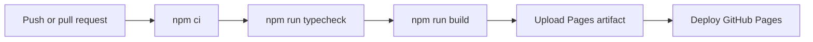

# Docusaurus Components And Deployment

<DocLabels items={[{label: 'Advanced', tone: 'advanced'}, {label: 'Shopverse', tone: 'shopverse'}, {label: 'Production', tone: 'production'}]} />

## Modify Styling

Shopverse loads:

```text
documentation/src/css/custom.css
```

through:

```typescript
theme: {
  customCss: './src/css/custom.css',
},
```

Use Docusaurus Infima variables instead of hardcoding every color:

```css
:root {
  --ifm-color-primary: #176b5b;
  --doc-border: #d7e1df;
  --doc-surface: #f7faf9;
}

[data-theme="dark"] {
  --ifm-color-primary: #55c7ad;
  --doc-border: #344743;
  --doc-surface: #18221f;
}
```

Production styling guidance:

- preserve readable line lengths;
- test wide tables and code blocks on mobile;
- maintain visible focus states and sufficient contrast;
- do not rely only on color to communicate status;
- keep cards flat and purposeful;
- use one `h1` per page;
- support both light and dark mode;
- avoid overriding deeply generated Docusaurus selectors unless required.

## Add Reusable React Components

Shopverse components live under:

```text
documentation/src/components/
```

Example:

```tsx
export function ReadingGuide({
  children,
}: {
  children: React.ReactNode;
}) {
  return (
    <aside className={styles.readingGuide}>
      {children}
    </aside>
  );
}
```

Use CSS modules beside the component:

```text
DocumentationLanding/
|-- index.tsx
`-- styles.module.css
```

CSS modules prevent component styles from leaking into unrelated pages.
Global documentation behavior belongs in `src/css/custom.css`.

## Search

Shopverse uses local static search:

```typescript
[
  '@easyops-cn/docusaurus-search-local',
  {
    hashed: true,
    language: ['en'],
    indexDocs: true,
    docsDir: 'docs',
  },
],
```

The search index is generated during the production build. If a page does not
appear:

1. confirm the page is included in the docs plugin;
2. run `npm run build`;
3. clear stale Docusaurus caches;
4. serve the new production build;
5. verify the page is not excluded by plugin configuration.

## Production Configuration

These values define GitHub Pages routing:

```typescript
url: 'https://taukhir.github.io',
baseUrl: '/shopverse/',
organizationName: 'taukhir',
projectName: 'shopverse',
```

For a custom domain hosted at the root:

```typescript
url: 'https://docs.example.com',
baseUrl: '/',
```

Incorrect `url` or `baseUrl` commonly causes missing CSS, JavaScript, images,
and broken navigation after deployment.

## Deploy With GitHub Pages

Shopverse deploys through:

```text
.github/workflows/docs-site.yml
```



The workflow:

1. runs when `documentation/` or the workflow changes;
2. checks out the repository;
3. installs Node.js 20 and npm dependencies;
4. type-checks configuration and components;
5. creates the production site;
6. uploads `documentation/build`;
7. deploys the artifact to the `github-pages` environment.

Repository setup:

1. Open GitHub repository **Settings**.
2. Open **Pages**.
3. Set the source to **GitHub Actions**.
4. Ensure workflows have Pages permissions.
5. Push to `main` or manually run **Shopverse Documentation**.

Pull requests build the site but do not deploy it. This catches broken MDX,
routes, sidebars, or components before merge.

## Deploy Manually

Create the static site:

```powershell
Set-Location documentation
npm ci
npm run typecheck
npm run build
```

The deployable artifact is:

```text
documentation/build/
```

Any static host can serve it, including Nginx, Apache, S3/CloudFront, Azure
Static Web Apps, Netlify, or a container image.

Example Nginx container:

```dockerfile
FROM nginx:1.27-alpine
COPY documentation/build /usr/share/nginx/html/shopverse
EXPOSE 80
```

The host path must agree with `baseUrl`.

## Validate A Change

Use this sequence:

```powershell
Set-Location documentation
npm run typecheck
npm run build
npm run serve -- --port 3001
```

Check:

- home and case-study landing pages;
- sidebar and navbar links;
- search;
- Mermaid diagrams;
- code blocks and wide tables;
- images and captions;
- light and dark themes;
- desktop and mobile widths;
- browser console warnings;
- direct refresh on nested routes.

## Troubleshooting

### Port Already In Use

```powershell
npm start -- --port 3001
```

### Stale Generated Content

```powershell
npm run clear
npm start
```

### Document ID Not Found

Check that:

- the file exists below `documentation/docs/`;
- the sidebar ID matches its path without the extension;
- filename case matches exactly;
- the document has valid front matter.

### MDX Compilation Failure

Common causes:

- unclosed JSX tags;
- braces interpreted as JavaScript;
- importing a component from the wrong path;
- Markdown content placed directly inside JSX without blank lines;
- invalid TypeScript in a component.

Run:

```powershell
npm run typecheck
npm run build
```

### Images Work Locally But Not On GitHub Pages

Use Docusaurus-aware paths and verify `baseUrl`. React components should use
`useBaseUrl`, as Shopverse's `DocFigure` does.

### Broken Styling After Dependency Changes

```powershell
Remove-Item -Recurse -Force node_modules
npm ci
npm run clear
npm run build
```

Do not delete `package-lock.json` merely to bypass a dependency conflict.

## Dependency And Upgrade Practices

- pin all Docusaurus packages to the same release;
- commit `package-lock.json`;
- review release notes before upgrading;
- upgrade in a dedicated pull request;
- run type-check, build, search, diagram, and responsive tests;
- review `npm audit` findings rather than applying breaking force upgrades
  automatically;
- avoid unnecessary theme swizzling because copied theme components become
  upgrade responsibilities.

Classic is the maintained Docusaurus application theme. Prefer configuration,
CSS, MDX components, and limited component wrapping before swizzling internal
theme components.

## Shopverse Files To Modify

| Change | File or directory |
|---|---|
| add study content | `documentation/docs/` |
| add sidebar entry | `documentation/sidebars.ts` |
| modify navbar/footer/plugins | `documentation/docusaurus.config.ts` |
| modify global colors and typography | `documentation/src/css/custom.css` |
| add reusable visual component | `documentation/src/components/` |
| add image or downloadable asset | `documentation/static/` |
| add/update dependency | `documentation/package.json` |
| modify deployment | `.github/workflows/docs-site.yml` |

## Recommended Next

Return to [Docusaurus Documentation Engineering](./DOCUSAURUS.md) to select the next focused guide.


## Official References

- [Docusaurus documentation](https://docusaurus.io/docs)
- [Git documentation](https://git-scm.com/docs)
