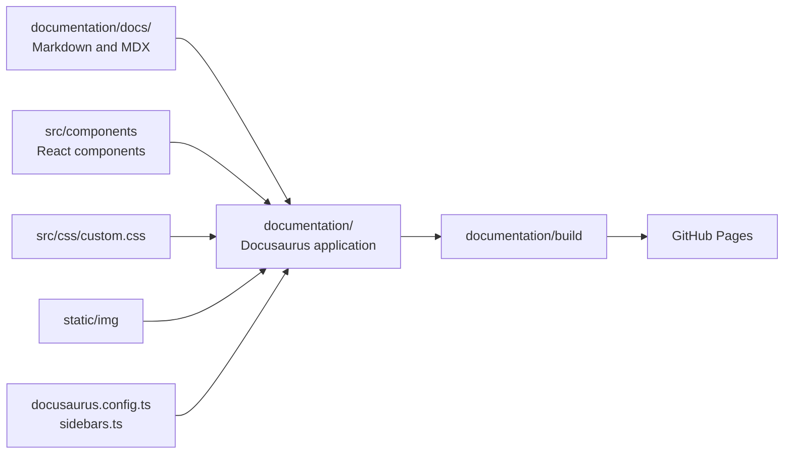
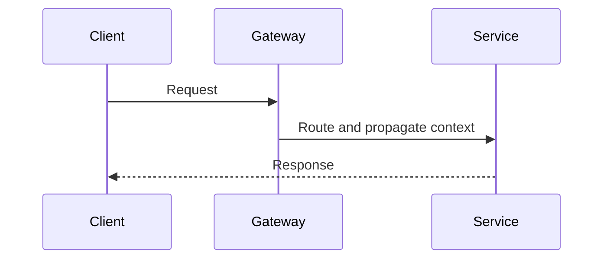
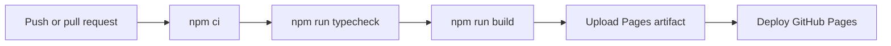

# Docusaurus Documentation Portal

Docusaurus is a React-based static-site generator designed for documentation.
It converts Markdown and MDX into a searchable, versionable website while
providing navigation, syntax highlighting, responsive layouts, dark mode, and
static deployment.

Official documentation:

- [Docusaurus introduction](https://docusaurus.io/docs)
- [Installation](https://docusaurus.io/docs/installation)
- [Configuration](https://docusaurus.io/docs/api/docusaurus-config)
- [Markdown and MDX](https://docusaurus.io/docs/markdown-features)
- [Deployment](https://docusaurus.io/docs/deployment)

## Shopverse Documentation Architecture



Shopverse deliberately separates:

- `documentation/docs/`: reusable study material and Shopverse case-study content;
- `documentation/`: the application and content root;
- service READMEs: commands and contracts close to each service;
- `documentation/static/`: images copied unchanged into the generated site;
- `documentation/src/`: React components and custom CSS.

This lets GitHub render most Markdown directly while Docusaurus provides the
structured learning portal.

## Prerequisites

Use:

- Node.js 20 or later;
- npm supplied with Node.js;
- Git;
- a current browser.

Verify:

```powershell
node --version
npm --version
git --version
```

Shopverse currently pins Docusaurus packages in
`documentation/package.json` and commits `package-lock.json` for reproducible
installations.

## Set Up A New Docusaurus Site

For a new standalone project:

```powershell
npx create-docusaurus@latest my-documentation classic --typescript
Set-Location my-documentation
npm start
```

The `classic` template includes documentation, a blog, pages, navigation,
Prism highlighting, and a default theme. Remove unused features, such as the
blog, rather than maintaining empty sections.

For an existing Shopverse checkout, do not recreate the site. Install the
committed dependencies:

```powershell
Set-Location documentation
npm ci
```

Use `npm ci` in CI and clean local environments because it installs exactly
what is recorded in `package-lock.json`. Use `npm install` when intentionally
adding or updating a dependency.

## Run Locally

Development server with live reload:

```powershell
Set-Location documentation
npm start
```

Open:

```text
http://localhost:3000/shopverse/
```

Use another port when `3000` is already occupied:

```powershell
npm start -- --port 3001
```

The development server recompiles changed Markdown, MDX, React components, and
CSS. Restart it after changing dependencies or when configuration changes are
not detected.

## Important Commands

| Command | Purpose |
|---|---|
| `npm ci` | install the exact locked dependency graph |
| `npm start` | run the development server with live reload |
| `npm run typecheck` | validate TypeScript configuration and components |
| `npm run build` | create the optimized static production site |
| `npm run serve` | serve the generated `build/` directory locally |
| `npm run clear` | remove Docusaurus caches and generated metadata |

Recommended validation:

```powershell
npm run typecheck
npm run build
npm run serve -- --port 3001
```

`npm start` proves the development experience works. `npm run build` is the
authoritative check because it validates server rendering, routes, MDX,
sidebars, Mermaid diagrams, and production assets together.

## Repository Structure

```text
shopverse/
|-- documentation/
|   |-- docs/
|   |   |-- README.mdx
|   |   |-- architecture/
|   |   |-- spring/
|   |   |-- data/
|   |   |-- observability/
|   |   `-- operations/
|   |-- src/
|   |   |-- components/
|   |   `-- css/custom.css
|   |-- static/img/
|   |-- docusaurus.config.ts
|   |-- sidebars.ts
|   |-- package.json
|   `-- tsconfig.json
`-- .github/workflows/docs-site.yml
```

## Add A Documentation Page

Create a Markdown file under the correct topic:

```markdown
---
title: Transaction Isolation
sidebar_position: 6
---

# Transaction Isolation

Content starts here.
```

Then add its document ID to `documentation/sidebars.ts`:

```typescript
{
  type: 'category',
  label: 'Data And Caching',
  items: [
    'data/DATABASE-ENGINEERING',
    'data/TRANSACTION-ISOLATION',
  ],
}
```

The document ID is the path below `documentation/docs/` without the `.md` or `.mdx`
extension.

Use front matter for page metadata:

| Property | Purpose |
|---|---|
| `title` | page and sidebar title |
| `sidebar_position` | ordering when generated sidebars are used |
| `slug` | custom route |
| `description` | search and social metadata |
| `hide_title` | hide Docusaurus' automatic title |
| `hide_table_of_contents` | hide the right-side section index |

Shopverse uses `hide_title` on visual landing pages because their React hero
already contains the main `h1`.

## Markdown Versus MDX

Use `.md` when headings, prose, tables, code, and Mermaid are sufficient.

Use `.mdx` when the page needs React components:

```mdx
import {
  DocFigure,
  ReadingGuide,
} from '@site/src/components/DocumentationLanding';

<ReadingGuide>

Read the architecture page before the implementation details.

</ReadingGuide>

<DocFigure
  src="/img/diagrams/system.svg"
  alt="System architecture"
  caption="High-level service topology."
/>
```

Prefer Markdown by default. MDX increases capability, but it also introduces
component imports, JSX syntax, and TypeScript/build dependencies.

## Add Mermaid Diagrams

Shopverse enables Mermaid in `docusaurus.config.ts`:

```typescript
markdown: {
  mermaid: true,
},
themes: ['@docusaurus/theme-mermaid'],
```

Use a fenced block:

````markdown

````

Mermaid is preferred for diagrams that change with code because the source
remains reviewable and version controlled. Use a prepared SVG or bitmap when
the diagram needs dense layout, visual grouping, or presentation-quality
labels.

## Add Images

Place static assets under:

```text
documentation/static/img/
```

A file at:

```text
documentation/static/img/diagrams/shopverse-architecture-flow.svg
```

is referenced as:

```markdown

```

Shopverse visual pages use `DocFigure` to add a caption and full-size link.

Image practices:

- use SVG for architecture and flow diagrams;
- provide meaningful `alt` text;
- avoid embedding important explanations only inside an image;
- keep source diagrams version controlled;
- verify light and dark modes;
- compress large bitmap images;
- use stable descriptive filenames.

## Modify Navigation

### Sidebar

Edit `documentation/sidebars.ts`:

```typescript
{
  type: 'category',
  label: '8. Delivery, Containers And CI/CD',
  items: [
    'operations/DOCKER',
    'operations/JENKINS',
    'operations/DOCUSAURUS',
  ],
}
```

### Navbar

Edit `themeConfig.navbar` in `documentation/docusaurus.config.ts`:

```typescript
navbar: {
  title: 'Backend Engineering',
  logo: {
    alt: 'Backend Engineering Knowledge Base',
    src: 'img/favicon.svg',
  },
  items: [
    {
      to: '/reference/LEARNING-PATH',
      label: 'Learning Path',
      position: 'left',
    },
  ],
},
```

### Footer

Edit `themeConfig.footer.links` to expose durable entry points. Avoid putting
every page in the footer; use the sidebar and search for detailed navigation.

## Modify Styling

Shopverse loads:

```text
documentation/src/css/custom.css
```

through:

```typescript
theme: {
  customCss: './src/css/custom.css',
},
```

Use Docusaurus Infima variables instead of hardcoding every color:

```css
:root {
  --ifm-color-primary: #176b5b;
  --doc-border: #d7e1df;
  --doc-surface: #f7faf9;
}

[data-theme="dark"] {
  --ifm-color-primary: #55c7ad;
  --doc-border: #344743;
  --doc-surface: #18221f;
}
```

Production styling guidance:

- preserve readable line lengths;
- test wide tables and code blocks on mobile;
- maintain visible focus states and sufficient contrast;
- do not rely only on color to communicate status;
- keep cards flat and purposeful;
- use one `h1` per page;
- support both light and dark mode;
- avoid overriding deeply generated Docusaurus selectors unless required.

## Add Reusable React Components

Shopverse components live under:

```text
documentation/src/components/
```

Example:

```tsx
export function ReadingGuide({
  children,
}: {
  children: React.ReactNode;
}) {
  return (
    <aside className={styles.readingGuide}>
      {children}
    </aside>
  );
}
```

Use CSS modules beside the component:

```text
DocumentationLanding/
|-- index.tsx
`-- styles.module.css
```

CSS modules prevent component styles from leaking into unrelated pages.
Global documentation behavior belongs in `src/css/custom.css`.

## Search

Shopverse uses local static search:

```typescript
[
  '@easyops-cn/docusaurus-search-local',
  {
    hashed: true,
    language: ['en'],
    indexDocs: true,
    docsDir: 'docs',
  },
],
```

The search index is generated during the production build. If a page does not
appear:

1. confirm the page is included in the docs plugin;
2. run `npm run build`;
3. clear stale Docusaurus caches;
4. serve the new production build;
5. verify the page is not excluded by plugin configuration.

## Production Configuration

These values define GitHub Pages routing:

```typescript
url: 'https://taukhir.github.io',
baseUrl: '/shopverse/',
organizationName: 'taukhir',
projectName: 'shopverse',
```

For a custom domain hosted at the root:

```typescript
url: 'https://docs.example.com',
baseUrl: '/',
```

Incorrect `url` or `baseUrl` commonly causes missing CSS, JavaScript, images,
and broken navigation after deployment.

## Deploy With GitHub Pages

Shopverse deploys through:

```text
.github/workflows/docs-site.yml
```



The workflow:

1. runs when `documentation/` or the workflow changes;
2. checks out the repository;
3. installs Node.js 20 and npm dependencies;
4. type-checks configuration and components;
5. creates the production site;
6. uploads `documentation/build`;
7. deploys the artifact to the `github-pages` environment.

Repository setup:

1. Open GitHub repository **Settings**.
2. Open **Pages**.
3. Set the source to **GitHub Actions**.
4. Ensure workflows have Pages permissions.
5. Push to `main` or manually run **Shopverse Documentation**.

Pull requests build the site but do not deploy it. This catches broken MDX,
routes, sidebars, or components before merge.

## Deploy Manually

Create the static site:

```powershell
Set-Location documentation
npm ci
npm run typecheck
npm run build
```

The deployable artifact is:

```text
documentation/build/
```

Any static host can serve it, including Nginx, Apache, S3/CloudFront, Azure
Static Web Apps, Netlify, or a container image.

Example Nginx container:

```dockerfile
FROM nginx:1.27-alpine
COPY documentation/build /usr/share/nginx/html/shopverse
EXPOSE 80
```

The host path must agree with `baseUrl`.

## Validate A Change

Use this sequence:

```powershell
Set-Location documentation
npm run typecheck
npm run build
npm run serve -- --port 3001
```

Check:

- home and case-study landing pages;
- sidebar and navbar links;
- search;
- Mermaid diagrams;
- code blocks and wide tables;
- images and captions;
- light and dark themes;
- desktop and mobile widths;
- browser console warnings;
- direct refresh on nested routes.

## Troubleshooting

### Port Already In Use

```powershell
npm start -- --port 3001
```

### Stale Generated Content

```powershell
npm run clear
npm start
```

### Document ID Not Found

Check that:

- the file exists below `documentation/docs/`;
- the sidebar ID matches its path without the extension;
- filename case matches exactly;
- the document has valid front matter.

### MDX Compilation Failure

Common causes:

- unclosed JSX tags;
- braces interpreted as JavaScript;
- importing a component from the wrong path;
- Markdown content placed directly inside JSX without blank lines;
- invalid TypeScript in a component.

Run:

```powershell
npm run typecheck
npm run build
```

### Images Work Locally But Not On GitHub Pages

Use Docusaurus-aware paths and verify `baseUrl`. React components should use
`useBaseUrl`, as Shopverse's `DocFigure` does.

### Broken Styling After Dependency Changes

```powershell
Remove-Item -Recurse -Force node_modules
npm ci
npm run clear
npm run build
```

Do not delete `package-lock.json` merely to bypass a dependency conflict.

## Dependency And Upgrade Practices

- pin all Docusaurus packages to the same release;
- commit `package-lock.json`;
- review release notes before upgrading;
- upgrade in a dedicated pull request;
- run type-check, build, search, diagram, and responsive tests;
- review `npm audit` findings rather than applying breaking force upgrades
  automatically;
- avoid unnecessary theme swizzling because copied theme components become
  upgrade responsibilities.

Classic is the maintained Docusaurus application theme. Prefer configuration,
CSS, MDX components, and limited component wrapping before swizzling internal
theme components.

## Shopverse Files To Modify

| Change | File or directory |
|---|---|
| add study content | `documentation/docs/` |
| add sidebar entry | `documentation/sidebars.ts` |
| modify navbar/footer/plugins | `documentation/docusaurus.config.ts` |
| modify global colors and typography | `documentation/src/css/custom.css` |
| add reusable visual component | `documentation/src/components/` |
| add image or downloadable asset | `documentation/static/` |
| add/update dependency | `documentation/package.json` |
| modify deployment | `.github/workflows/docs-site.yml` |
