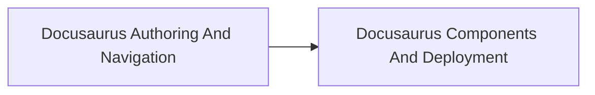

<!-- split-guide-index -->
# Docusaurus Documentation Engineering

<DocLabels items={[{label: 'Focused guides', tone: 'advanced'}, {label: 'Shopverse', tone: 'shopverse'}, {label: 'Architect route', tone: 'production'}]} />

Author, organize, customize, deploy, and validate the Shopverse documentation site. The original long-form material is preserved without duplication across the focused pages below.

<TopicCards items={[
  {title: 'Docusaurus Authoring And Navigation', href: '/operations/DOCUSAURUS-AUTHORING-NAVIGATION', description: 'Part 1 of the focused Docusaurus Documentation Engineering learning route.', icon: 'route', tags: ['Focused', 'Advanced']},
  {title: 'Docusaurus Components And Deployment', href: '/operations/DOCUSAURUS-COMPONENTS-DEPLOYMENT', description: 'Part 2 of the focused Docusaurus Documentation Engineering learning route.', icon: 'security', tags: ['Focused', 'Advanced']},
]} />

<DocCallout type="tip" title="Use the index as the stable entry point">

Each focused page owns one concern. Cross-links point to the canonical explanation instead of repeating the same material.

</DocCallout>

## Recommended Learning Order

1. [Docusaurus Authoring And Navigation](./DOCUSAURUS-AUTHORING-NAVIGATION.md)
2. [Docusaurus Components And Deployment](./DOCUSAURUS-COMPONENTS-DEPLOYMENT.md)

## Reading Strategy

Use **Docusaurus Documentation Engineering** as a decision and verification guide inside **Docusaurus Documentation Engineering**. Start by naming the invariant or operational outcome, then follow the runtime flow and identify the owning component. For every example, record the expected success evidence, the most important failure mode, and the metric or test that proves recovery. This keeps the material useful for implementation reviews, production incidents, and architect interviews instead of treating it as isolated syntax.

Within **Docusaurus Documentation Engineering**, apply the Shopverse guidance incrementally: verify the current behavior, introduce one bounded change, test the unhappy path, and preserve a rollback or reconciliation route. Follow links to canonical pages when a concept belongs to another track; do not copy that explanation into this page. This ownership rule keeps the focused guides short while retaining technical depth and traceability.

## Official References

- [Docusaurus documentation](https://docusaurus.io/docs)
- [Git documentation](https://git-scm.com/docs)
