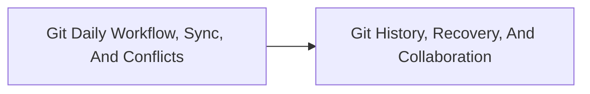

<!-- split-guide-index -->
# Git Engineering Guide

<DocLabels items={[{label: 'Focused guides', tone: 'advanced'}, {label: 'Shopverse', tone: 'shopverse'}, {label: 'Architect route', tone: 'production'}]} />

Use Git safely for daily delivery, history management, recovery, and collaboration. The original long-form material is preserved without duplication across the focused pages below.

<TopicCards items={[
  {title: 'Git Daily Workflow, Sync, And Conflicts', href: '/operations/GIT-DAILY-SYNC-CONFLICTS', description: 'Part 1 of the focused Git Engineering Guide learning route.', icon: 'route', tags: ['Focused', 'Advanced']},
  {title: 'Git History, Recovery, And Collaboration', href: '/operations/GIT-HISTORY-RECOVERY-COLLABORATION', description: 'Part 2 of the focused Git Engineering Guide learning route.', icon: 'security', tags: ['Focused', 'Advanced']},
]} />

<DocCallout type="tip" title="Use the index as the stable entry point">

Each focused page owns one concern. Cross-links point to the canonical explanation instead of repeating the same material.

</DocCallout>

## Recommended Learning Order

1. [Git Daily Workflow, Sync, And Conflicts](./GIT-DAILY-SYNC-CONFLICTS.md)
2. [Git History, Recovery, And Collaboration](./GIT-HISTORY-RECOVERY-COLLABORATION.md)

## Reading Strategy

Use **Git Engineering Guide** as a decision and verification guide inside **Git Engineering Guide**. Start by naming the invariant or operational outcome, then follow the runtime flow and identify the owning component. For every example, record the expected success evidence, the most important failure mode, and the metric or test that proves recovery. This keeps the material useful for implementation reviews, production incidents, and architect interviews instead of treating it as isolated syntax.

Within **Git Engineering Guide**, apply the Shopverse guidance incrementally: verify the current behavior, introduce one bounded change, test the unhappy path, and preserve a rollback or reconciliation route. Follow links to canonical pages when a concept belongs to another track; do not copy that explanation into this page. This ownership rule keeps the focused guides short while retaining technical depth and traceability.

## Official References

- [Docusaurus documentation](https://docusaurus.io/docs)
- [Git documentation](https://git-scm.com/docs)
