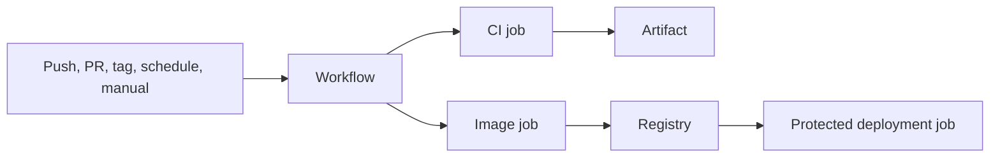

# GitHub Actions

GitHub Actions runs repository automation from YAML workflows under
`.github/workflows`.



## Concepts

| Concept | Meaning |
|---|---|
| Workflow | YAML automation definition |
| Event | trigger such as `push` or `workflow_dispatch` |
| Job | group of steps running on one runner |
| Step | shell command or reusable action |
| Runner | machine executing a job |
| Action | reusable automation component |
| Artifact | files retained from a run |
| Environment | deployment target with secrets and protection rules |

## CI Example

```yaml
name: Service CI

on:
  pull_request:
  push:
    branches: [main]

permissions:
  contents: read

concurrency:
  group: service-ci-${{ github.ref }}
  cancel-in-progress: true

jobs:
  test:
    runs-on: ubuntu-latest
    timeout-minutes: 10
    strategy:
      fail-fast: false
      matrix:
        service: [order-service, inventory-service, payment-service]
    steps:
      - uses: actions/checkout@v4
      - uses: actions/setup-java@v4
        with:
          distribution: temurin
          java-version: "21"
      - uses: gradle/actions/setup-gradle@v4
      - run: ./gradlew test --no-daemon --max-workers=2
        working-directory: ${{ matrix.service }}
```

## Docker Build And Push

```yaml
- uses: docker/setup-buildx-action@v3
- uses: docker/login-action@v3
  with:
    registry: ghcr.io
    username: ${{ github.actor }}
    password: ${{ secrets.GITHUB_TOKEN }}
- uses: docker/build-push-action@v6
  with:
    context: ./order-service
    push: true
    tags: ghcr.io/example/order-service:${{ github.sha }}
    cache-from: type=gha,scope=order-service
    cache-to: type=gha,mode=max,scope=order-service
```

Use immutable SHA tags for deployment. A `latest` tag can be published as a
convenience but must not be the only deployment identity.

## Useful Features

### Path Filters

Run service jobs only when their code or shared configuration changes. For a
monorepo, calculate an affected-service matrix when path rules become complex.

### Reusable Workflows

Put common build logic in one workflow invoked with `workflow_call`. Use
composite actions for reusable step sequences. Do not copy the same 50-line
build into every service.

### Environments

```yaml
environment: production
```

GitHub environments can provide:

- environment-scoped secrets;
- required reviewers;
- branch/tag restrictions;
- deployment history.

### OIDC

Prefer OpenID Connect federation for cloud deployment over long-lived cloud
access keys. The workflow obtains a short-lived identity scoped by repository,
branch, and environment policy.

## Security Practices

1. Set minimum `permissions`.
2. Pin third-party actions to trusted versions or commit SHAs according to
   organizational policy.
3. Do not run untrusted pull-request code with production secrets.
4. Use protected environments for production.
5. Mask and avoid printing secrets.
6. Scan dependencies, source, images, and IaC.
7. Generate SBOMs and sign release artifacts.
8. Separate CI validation from privileged deployment.

## Shopverse Workflows

Shopverse currently has:

| Workflow | Responsibility |
|---|---|
| `ci.yml` | config validation, affected-service tests, Testcontainers, images, SAGA smoke test |
| `deploy.yml` | GHCR image publication and optional SSH deployment |
| `docs-site.yml` | Docusaurus validation and GitHub Pages deployment |
| `jenkins-trigger.yml` | optional Jenkins handoff |

The CI workflow uses bounded timeouts, limited matrix parallelism, Gradle cache,
Buildx cache scopes, failure artifacts, and cleanup.

See [Shopverse workflow guide](https://github.com/taukhir/shopverse/tree/main/.github/workflows).

## Interview Questions

<ExpandableAnswer title="Hosted Or Self-Hosted Runner?">

Hosted runners are isolated and low-maintenance. Self-hosted runners provide
private-network access and custom tooling but require patching, isolation,
capacity management, and protection from untrusted workflow code.

</ExpandableAnswer>
<ExpandableAnswer title="Cache Or Artifact?">

A cache accelerates future runs and may be evicted. An artifact is output from
a specific run retained for download, diagnosis, or promotion.

</ExpandableAnswer>