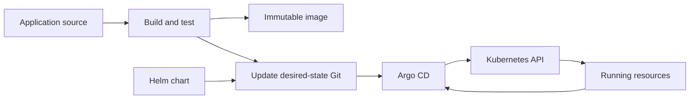

# Helm, GitOps, And Argo CD Overview

Helm, GitOps, and Argo CD operate at related but different layers:

- **Helm** packages and renders Kubernetes resources.
- **GitOps** is an operating model where version-controlled desired state is reviewed and
  reconciled into environments.
- **Argo CD** is a Kubernetes delivery controller that implements GitOps-style comparison,
  synchronization, and health reporting.

They complement Kubernetes; none of them creates a correct application, a safe database
migration, or a complete release policy automatically.

## Why These Tools Exist

A production application often needs Deployments, Services, configuration, policies, autoscaling,
and environment-specific values. Copying YAML creates drift. Running imperative deployment scripts
from laptops or CI hides actual state and gives push systems broad credentials.



## Helm Basics

A **chart** is a versioned package containing Kubernetes templates, default values, metadata, and
optional dependencies. A **release** is one installed instance of a chart with a selected value
set in a target namespace.

```text
chart/
├── Chart.yaml          chart name and version
├── values.yaml         documented defaults
├── templates/          Kubernetes manifest templates
├── charts/             packaged dependencies
└── values.schema.json  optional values validation
```

| Concept | Meaning |
|---|---|
| chart | reusable Kubernetes application package |
| template | manifest containing Go-template expressions |
| values | input data used while rendering templates |
| release | installed chart instance and its release history |
| repository/registry | location used to distribute charts |

Important commands:

```bash
helm lint ./chart
helm template orders ./chart -f values-dev.yaml
helm upgrade --install orders ./chart --namespace shopverse --create-namespace
helm list --namespace shopverse
helm history orders --namespace shopverse
helm rollback orders 2 --namespace shopverse
```

Render and validate before applying. Helm rollback restores rendered Kubernetes resources from a
release revision; it cannot reverse external side effects or incompatible database changes.

## GitOps Basics

GitOps applies four core ideas:

1. desired state is declared rather than encoded only as imperative steps;
2. desired state is versioned and reviewable;
3. software agents pull and reconcile approved state;
4. drift and convergence are observable.

Git is the source of reviewed intent, not necessarily the source of runtime truth. Kubernetes
status, application telemetry, and user-facing checks still determine whether a release works.

A common repository boundary is:

```text
application repository -> source, tests, image build
desired-state repository -> chart/version/digest and environment configuration
```

Promote an immutable image digest between environments instead of rebuilding different binaries.
Keep secret plaintext out of Git; use an approved encryption or external-secret workflow.

## Argo CD Basics

Argo CD watches declared applications, retrieves desired state, compares it with live cluster
resources, and reports or reconciles differences.

| Concept | Purpose |
|---|---|
| Application | connects source, revision, path/chart, destination cluster, and namespace |
| Project | constrains allowed sources, destinations, and resource kinds |
| sync | applies desired changes to the destination |
| health | interprets whether managed resources appear operational |
| drift | difference between desired and live state |
| prune | deletes resources no longer present in desired state |

Automatic sync is not automatically safe. Prune, self-heal, hooks, waves, and destructive resource
changes require explicit policy and recovery planning.

<ExpandableAnswer title="Dry run: a new application version">

1. CI tests the application, builds one image, scans/signs it, and pushes its immutable digest.
2. CI or a release process proposes that digest in the desired-state repository.
3. Review verifies configuration, policy, schema/event compatibility, and rollout intent.
4. After merge, Argo CD detects the new desired revision.
5. Helm rendering produces Kubernetes objects when the source uses a chart.
6. Argo CD compares rendered desired objects with live objects and performs an approved sync.
7. Kubernetes controllers roll out Pods; readiness and application telemetry determine usable
   health.
8. Failure handling may revert desired state, pause exposure, or run domain recovery. A Git revert
   alone cannot undo irreversible data changes.

</ExpandableAnswer>

## Responsibility Boundaries

| Concern | Primary owner |
|---|---|
| package related Kubernetes manifests | Helm chart |
| review and version desired state | Git workflow |
| compare and reconcile cluster state | Argo CD |
| schedule and run Pods | Kubernetes |
| build and test application image | CI |
| progressive traffic analysis | rollout/controller tooling plus observability |
| schema and event compatibility | application/data delivery design |
| secret source and rotation | secret-management platform and workload integration |

## Common Mistakes

- treating Helm as a cluster provisioner or full CI/CD platform;
- editing live objects that Argo CD immediately reconciles away;
- storing passwords or tokens in plain values files;
- using mutable image tags and expecting Git history to identify deployed bytes;
- enabling automatic prune without protecting critical resources;
- equating Kubernetes resource health with business correctness;
- assuming rollback reverses database migrations, messages, or external calls.

## Official References

- [Introduction to Helm](https://helm.sh/docs/intro/introduction/)
- [OpenGitOps principles](https://opengitops.dev/)
- [Argo CD documentation](https://argo-cd.readthedocs.io/)

## Recommended Next

Continue with the [Helm, GitOps, And Argo CD Architect Path](./HELM-GITOPS-ARGOCD-PATH.md).
