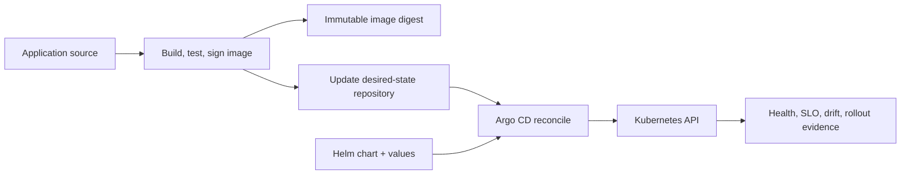

# Helm, GitOps, And Argo CD Architect Path

Helm packages Kubernetes resources; GitOps defines Git as the reviewed desired-state
source; Argo CD continuously compares and reconciles that state with clusters. They solve
different layers and must not be treated as one deployment command.

## At-A-Glance Responsibilities

| Layer | Owns | Must not own implicitly |
|---|---|---|
| Helm | templates, defaults, packaging, install/upgrade rendering | environment promotion policy or cluster reconciliation |
| GitOps | desired-state workflow, review, audit, reconciliation principles | application correctness and database compatibility |
| Argo CD | pull, diff, sync, health, RBAC, multi-cluster application delivery | image build, secret plaintext, safe business migration |
| rollout controller | canary/blue-green traffic and analysis | schema/event compatibility and domain reconciliation |

## Complete Route

1. [Helm Chart Engineering And Testing](./helm-gitops/HELM-CHART-ENGINEERING.md)
2. [GitOps Repository, Promotion, And Drift Design](./helm-gitops/GITOPS-DELIVERY-DESIGN.md)
3. [Argo CD Architecture, Security, Operations, And Progressive Delivery](./helm-gitops/ARGOCD-PRODUCTION-OPERATIONS.md)
4. [Incidents, Labs, Interview Questions, And Revision](./helm-gitops/HELM-GITOPS-ARGOCD-INTERVIEW-REVISION.md)

## Completion Standard

You can design a values contract, render/test charts, promote immutable digests without
rebuilding, explain Argo CD controllers and sync phases, secure projects/repositories/
clusters, prevent destructive prune and secret leakage, handle drift and failed sync,
coordinate database changes, restore the GitOps control plane, and prove deployment through
health, SLO, rollback, and reconciliation evidence.

## Official References

- [Helm documentation](https://helm.sh/docs/)
- [OpenGitOps principles](https://opengitops.dev/)
- [Argo CD documentation](https://argo-cd.readthedocs.io/)

## Recommended Next

Begin with [Helm Chart Engineering And Testing](./helm-gitops/HELM-CHART-ENGINEERING.md).

