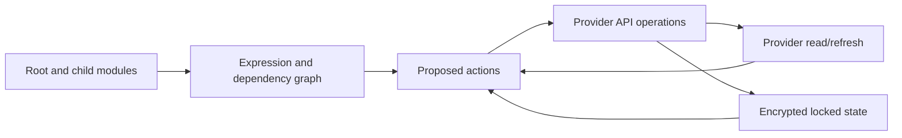

# Terraform And OpenTofu Infrastructure-As-Code Architect Path

Terraform and OpenTofu evaluate declarative configuration into a dependency graph, compare
configuration/state/remote objects, produce a plan, and call provider APIs to converge infrastructure.
State is a sensitive binding database—not merely a cache—and an approved plan is only valid for the
inputs, credentials, state and remote conditions under which it was produced.



## Required Coverage

- HCL expressions, types, variables, locals, outputs and validation;
- resources, data sources, providers, aliases, `count`, `for_each` and dependencies;
- lifecycle behavior, replacement, create-before-destroy and dangerous targeting;
- state mapping, locking, encryption, access, backup and recovery;
- modules, versioning, contracts, registries and composition boundaries;
- environment/account separation without copy-paste sprawl;
- import, moved/removed declarations, refactoring and drift remediation;
- formatting, validation, linting, security/policy, tests and ephemeral integration;
- CI plan review, trusted apply, short-lived identity and promotion;
- failures, rate limits, partial apply, interrupted apply and provider upgrades.

## Safe State Architecture

Use a remote backend/service with encryption, locking or serialized runs, versioning, least privilege,
audit and recovery. Separate state by blast radius and ownership, not one file per resource or one global
file for the company. Outputs and state may contain secrets even when marked sensitive; control storage,
logs and plan artifacts accordingly. Never hand-edit JSON state.

## Module Standard

A module owns one coherent capability, declares provider/version requirements, exposes typed validated
inputs and minimal outputs, documents behavior and breaking changes, includes examples/tests and avoids
embedded provider configuration in reusable children. Pin released module versions; update through
reviewed plans. Excessive wrappers and deeply nested modules hide provider semantics and slow upgrades.

## Delivery Workflow

```text
pull request -> fmt/validate/lint/security/tests -> speculative plan
             -> human/policy review -> merge -> protected apply with fresh plan
             -> post-apply verification -> drift detection/reconciliation
```

Do not apply untrusted pull-request code with production credentials. Prefer workload identity/OIDC over
static cloud keys. Persist plan artifacts only when their sensitive content and stale-plan risk are governed.

## Design Decisions

| Decision | Strong default | Reconsider when |
|---|---|---|
| Terraform vs OpenTofu | select intentionally by compatibility, governance and support | licensing/ecosystem/provider needs change |
| workspaces vs directories/accounts | explicit roots and strong account boundaries | workspace semantics are centrally governed |
| one large state | split by owner/blast radius/change cadence | cross-state coupling becomes worse than isolation |
| manual console changes | emergency only, followed by import/reconciliation | provider cannot manage the capability |
| `-target` | recovery diagnostic only | never normal deployment architecture |

## Hands-On And Interviews

The companion workbook implements AWS network/EKS foundations, remote state, a reusable module,
imports/refactors, drift, policy tests, CI and state recovery.

## Official References

- [Terraform language](https://developer.hashicorp.com/terraform/language)
- [Terraform state purpose](https://developer.hashicorp.com/terraform/language/state/purpose)
- [OpenTofu documentation](https://opentofu.org/docs/)

## Recommended Next

Continue with [IaC Implementation, Operations, Incidents, Labs, And Interviews](./iac/IAC-IMPLEMENTATION-OPERATIONS-INTERVIEW.md).

