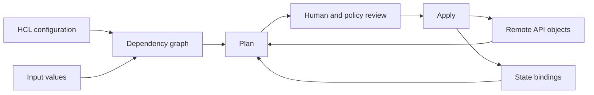

# Infrastructure As Code Overview: Terraform And OpenTofu Basics

Infrastructure as Code (**IaC**) means defining infrastructure through version-controlled files
and automated tooling instead of relying only on manual console actions. Terraform and OpenTofu
read declarative HCL configuration, build a dependency graph, compare configuration and recorded
state with remote systems, and call provider APIs to perform planned changes.

## What Problem Does IaC Solve?

Manual infrastructure changes are difficult to review, reproduce, test, and recover. IaC provides:

- reviewable intent in version control;
- repeatable creation of environments;
- reusable modules and policy checks;
- a plan showing proposed actions before execution;
- automation through provider APIs;
- a record that can be compared with remote infrastructure to detect drift.

IaC does not make every change safe. A reviewed configuration can still delete data, expose a
network, exceed cost limits, or fail midway.

## Core Mental Model



| Term | Meaning |
|---|---|
| provider | plugin that translates resource operations into platform API calls |
| resource | infrastructure object IaC should manage |
| data source | read-only lookup of existing information |
| variable | typed input to a root configuration or module |
| local value | named expression calculated inside configuration |
| output | selected value exposed by a module or root configuration |
| module | reusable collection of IaC configuration |
| state | mapping between resource addresses and remote objects plus recorded attributes |
| plan | proposed actions calculated for particular inputs, state, credentials, and remote state |

## Declarative Versus Imperative

Imperative automation says **how** to perform each step:

```text
create network -> create subnet -> create instance -> attach policy
```

Declarative configuration says **what** should exist and expresses relationships. The engine
calculates operation order from references and provider behavior. Declarative does not mean every
operation is reversible or that ordering never needs explicit modeling.

## Basic HCL Example

```hcl
terraform {
  required_providers {
    aws = {
      source  = "hashicorp/aws"
      version = "~> 5.0"
    }
  }
}

provider "aws" {
  region = var.aws_region
}

variable "aws_region" {
  type        = string
  description = "AWS region for this environment"
}

resource "aws_s3_bucket" "assets" {
  bucket = "shopverse-assets-example"

  tags = {
    Service     = "assets"
    Environment = "dev"
  }
}

output "bucket_arn" {
  value = aws_s3_bucket.assets.arn
}
```

The resource address is `aws_s3_bucket.assets`. Referencing its ARN creates a graph dependency for
consumers. Real bucket configuration also needs deliberate ownership, encryption, access, public-
access blocking, versioning, lifecycle, logging, backup, and naming strategy.

## Configuration, State, And Reality

These are different things:

```text
configuration = declared intent
state         = IaC's recorded bindings and attributes
remote object = infrastructure that currently exists in the provider
```

State is not merely a disposable cache. It connects configuration addresses to real objects and
may contain sensitive values. Protect it with encryption, access control, locking or serialized
runs, versioning, audit, backup, and a tested recovery process.

Do not commit state, saved plan files, credentials, or generated provider caches to Git. Do not
hand-edit state JSON. Use supported import, move, remove, and state-recovery operations with a
backup and exact target.

## The Normal Workflow

```bash
terraform fmt -check
terraform init
terraform validate
terraform plan -out=tfplan
terraform apply tfplan
terraform output
```

OpenTofu uses equivalent `tofu` commands.

<ExpandableAnswer title="Dry run: configuration change to apply">

1. `init` installs selected providers/modules and configures the backend.
2. `validate` checks configuration structure and internal consistency, not production safety.
3. `plan` reads inputs, state, and remote objects, builds a graph, and proposes actions.
4. Review checks identity/account, workspace/root, replacements, deletions, network exposure,
   data risk, cost, and unexpected drift.
5. `apply` executes provider operations. Some APIs are asynchronous or can partially succeed.
6. The tool records successful bindings and attributes in state.
7. Post-apply checks verify the real service behavior; a successful apply only proves accepted
   infrastructure operations.

</ExpandableAnswer>

## Resources, Data Sources, And Modules

- A resource declares something the configuration owns.
- A data source reads something managed elsewhere.
- A module groups one coherent capability behind typed inputs and minimal outputs.

Modules should not hide every provider feature behind generic wrappers. Version released modules,
declare provider constraints, validate inputs, provide examples and tests, and document breaking
changes.

## Environments And State Boundaries

Split state by ownership, blast radius, permissions, and change cadence. One global state creates
large locks and failures; one state per tiny resource creates excessive cross-state coupling.

Use separate accounts/projects and credentials for strong environment isolation. Directory roots,
workspaces, or a managed IaC platform are implementation choices, not substitutes for an explicit
security boundary.

## Safe Automation

```text
pull request -> fmt -> validate -> lint/security/policy -> tests -> speculative plan
             -> review -> merge -> protected fresh plan/apply -> verification
```

- use short-lived workload identity rather than static cloud keys;
- never apply untrusted pull-request code with production credentials;
- pin provider and module versions intentionally;
- review replacement and destroy actions explicitly;
- avoid routine `-target`; it can produce an incomplete plan view;
- preserve state and diagnostic evidence after partial failure;
- reconcile emergency console changes back into managed configuration.

## Common Misconceptions

| Misconception | Correct model |
|---|---|
| IaC is just scripts | declarative engines maintain configuration/state/object relationships |
| state can always be regenerated safely | state is a sensitive binding database and recovery input |
| a clean plan is permanently valid | it is calculated for specific state, inputs, identity, and remote conditions |
| apply is transactional | provider operations can partially complete across independent APIs |
| sensitive output means encrypted | display redaction does not secure state or plan storage |
| drift should always be overwritten | first identify ownership and whether the remote change was legitimate |

## Official References

- [Terraform language](https://developer.hashicorp.com/terraform/language)
- [Terraform state purpose](https://developer.hashicorp.com/terraform/language/state/purpose)
- [OpenTofu language](https://opentofu.org/docs/language/)
- [OpenTofu backend configuration](https://opentofu.org/docs/language/settings/backends/configuration/)

## Recommended Next

Continue with the [Terraform And OpenTofu Architect Path](./INFRASTRUCTURE-AS-CODE-ARCHITECT-PATH.md).
