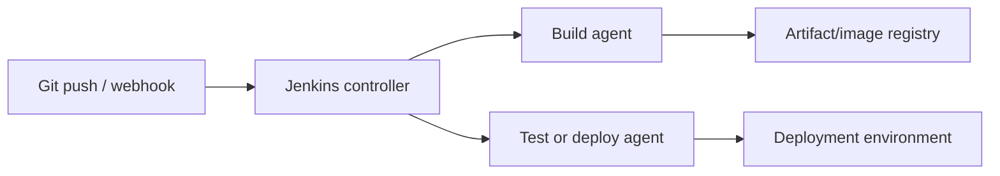

# Jenkins

Jenkins is a self-hosted automation server. Pipeline as Code stores build and
deployment logic in a `Jenkinsfile` beside application code.



## Main Components

| Component | Responsibility |
|---|---|
| Controller | schedules jobs, stores configuration, serves UI |
| Agent | executes pipeline work |
| Executor | concurrent work slot on an agent |
| Job | configured automation unit |
| Build | one execution of a job |
| Jenkinsfile | versioned pipeline definition |
| Plugin | extension such as Git, Pipeline, credentials, or Docker support |

Avoid running production builds on the controller. Use controlled ephemeral or
dedicated agents.

## Declarative Pipeline

```groovy
pipeline {
    agent any

    options {
        disableConcurrentBuilds()
        timeout(time: 20, unit: 'MINUTES')
        buildDiscarder(logRotator(numToKeepStr: '20'))
    }

    parameters {
        booleanParam(
            name: 'BUILD_IMAGE',
            defaultValue: true,
            description: 'Build the Docker image'
        )
    }

    environment {
        IMAGE = "shopverse/order-service:${BUILD_NUMBER}"
    }

    stages {
        stage('Checkout') {
            steps {
                checkout scm
            }
        }

        stage('Test') {
            steps {
                dir('order-service') {
                    sh './gradlew test --no-daemon'
                }
            }
        }

        stage('Build Image') {
            when {
                expression { params.BUILD_IMAGE }
            }
            steps {
                sh 'docker build -t "$IMAGE" ./order-service'
            }
        }
    }

    post {
        always {
            junit allowEmptyResults: true,
                    testResults: '**/build/test-results/test/*.xml'
        }
    }
}
```

## Pipeline Blocks

| Block | Purpose |
|---|---|
| `agent` | selects where work runs |
| `options` | timeouts, concurrency, retention, timestamps |
| `parameters` | runtime inputs displayed by Jenkins |
| `environment` | pipeline environment variables |
| `stages` | ordered major phases |
| `stage` | one visible pipeline phase |
| `steps` | commands/actions inside a stage |
| `when` | conditional stage execution |
| `post` | cleanup and reporting after result |
| `parallel` | concurrent independent branches |
| `matrix` | combinations such as Java/OS versions |

## Recommended Stages

```text
Checkout
  -> Validate
  -> Compile and unit test
  -> Integration test
  -> Static/security scan
  -> Package
  -> Build image
  -> Scan/sign/publish image
  -> Deploy
  -> Smoke test
  -> Promote or rollback
```

Fail fast on configuration and compilation. Run expensive integration and
image work only after cheaper gates pass.

## Credentials

```groovy
withCredentials([usernamePassword(
    credentialsId: 'registry-credentials',
    usernameVariable: 'REGISTRY_USER',
    passwordVariable: 'REGISTRY_PASSWORD'
)]) {
    sh '''
      echo "$REGISTRY_PASSWORD" |
        docker login ghcr.io -u "$REGISTRY_USER" --password-stdin
    '''
}
```

Never place secrets directly in the Jenkinsfile or console output. Prefer
short-lived workload identity when the platform supports it.

## Reuse And Scale

- use shared libraries for stable organization-wide pipeline functions;
- use ephemeral agents to reduce configuration drift;
- cache dependencies without sharing unsafe mutable workspaces;
- archive test reports and important diagnostics;
- use unique immutable image tags;
- protect deployment environments with approval and authorization;
- bound every stage with timeouts;
- clean workspaces and Compose stacks in `post { always { ... } }`.

## Shopverse Pipeline

Shopverse demonstrates:

- repository validation;
- parallel Gradle service builds;
- JUnit report publication;
- optional Docker image build and push;
- parameterized Compose smoke tests;
- local service deployment;
- deterministic image tags using build number and Git SHA.

See the canonical project instructions and actual pipeline:

- [Shopverse Jenkins guide](https://github.com/taukhir/shopverse/tree/main/jenkins)
- [Shared Jenkinsfile](https://github.com/taukhir/shopverse/blob/main/jenkins/Jenkinsfile)

## Interview Questions

<ExpandableAnswer title="Declarative Versus Scripted Pipeline">

Declarative Pipeline has a constrained, validated structure and built-in
sections such as `stages`, `when`, and `post`. Scripted Pipeline is flexible
Groovy but easier to make inconsistent. Prefer Declarative and use small
`script` blocks only where needed.

</ExpandableAnswer>
<ExpandableAnswer title="Why Disable Concurrent Builds?">

When builds share fixed Docker tags, ports, workspaces, or Compose project
names, concurrency can corrupt or conflict with state. A better long-term
solution is isolated workspaces and unique resource names; disabling
concurrency is still appropriate for inherently exclusive deployment jobs.

</ExpandableAnswer>