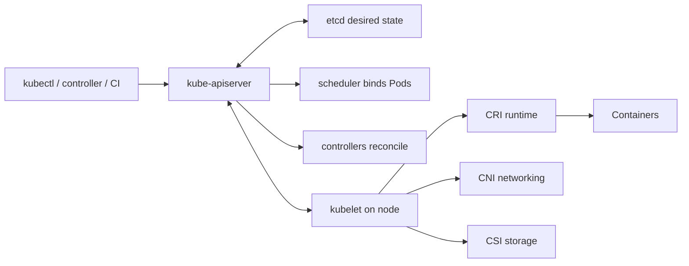

# Kubernetes Beginner-To-Architect Path

Kubernetes is an API-driven reconciliation platform. Users submit desired state; independent
controllers observe stored and actual state and repeatedly act to reduce the difference. It
does not make an application correct, stateless, secure, scalable or highly available by itself.



## Complete Route

### 1. Foundations And Client Access

1. [Kubernetes Workload Engineering Primer](./KUBERNETES-WORKLOAD-ENGINEERING.md)
2. [kubectl Commands, YAML, JSON, And API Configuration](./kubernetes/KUBERNETES-KUBECTL-MANIFESTS-COMMANDS.md)
3. [Kubeconfig, Contexts, Authentication, And Cluster Access](./kubernetes/KUBERNETES-KUBECONFIG-ACCESS.md)
4. [API Machinery, Control Plane, Nodes, And Reconciliation](./kubernetes/KUBERNETES-CONTROL-PLANE-INTERNALS.md)

### 2. Workloads And Data Plane

5. [Pods, Containers, Workloads, Lifecycle, And Scheduling](./kubernetes/KUBERNETES-WORKLOADS-SCHEDULING.md)
6. [Networking, Services, DNS, Ingress, And Gateway API](./kubernetes/KUBERNETES-NETWORKING-SERVICES.md)
7. [Persistent Storage, Stateful Workloads, And CSI](./kubernetes/KUBERNETES-STORAGE-STATEFUL.md)

### 3. Security And Platform Operations

8. [Security, Admission, Policy, And Multi-Tenancy](./kubernetes/KUBERNETES-SECURITY-MULTITENANCY.md)
9. [Cluster Operations, Capacity, Upgrades, HA, And Recovery](./kubernetes/KUBERNETES-CLUSTER-OPERATIONS.md)

### 4. Infrastructure And TKGI

10. [Containers, Virtual Machines, Kubernetes, And BOSH](./kubernetes/KUBERNETES-CONTAINERS-VMS-BOSH.md)
11. [TKGI Beginner-To-Architect Overview And Dedicated Component Pages](./kubernetes/TKGI-OVERVIEW-PATH.md)

### 5. Troubleshooting And Revision

12. [Troubleshooting, Incident Labs, Interviews, And Revision](./kubernetes/KUBERNETES-TROUBLESHOOTING-INTERVIEW-REVISION.md)

Use [Kubernetes Workload Engineering](./KUBERNETES-WORKLOAD-ENGINEERING.md) as the concise
primer, then follow this route for complete professional coverage.

For application packaging after the Kubernetes foundation, continue with the
[Helm, GitOps, And Argo CD Architect Path](./HELM-GITOPS-ARGOCD-PATH.md). Helm has its own
complete coverage of chart structure, Go templates, values and `values.schema.json`,
dependencies, hooks, upgrades, rollback limits, testing, GitOps reconciliation, Argo CD,
security, production incidents, and interview revision.

## Coverage Map

| Question | Canonical Page |
|---|---|
| What is Kubernetes and how does reconciliation work? | [Control Plane Internals](./kubernetes/KUBERNETES-CONTROL-PLANE-INTERNALS.md) |
| How do YAML and JSON manifests map to API objects? | [kubectl And Configuration](./kubernetes/KUBERNETES-KUBECTL-MANIFESTS-COMMANDS.md) |
| Which `kubectl` commands should an engineer know? | [kubectl And Configuration](./kubernetes/KUBERNETES-KUBECTL-MANIFESTS-COMMANDS.md) |
| How do kubeconfig, contexts, users, clusters and namespaces work? | [Kubeconfig And Cluster Access](./kubernetes/KUBERNETES-KUBECONFIG-ACCESS.md) |
| How do certificates, tokens, OIDC and exec credential plugins differ? | [Kubeconfig And Cluster Access](./kubernetes/KUBERNETES-KUBECONFIG-ACCESS.md) |
| What is the difference between a container and a Pod? | [Pods And Workloads](./kubernetes/KUBERNETES-WORKLOADS-SCHEDULING.md) |
| How do Deployment, StatefulSet, DaemonSet, Job and CronJob differ? | [Pods And Workloads](./kubernetes/KUBERNETES-WORKLOADS-SCHEDULING.md) |
| How do Services, DNS, CNI, Ingress and Gateway API work? | [Networking And Services](./kubernetes/KUBERNETES-NETWORKING-SERVICES.md) |
| How do PV, PVC, StorageClass and CSI work? | [Storage And Stateful Workloads](./kubernetes/KUBERNETES-STORAGE-STATEFUL.md) |
| How are RBAC, service accounts, admission and tenancy secured? | [Security And Multi-Tenancy](./kubernetes/KUBERNETES-SECURITY-MULTITENANCY.md) |
| How do VMs, containers, Kubernetes nodes and BOSH relate? | [Containers, VMs, Kubernetes, And BOSH](./kubernetes/KUBERNETES-CONTAINERS-VMS-BOSH.md) |
| How does TKGI provision and operate Kubernetes clusters? | [TKGI Beginner-To-Architect Overview](./kubernetes/TKGI-OVERVIEW-PATH.md) |
| How are charts packaged and deployed? | [Helm, GitOps, And Argo CD](./HELM-GITOPS-ARGOCD-PATH.md) |

## Important-Factor Audit

The pages are grouped by ownership and runtime layer instead of creating one page for
every resource kind. Use this map to verify that an interview or production topic has
not been missed.

| Area | Included topics | Canonical location |
|---|---|---|
| client access | kubeconfig anatomy, contexts, namespaces, multiple clusters, merge precedence, certificates, tokens, OIDC, exec plugins, service accounts, impersonation and TKGI credentials | [Kubeconfig And Cluster Access](./kubernetes/KUBERNETES-KUBECONFIG-ACCESS.md) |
| API usage | kubectl safety, discovery, YAML/JSON, metadata/spec/status, JSONPath, diff, server-side apply, patches, finalizers and rollout commands | [kubectl And Configuration](./kubernetes/KUBERNETES-KUBECTL-MANIFESTS-COMMANDS.md) |
| control plane | API request path, authentication/authorization/admission, etcd, scheduler, controllers, watches, kubelet, runtime, CRI and CRDs | [Control Plane Internals](./kubernetes/KUBERNETES-CONTROL-PLANE-INTERNALS.md) |
| workloads | Pods, init/sidecar containers, Deployment, StatefulSet, DaemonSet, Job, CronJob, probes, termination, resources, QoS, placement, HPA/VPA and disruption-safe rollout | [Pods And Workloads](./kubernetes/KUBERNETES-WORKLOADS-SCHEDULING.md) |
| configuration | ConfigMaps, Secrets, environment/volume injection, immutable configuration and safe command handling | [kubectl And Configuration](./kubernetes/KUBERNETES-KUBECTL-MANIFESTS-COMMANDS.md) and [Security](./kubernetes/KUBERNETES-SECURITY-MULTITENANCY.md) |
| networking | Pod network, CNI, Services, EndpointSlices, kube-proxy/dataplane, DNS, Ingress, Gateway API, NetworkPolicy and packet diagnosis | [Networking And Services](./kubernetes/KUBERNETES-NETWORKING-SERVICES.md) |
| storage | volumes, PV, PVC, StorageClass, CSI, StatefulSet identity, snapshots, expansion, backup, reclaim and performance | [Storage And Stateful Workloads](./kubernetes/KUBERNETES-STORAGE-STATEFUL.md) |
| security | RBAC, service accounts, Pod Security, admission, Secrets/etcd encryption, network policy, supply chain, runtime/node protection and tenancy | [Security And Multi-Tenancy](./kubernetes/KUBERNETES-SECURITY-MULTITENANCY.md) |
| operations | capacity, node lifecycle, drain, upgrades, certificates, etcd recovery, observability, add-ons, disaster recovery and cost | [Cluster Operations](./kubernetes/KUBERNETES-CLUSTER-OPERATIONS.md) |
| infrastructure | VM/container/Pod boundaries, BOSH stemcells, releases, jobs, CPI, health and reconciliation | [Containers, VMs, Kubernetes And BOSH](./kubernetes/KUBERNETES-CONTAINERS-VMS-BOSH.md) |
| enterprise TKGI | API, UAA, database, BOSH lifecycle, Harbor, Management Console, NSX, Concourse and platform incidents | [TKGI Overview](./kubernetes/TKGI-OVERVIEW-PATH.md) |
| diagnosis | failure-first method, Pending Pods, 503s, node drain, control-plane policy failures, interview questions and revision | [Troubleshooting And Revision](./kubernetes/KUBERNETES-TROUBLESHOOTING-INTERVIEW-REVISION.md) |

### Deliberate Umbrella Boundaries

Related subjects remain in their own complete tracks so Kubernetes navigation stays
coherent:

- containers and image/runtime internals: [Docker Beginner-To-Architect](./DOCKER-ARCHITECT-PATH.md);
- packaging and desired-state delivery: [Helm, GitOps And Argo CD](./HELM-GITOPS-ARGOCD-PATH.md);
- host diagnosis: [Linux Production Troubleshooting](./LINUX-PRODUCTION-TROUBLESHOOTING-PATH.md);
- transport diagnosis: [Network Protocol And Production Diagnosis](../architecture/NETWORK-PROTOCOL-DIAGNOSIS-PATH.md);
- metrics, logs and traces: [Observability Overview](../observability/OBSERVABILITY-OVERVIEW.md).

This separation prevents duplicated, contradictory explanations while the Kubernetes
overview keeps a canonical link for each dependency.

## Core Object Mental Model

```text
Container = isolated packaged process configuration
Pod       = one Kubernetes scheduling/lifecycle unit containing containers
Node      = machine/VM running kubelet and a container runtime
Cluster   = control plane plus nodes and cluster add-ons
Workload  = controller that maintains Pods
Service   = stable virtual endpoint selecting ready Pods
Manifest  = YAML or JSON representation of a Kubernetes API object
Kubeconfig = local client configuration selecting API endpoint, trust, identity and context
Helm      = chart rendering and release-management layer over Kubernetes objects
BOSH      = VM and distributed-software lifecycle manager used beneath TKGI
TKGI      = on-demand Kubernetes cluster service built around a TKGI API and BOSH
```

## Competency Model

| Level | You can do |
|---|---|
| beginner | read manifests, inspect Pods, logs, Services and rollouts |
| application engineer | build safe Deployments, probes, resources, configuration and policies |
| senior engineer | diagnose scheduling, DNS, traffic, storage, rollout and node failures |
| lead | define platform standards, capacity, security, observability and release controls |
| architect | design failure domains, tenancy, cluster topology, lifecycle and recovery with evidence |

## Completion Standard

You should be able to trace object creation from authenticated API request through admission,
etcd, watch, scheduling, kubelet, runtime, CNI and CSI; explain every production manifest
field; recover from node, DNS, storage and control-plane incidents; secure tenant boundaries;
perform a safe upgrade and etcd recovery exercise; and defend when not to use Kubernetes.

## Official References

- [Kubernetes concepts](https://kubernetes.io/docs/concepts/)
- [Kubernetes components](https://kubernetes.io/docs/concepts/overview/components/)
- [Kubernetes production environment](https://kubernetes.io/docs/setup/production-environment/)

## Recommended Next

Begin with [API Machinery, Control Plane, Nodes, And Reconciliation](./kubernetes/KUBERNETES-CONTROL-PLANE-INTERNALS.md).
